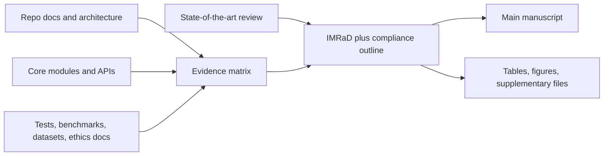

# Scientific Paper Plan

## Goal
Prepare a journal-ready manuscript plan for the full **Mission Control - Flight Surgeon** platform as an integrated aerospace medicine software system, emphasizing **clinical and operational translation** while preserving reproducibility and transparency.

## Current Basis In The Repository
The paper can be grounded in the current system definition and architecture already documented in:
- [README.md](c:\Users\User\OneDrive\FAC\Research\Python%20Scripts\HRV\README.md)
- [WARP.md](c:\Users\User\OneDrive\FAC\Research\Python%20Scripts\HRV\WARP.md)
- [docs/Manual.md](c:\Users\User\OneDrive\FAC\Research\Python%20Scripts\HRV\docs\Manual.md)
- [app/research_app.py](c:\Users\User\OneDrive\FAC\Research\Python%20Scripts\HRV\app\research_app.py)
- [app/operational_app.py](c:\Users\User\OneDrive\FAC\Research\Python%20Scripts\HRV\app\operational_app.py)
- [api/main.py](c:\Users\User\OneDrive\FAC\Research\Python%20Scripts\HRV\api\main.py)
- [app/hrv_core.py](c:\Users\User\OneDrive\FAC\Research\Python%20Scripts\HRV\app\hrv_core.py)
- [app/scheduling_core.py](c:\Users\User\OneDrive\FAC\Research\Python%20Scripts\HRV\app\scheduling_core.py)
- [tests/](c:\Users\User\OneDrive\FAC\Research\Python%20Scripts\HRV\tests)

## Key Planning Decision
Position the manuscript as a **systems/development paper** about a translational aerospace medicine platform, not yet as a narrowly scoped validation paper. The manuscript should explicitly separate:
- implemented capabilities,
- engineering verification already present in the repository,
- human/operational validation that is available,
- evidence that is still missing and must be acknowledged as a limitation.

## Recommended Manuscript Strategy
1. **Lead with the translational problem**: current HRV tools are fragmented and do not integrate autonomic analysis, circadian/fatigue modeling, space-weather context, wearable ingestion, and operational decision support into one reproducible platform.
2. **Frame the contribution as platform integration** rather than claiming every module is independently clinically validated.
3. **Use the paper to document architecture, workflows, and deployment pathways** across research and operational use cases.
4. **Add an evidence audit before drafting Results** so the manuscript only reports results that are genuinely supported by software tests, benchmarks, datasets, or user studies.
5. **Keep regulatory/compliance language bounded** to alignment and intended pathway unless formal certification exists.

## Proposed Paper Angle
**Working article concept:** an open-source, dual-architecture aerospace medicine decision-support platform that integrates HRV analytics, circadian and fatigue modeling, environmental and space-weather context, and multimodal physiological monitoring for research and operational workflows.

## Evidence Workflow

## Future `manuscript/` Workspace
When you move from planning to execution, create a top-level `manuscript/` folder with a structure like:
- `manuscript/outline/` for article outline, section notes, and journal targeting notes
- `manuscript/draft/` for the main manuscript markdown
- `manuscript/tables/` for result tables and comparison matrices
- `manuscript/figures/` for figure captions, source specs, and exported assets
- `manuscript/references/` for bibliography files and source tracking
- `manuscript/supplement/` for extended methods, reproducibility appendix, checklists, and supplementary results
- `manuscript/evidence/` for validation inventory, metrics provenance, ethics/compliance notes, and dataset/code availability statements

## Section-by-Section Writing Plan
### 1. Title and Abstract
Develop 2-3 candidate titles optimized for aerospace medicine, biomedical engineering, and software/methods audiences. Draft a structured abstract only after the evidence matrix confirms what can be claimed in Methods and Results.

### 2. Introduction
Build a thematic literature review around:
- HRV and autonomic assessment platforms
- fatigue and circadian decision-support systems
- aerospace/operational medicine digital tools
- multimodal physiological monitoring and environmental context systems
- the remaining gap: lack of an integrated translational platform

### 3. Methods
Split Methods into reproducible platform subsections:
- requirements and translational design rationale
- system architecture and dual-interface deployment model
- computational core and module families
- data ingestion and interoperability pathways
- operational and clinical workflows
- validation methodology, with a strict distinction between engineering verification and empirical evaluation

### 4. Results
Only report results supported by actual artifacts. Expected result categories:
- platform implementation summary
- software verification coverage and reproducibility artifacts
- available benchmark or performance evidence
- any retrospective/prospective evaluation that can be documented cleanly
- deployment and workflow demonstration results

### 5. Discussion
Center the Discussion on:
- clinical and operational usefulness
- generalizability to aerospace and other extreme-environment settings
- maintainability and technical debt
- evidence limits and what still requires formal validation
- regulatory and deployment pathway toward operational or clinical use

### 6. Compliance and Transparency
Prepare dedicated statements for:
- data/code/artifact availability
- ethics approval and informed consent where applicable
- standards/regulatory alignment already considered
- CRediT authorship
- funding/conflicts/acknowledgments
- reporting-guideline mapping

## Reporting Guideline Recommendation
Because this is a full-platform software manuscript with potential health/AI implications, plan to use a hybrid reporting framework:
- primary backbone: **journal-specific software/system paper guidance**
- add adapted elements from **STROBE** if observational validation data are included
- add **TRIPOD+AI / CLAIM / MI-CLAIM** only for modules where predictive AI claims are actually reported
- include a short justification section explaining which checklist elements were adapted and why

## Concrete Research Tasks Before Drafting
1. Build an **evidence matrix** mapping every planned manuscript claim to one of: code, documentation, tests, datasets, benchmark outputs, ethics documents, or literature.
2. Audit the repository for **publication-safe quantitative results** versus internal engineering claims.
3. Decide which modules are **core to the paper narrative** and which should be relegated to supplementary material.
4. Assemble a **comparison table** of external systems to support the gap statement.
5. Gather ethics, regulatory-alignment, and sharing details early so the compliance sections are not left vague.
6. Define a **claim discipline** rule: anything unsupported becomes either a limitation, future work, or is removed.

## Recommended Source Priorities
Use these files first when drafting the paper body:
- [README.md](c:\Users\User\OneDrive\FAC\Research\Python%20Scripts\HRV\README.md) for high-level system framing
- [WARP.md](c:\Users\User\OneDrive\FAC\Research\Python%20Scripts\HRV\WARP.md) for architecture, validation/testing pointers, and system evolution
- [docs/Manual.md](c:\Users\User\OneDrive\FAC\Research\Python%20Scripts\HRV\docs\Manual.md) for feature-level descriptions and references
- [app/hrv_core.py](c:\Users\User\OneDrive\FAC\Research\Python%20Scripts\HRV\app\hrv_core.py) for the computational core
- [api/main.py](c:\Users\User\OneDrive\FAC\Research\Python%20Scripts\HRV\api\main.py) for deployment and interface surface
- [tests/](c:\Users\User\OneDrive\FAC\Research\Python%20Scripts\HRV\tests) for verifiable engineering evidence

## Risks To Manage In The Manuscript
- The repository appears to have strong **engineering verification**, but journal-grade **external validation** may be incomplete or uneven across modules.
- The platform is broad; without pruning, the paper may become too diffuse for a Q1 submission.
- Regulatory references can easily drift into overclaiming if they are not explicitly framed as alignment rather than certification.
- Results sections must not rely on aspirational roadmap features or README marketing language.

## Acceptance Criteria For The Writing Phase
The writing phase should begin only once:
- the core manuscript scope is fixed around the full platform,
- the evidence matrix exists,
- the main comparison set from the literature is assembled,
- the validation story is explicitly bounded,
- the `manuscript/` workspace is created and mapped to section outputs,
- every major claim has a source or is clearly labeled as limitation/future work.

## Progress Update

### Completed foundation

- The `manuscript/` workspace has been created and populated with outline, draft, tables, figures, references, supplement, and evidence subfolders.
- The evidence matrix, core module scope, literature-gap comparison, validation story, and compliance/transparency map are complete.
- The manuscript now has a working scaffold in `manuscript/draft/main_manuscript_scaffold.md`.

### Active drafting status

- The Introduction has been drafted around the translational problem, comparator landscape, gap statement, and contribution framing.
- The Methods section has been drafted around requirements, architecture, implementation, and a tiered validation methodology.
- Seed references have been expanded to include aviation fatigue, circadian monitoring, and geomagnetic/autonomic literature used in the draft.
- The structured abstract, Results, Discussion, and Compliance/Transparency sections have now been drafted in `manuscript/draft/main_manuscript_scaffold.md`.
- The Results narrative is explicitly bounded to implemented architecture, engineering verification, reproducibility assets, and a qualified exploratory-analysis vignette rather than unsupported validation claims.
- The submission-candidate asset package now includes Table 1 through Table 5 as manuscript markdown tables, draft figure captions/specifications in `manuscript/figures/figure_plan.md`, and a populated `References` section in the main manuscript draft.
- Figure 1 through Figure 4 have now been rendered as SVG assets in `manuscript/figures/`, covering platform architecture, end-to-end workflow, research-to-operations coupling, and verification coverage.

### MCP research status

- Scientific literature was gathered with `paper-search` and `scite`.
- Zotero searches were partially successful and yielded relevant library items for HRV, vigilance, geomagnetic coupling, and space analogs.
- Official technical documentation was located with `brave`, including NASA-STD-3001, ICAO Doc 9966, and EQUATOR resources.
- **Update:** Firecrawl MCP authentication was fixed (valid `FIRECRAWL_API_KEY` in user MCP config); Tavily was added as Docker MCP `mcp/tavily`; ArXiv was added as `arxiv-mcp-server` with local storage on `E:\ArXiv`. **2026-04-08:** Smoke tests succeeded for `firecrawl_search`, `tavily-search`, and arXiv `search_papers`; details are logged in `manuscript/references/mcp_research_notes.md` under “MCP connectivity verification”. Core manuscript bullets still originate from the first pass (paper-search, scite, zotero, brave); use the three servers for supplemental harvesting and extend references as needed.

### Next writing targets

1. Expand and verify the bibliography toward a submission-ready reference list, including any standards documents or additional software-paper references used in the final text.
2. Confirm final authorship, affiliations, funding, conflict-of-interest, and acknowledgment details before submission.
3. Decide whether any exploratory analysis vignette will be promoted into the main paper or kept in supplementary material pending provenance curation.
4. Prepare a tagged release or archived DOI and harmonize environment wording for the final reproducibility statement.
5. If needed, convert the manuscript package into the exact journal template and figure-sizing requirements once a target venue is chosen.