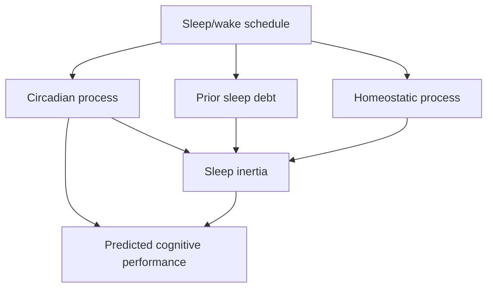
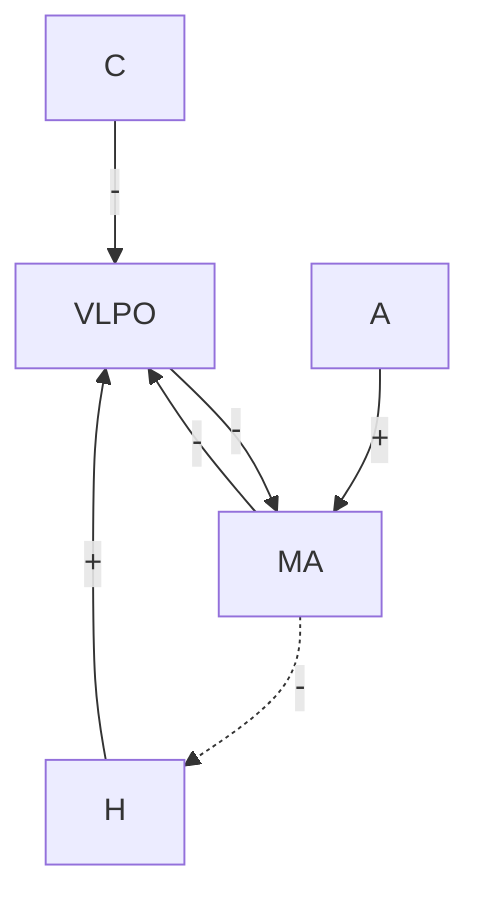
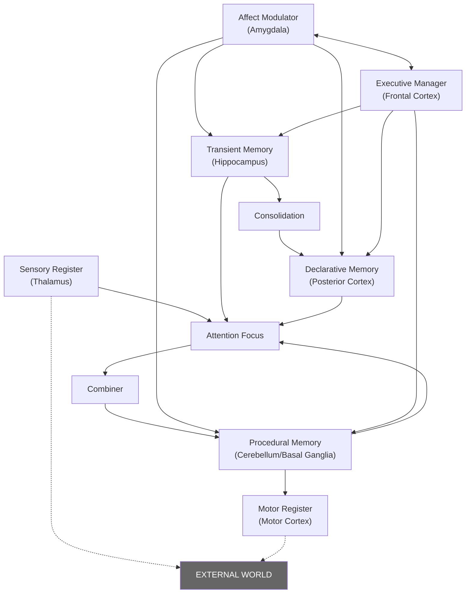

# Development of bio-mathematical models for human performance under fatigue

## Bio-mathematical fatigue modeling

Henry Peng
Fethi Bouak
DRDC – Toronto Research Centre

Defence Research and Development Canada
Scientific Report
December 2015


---

This publication has been peer-reviewed and published by the Editorial Office of Defence Research and Development Canada, an agency of the Department of National Defence of Canada. Inquiries can be sent to: Publications.DRDC-RDDC@drdc-rddc.gc.ca

This S&T document is provided for convenience of reference only. Her Majesty the Queen in right of Canada, as represented by the Minister of National Defence ("Canada"), makes no representations or warranties, expressed or implied, of any kind whatsoever, and assumes no liability for the accuracy, reliability, completeness, currency or usefulness of any information, product, process or material included in this document. Nothing in this document should be interpreted as an endorsement for the specific use of any tool, technique or process examined in it. Any reliance on, or use of, any information, product, process or material included in this document is at the sole risk of the person so using it or relying on it. Canada does not assume any liability in respect of any damages or losses arising out of or in connection with the use of, or reliance on, any information, product, process or material included in this document.

© Her Majesty the Queen in Right of Canada, as represented by the Minister of National Defence, 2015

© Sa Majesté la Reine (en droit du Canada), telle que représentée par le ministre de la Défense nationale, 2015


---

## Abstract

Sleep-induced fatigue has been well recognized as a major factor influencing military's performance across all operational environments. Various strategies have been studied to mitigate the impairment of sleep loss on health and performance. Bio-mathematical models to predict fatigue are valuable tools. Most of the existing models do not consider other factors affecting human fatigue beyond sleep, and any countermeasures. We have used MATLAB® a generic modeling tool to develop and validate a fatigue model for full and partial sleep deprivation including shift work and jet lag. We compared our model with Fatigue Avoidance Scheduling Tool (FAST), a commercial software using the SAFTE algorithm, and validate it using existing experimental data. The flexibility of our model would allow additions of new algorithms and mechanisms for non-sleep factors and countermeasures and thus improve model predictions and usefulness for both civilian and military applications. In this report, we first reviewed the literature on various models of human mental fatigue and cognitive performance and then described two DRDC bio-mathematical models. The first one (named as DRDC model 1) described in Section 3 is a further development of the SAFTE model and the second one (named as DRDC model 2) described in Section 4 is completely different. The basic elements of DRDC model 1 were based on the SAFTE model with the additions of pharmaceutical and workload effects, while light- and melatonin-induced circadian phase shifts were incorporated in our model 2. Future development and validation of our fatigue model were warranted.

## Significance to defence and security

Fatigue has been well recognized as a major factor influencing the military's performance across all operational environments (Army, Navy and Air). In this report, we described our work on improving the current bio-mathematical models for predicting cognitive performance decrements caused by fatigue. Our models can be used to build a valuable decision-making tool for assessing the risks and providing guidance for the use of countermeasures during military operations where sleep loss occurs.

---

# Résumé

La fatigue causée par le manque de sommeil est reconnue comme étant un facteur qui influence grandement le rendement des militaires de tous les environnements opérationnels. Nous nous sommes penchés sur diverses stratégies en vue d'atténuer les effets néfastes du manque de sommeil sur la santé et le rendement. Les modèles biomathématiques sont de précieux outils de prévision de la fatigue. Cependant, la plupart des modèles existants ne tiennent pas compte des facteurs autres que le sommeil qui influencent la fatigue chez l'être humain ainsi que des contre-mesures possibles. Nous avons utilisé MATLAB®, un outil de modélisation générique, pour élaborer et valider notre propre modèle d'évaluation de la fatigue due à un manque de sommeil complet ou partiel causé par des facteurs comme le travail par quarts et le décalage horaire. Nous avons comparé notre modèle avec FAST® (Fatigue Avoidance Scheduling Tool – Outil de planification pour contrer la fatigue), un logiciel commercial utilisant l'algorithme SAFTE, puis nous l'avons validé au moyen des données expérimentales existantes. La souplesse que confère ce modèle permettra l'ajout de nouveaux algorithmes et mécanismes qui tiendront compte de facteurs et de contre-mesures non associés au sommeil, ce qui permettra d'améliorer ses prévisions et accroîtra son utilité dans les applications civiles et militaires. Dans le présent rapport, nous avons d'abord fait une revue de la littérature sur les différents modèles de fatigue mentale et de rendement cognitif chez l'être humain, puis nous avons conçu deux modèles biomathématiques pour RDDC. Le premier, appelé « modèle 1 de RDDC », est décrit au chapitre 3 et représente une version évoluée du modèle SAFTE, tandis que le deuxième (modèle 2 de RDDC), décrit au chapitre 4, diffère complètement. À la base, le modèle 1 est semblable au SAFTE à la seule différence que nous y avons inclus les effets des produits pharmaceutiques et de la charge de travail. En ce qui a trait au modèle 2, nous y avons incorporé le décalage des rythmes circadiens induit par la lumière et la mélatonine. D'autres travaux de développement et de validation de notre modèle de fatigue seront toutefois de mise.

# Importance pour la défense et la sécurité

La fatigue est reconnue comme étant un facteur qui influence grandement le rendement des militaires de tous les environnements opérationnels (Armée, Marine et Aviation). Dans le présent rapport, nous décrivons les travaux réalisés en vue d'améliorer les modèles biomathématiques actuels de prévision des baisses de rendement cognitif causées par la fatigue. Nos modèles peuvent servir à l'élaboration d'un précieux outil de prise de décisions permettant d'évaluer les risques et d'orienter l'utilisation de contre-mesures lors d'opérations militaires au cours desquelles le manque de sommeil entre en jeu.

---

# Table of contents

Abstract . . .i

Significance to defence and security . . . i

Résumé . . . ii

Importance pour la défense et la sécurité . . . ii

Table of contents . . . iii

List of figures . . . v

List of tables . . . viii

Acknowledgements . . . ix

## 1 Introduction . . . 1

### 1.1 Background . . . 1

## 2 Literature review of existing mathematical models for neurobehavioural performance . . . 3

### 2.1 Current modeling methods (approaches to fatigue modeling) . . . 3

#### 2.1.1 Physiological basis . . . 4

#### 2.1.2 Empirical methods . . . 4

### 2.2 Description of existing bio-mathematical fatigue models . . . 4

#### 2.2.1 Phenomenological models . . . 4

##### 2.2.1.1 Two-process model . . . 6

##### 2.2.1.2 Three-process model . . . 8

#### 2.2.2 Neurophysiological models . . . 11

#### 2.2.3 ACT-R fatigue model . . . 11

#### 2.2.4 Fatigue/Risk Index model . . . 12

#### 2.2.5 Fatigue models with pharmaceutical countermeasures . . . 13

##### 2.2.5.1 Caffeine . . . 14

#### 2.2.6 Existing fatigue modeling tools . . . 15

### 2.3 Sleep models . . . 15

### 2.4 Model applications . . . 16

### 2.5 General limitations of current fatigue models . . . 16

## 3 Development of bio-mathematical fatigue model . . . 18

### 3.1 Architecture and core components . . . 18

### 3.2 Model changes and additions . . . 20

#### 3.2.1 Pharmaceutical countermeasures . . . 21

#### 3.2.2 Workload . . . 22

#### 3.2.3 Jet lag . . . 22

### 3.3 Model implementation and comparison of simulations to experimental data . . . 23

### 3.4 Results and discussion . . . 25

#### 3.4.1 Input variables . . . 26

#### 3.4.2 Model simulations: sleep loss . . . 30

---

3.4.3 Model simulations: pharmacological countermeasures . . . . . . . 31
3.4.4 Model simulations: workload . . . . . . . . . . . . . . . . . . 34
3.5 Summary and recommendations . . . . . . . . . . . . . . . . . . . 35
4 Development of bio-mathematical model for circadian phase shift . . . . . . . 37
4.1 Modification of Version 1 of the DRDC fatigue model . . . . . . . . . 37
4.1.1 Homeostasis process. . . . . . . . . . . . . . . . . . . . . 37
4.1.1.1 Homeostasis base recovery . . . . . . . . . . . . . . 37
4.1.1.2 Sleep propensity and sleep debt . . . . . . . . . . . . 39
4.1.1.3 Sleep quality . . . . . . . . . . . . . . . . . . . . 40
4.1.2 Circadian rhythm . . . . . . . . . . . . . . . . . . . . . . 40
4.1.2.1 Circadian rhythm base model . . . . . . . . . . . . . 40
4.1.2.2 Night shift and light countermeasures . . . . . . . . . . 42
4.1.2.3 Melatonin countermeasures . . . . . . . . . . . . . . 43
4.1.3 Combined process . . . . . . . . . . . . . . . . . . . . . . 44
4.2 Model implementation and comparison of simulations to experimental data . . 44
4.3 Results and discussion . . . . . . . . . . . . . . . . . . . . . . . . 44
4.3.1 Model simulations: light-induced phase shift . . . . . . . . . . . 46
4.3.2 Model simulations: cognitive performance . . . . . . . . . . . . 48
4.3.3 Model simulation: melatonin countermeasures . . . . . . . . . . . 53
4.3.4 Model simulations: sleep quality . . . . . . . . . . . . . . . . 55
4.3.5 Model simulations: jet lag. . . . . . . . . . . . . . . . . . . 58
4.4 Conclusions and recommendations . . . . . . . . . . . . . . . . . . 59
5 Summary and future work. . . . . . . . . . . . . . . . . . . . . . . 61
References . . . . . . . . . . . . . . . . . . . . . . . . . . . . . . . 63
Annex A Experimental validation and optimization . . . . . . . . . . . . . 77
A.1 Experimental conditions reported in Van Dongen's paper [105] . . . . . . 77
A.2 Light input for model simulations. . . . . . . . . . . . . . . . . . . 80
A.3 Method of parameter optimization . . . . . . . . . . . . . . . . . . 83
List of symbols/abbreviations/acronyms/initialisms . . . . . . . . . . . . . . 84

---

# List of figures

Figure 1:      General components of the neurobiology in phenomenological models
               [reproduced with permission from [36]]. . . . . . . . . . . . . . . . . 5

Figure 2:      Changes in daily alertness level throughout the day regulated by homeostatic
               and circadian process [reproduced with permission from [35]]. . . . . . . 6

Figure 3:      Schematic of neurophysiological sleep model. The circadian (C) and
               homeostatic (H) drives combine to produce an overall sleep drive to
               ventrolateral preoptic nucleus (VLPO) of the hypothalamus. A constant
               drive A represents cholinergic/orexinergic input to monoaminergic brainstem
               populations (MA). The VLPO and MA are mutually inhibitory. Excitatory (+)
               and inhibitory (-) interactions are shown with arrows and arousal state
               feedback from the MA to H is shown dashed [reproduced with permission
               from [65]]. . . . . . . . . . . . . . . . . . . . . . . . . . . . . . 11

Figure 4:      A schematic overview of ACT-R neuro-cognitive architecture [reproduced
               with permission from [69]]. . . . . . . . . . . . . . . . . . . . . . . 12

Figure 5:      Linear fit of experimental data (PVT lapses) [16] vs. our model-predicted
               performance (%) using the experimental sleep schedule as input. . . . . . 24

Figure 6:      Comparison of experimental data [16] vs. model-predicted performance.
               Symbols represent the experimental data while the solid line represents the
               model predictions. . . . . . . . . . . . . . . . . . . . . . . . . . . 24

Figure 7:      Comparison between experimental data [16] and both model predictions. The
               blue symbols represent the experimental data. The red solid line is the scaled
               DRDC model predictions. The green line is the scaled SAFTE model
               predictions. . . . . . . . . . . . . . . . . . . . . . . . . . . . . . 25

Figure 8:      GUI of MATLAB model. . . . . . . . . . . . . . . . . . . . . . . . . 26

Figure 9:      Format for inputting sleep schedule in Excel spreadsheet. . . . . . . . . 27

Figure 10:     Windows for each of the optional inputs. . . . . . . . . . . . . . . . . 28

Figure 11:     Simulation demonstrating the effects of caffeine. . . . . . . . . . . . . 28

Figure 12:     Interface for selecting data points using the cursor. . . . . . . . . . . . 29

Figure 13:     Conversion of model predictions to the same scale as the experimental data
               (PVT lapses) of the DRDC model (left) and SAFTE model (right). . . . . . 29

Figure 14:     Comparison between performance as experimentally measured by cognitive
               tasks [142] and predicted by SAFTE and our DRDC fatigue models under total
               sleep loss. The performance was calculated as percentage of baseline under
               normal sleep. . . . . . . . . . . . . . . . . . . . . . . . . . . . . . 30

Figure 15:     Comparison between experimental cognitive performance as measured by
               visual vigilance tests [123] and predicted performance by SAFTE and our
               model when placebo and caffeine are used. Caffeine 400 mg was given at
               01:30 each night during sleep deprivation. . . . . . . . . . . . . . . . 32

---

## Figure 16:
Comparison between experimental performance as measured by psychomotor vigilance tasks [126] and predicted performance by our model under pharmaceutical countermeasures. An oral dose of caffeine 600 mg, dextroamphetamine (dextro) 20 mg, or modafinil 400 mg was administered after 64-h awake. . . . . . . . . . . . . . . . . . . . . . . . . . 33

## Figure 17:
Comparison between experimental performance as measured in high-speed ship navigation with high and low workload [131] and predicted performance by our model for low and high workload under total sleep deprivation. The low and high workload was defined as continuous attention seldom required and at most times, respectively. . . . . . . . . . . . . . . . . . . . . . . 34

## Figure 18:
Three process model for the circadian inclusive of the light process, sleep-wake process and natural circadian process with modulation of light and sleep-wake into the natural pacemaker [modified from [55, 154]. . . . . . . . . . 41

## Figure 19:
Comparison of predicted acrophase time for a phase-shift experiment without light treatment as reported by Deacon et al. [167, 168]. A 9-h delay phase shift was initially achieved by a combination of imposed light/dark and sleep/wake cycles followed by a 9-h rapid advance phase shift as the baseline sleep/wake schedule was resumed. . . . . . . . . . . . . . . . . . . . . . . 46

## Figure 20:
Comparison of the acrophase time predicted by existing models for a phase-shift experiment with light treatment reported by Deacon et al. [168] and Czeisler et al. [175]. Bright light treatment at 2000 lx in the morning (8:00–12:00) on Days 10 and 11 after a 9-h delay phase shift [168] and at 12000 lx in the evening (midnight to 8:00) from Day 7 to Day 10 for adaptation to night work [175]. . . . . . . . . . . . . . . . . . . . 47

## Figure 21:
Comparison of DRDC model 1, 2, and the FAST model for a 88-h sleep deprivation experiment reported by Van Dongen [16]. MSEs were calculated as 12.01, 12.08 and 12.75 for model predictions by FAST, DRDC model 1 and 2, respectively. . . . . . . . . . . . . . . . . . . . . . . . . 48

## Figure 22:
Comparison of DRDC model 1, 2 and the SAFTE model for a schedule with two 2-h naps between 14:30–16:30 and 2:30–4:30 after baseline sleep experiment reported by Van Dongen [16]. MSEs were calculated as 2.14, 2.81 and 2.48 for model predictions by SAFTE model, DRDC model 1 and 2, respectively. . . . . . . . . . . . . . . . . . . . . . . . . 49

## Figure 23:
Comparison of DRDC model 1 and 2 for predictions of cognitive performance a sleep study involving a 9-h delay phase shift and a return to baseline without light treatment reported by Deacon et al. [167]. MSEs were calculated as 26.36 and 30.37 for model predictions by DRDC model 1 and 32.96 and 41.29 for model prediction by model 2 against experimental data based on search and memory test and visual analogue scale, respectively. . . . . . . . . . . 50

## Figure 24:
Comparison of DRDC model 1 and 2 during a sleep study involving a 9-h delay phase shift and a return to baseline with light treatment using bright light treatment at 2000 lx in the morning (8:00–12:00) on Days 10 and 11 as reported by Deacon et al. [167]. MSEs were calculated as 8.03 and 10.67 for model predictions by DRDC model 1 and 8.03 and 14.63 for model prediction


---

by model 2 against experimental data based on search and memory test and visual analogue scale, respectively. . . . . . . . . . . . . . . . . . . 51

**Figure 25:** Comparison of DRDC model 1 and 2 for a 6-night shift work schedule without light treatment after baseline sleep experiment reported by Czeisler et al. [175]. MSEs were calculated as 44.70 for model predictions by DRDC model 1 and 45.49 for model prediction by model 2, against experimental data based on a cognitive test involving calculation of 125 randomly generated pairs of two-digit numbers, respectively. The experimental performance was scaled to be compatible to a percent model-predicted performance. . . . . . . . . . 52

**Figure 26:** Comparison of DRDC model 1 and 2 for a shift work schedule with light treatment at 12000 lx in the evening (midnight to 8:00) from Day 7 to Day 10 after baseline sleep experiment reported by Czeisler et al. [175]. MSEs were calculated as 95.97 for model predictions by DRDC model 1 and 84.95 for model prediction by model 2 against experimental data based on a cognitive test involving calculation of 125 randomly generated pairs of two-digit numbers, respectively. The experimental performance was scaled to be compatible to a percent performance predicted by the model. . . . . . . . 53

**Figure 27:** Comparison of the acrophase predicted by models for a phase-shift experiment without and with melatonin treatment reported by Deacon et al. [167, 168]. A melatonin dose of 5 mg was administered orally at 23:00 on Days 9, 10 and 11, respectively. . . . . . . . . . . . . . . . . . . . . . . . . . . . 54

**Figure 28:** Performance comparison of DRDC model 1 and 2 for a 9-h delay phase shift schedule with melatonin treatment at an oral dose of 5 mg at 23:00 on Days 9, 10 and 11 in a sleep experiment reported by Deacon et al. [167]. MSEs were calculated as 5.94 and 5.64 for model predictions by DRDC model 1 and 5.38 and 6.12 for model prediction by model 2 against experimental data based on search and memory test and visual analogue scale, respectively. . 55

**Figure 29:** The effect of sleep quality on recovery of cognitive performance capacity Rt in the DRDC model and FAST. . . . . . . . . . . . . . . . . . . . . . . . 56

**Figure 30:** The effect of sleep quality on cognitive performance as predicted by our model for a schedule with two 2-h naps between 14:30–16:30 and 2:30–4:30 after baseline sleep experiment reported by Van Dongen [16]. Sleep quality was assigned as excellent, good and poor in the model for the two 2-h naps. . . . 57

**Figure 31:** The circadian output of the jet lag component in the current model compared to the expected output after a round trip flight. The dark triangles represent the theoretical minimum of core body temperature (Tmin), while the green stars represent the model-predicted Tmin. The yellow horizontal bars represent the maximum duration of photoperiod (at the summer solstice), and the vertical lines within the bars represent the minimum duration of the photoperiod (at the winter solstice). The two circles connected by a line represent sleep times. . . 58

**Figure A.1:** Projection from Nelder-Mead simplex method. . . . . . . . . . . . . . 83

---

# List of tables

Table 1:      Summary of current three-process models. . . . . . . . . . . . . . . . . 9

Table 2:      Comparison of input variables between the SAFTE model and the
              DRDC model. . . . . . . . . . . . . . . . . . . . . . . . . . . . . . . 27

Table 3:      Summary of model-predicted performance with experimental data in different
              sleep conditions. . . . . . . . . . . . . . . . . . . . . . . . . . . . . 31

Table 4:      Comparison of equations and parameter values in light-based circadian
              models. . . . . . . . . . . . . . . . . . . . . . . . . . . . . . . . . . 45

Table A.1:    Light input for model simulations based on experimental conditions . . . . 80


---

# Acknowledgements

The authors would like to thank the following co-op students: Hao Zhou, Saad Ali and Vincent Chow for their excellent support for the development of the DRDC fatigue models. The authors also acknowledge the support of Natalia Doubova, a DRDC contractor, for MATLAB programming and the examination of light circadian models.

---

---


# 1 Introduction

## 1.1 Background

Fatigue has become an increasing problem in our modern society. There are workers needed around the clock. Specifically, night shift nurses, industrial processing plant workers, military trainees, and pilots are occupations that have work schedules that fluctuate based on real-time demand. It is widely known that human fatigue can lead to bad judgment, errors and accidents [1]. In occupations such as these, incorrect decisions can be fatal as they support human life and use dangerous, large scale equipment. Given their difficult work schedules in order to properly plan sleep times they must know their performance levels. Still, it is in the interest of all organizations to understand human fatigue and implement reasonable schedules as it decreases productivity and costs the world billions of dollars annually [2]. Not only fatigue reduces effectiveness, it can also have devastating implications that can be comparable to impaired driving. Take driving for example, in New York State, US, 40–60% of "run-off-road" (or ROR) crashes are due to driver fatigue or drowsiness [3]. In Australia, fatigue driving is responsible for 20% of fatal accidents [4]. More interestingly, in an experiment conducted by Dawson and Reid, it was found that human cognitive performance after 22 hours of wakefulness is equivalent to that of an individual with 0.08% blood alcohol concentration [5]. Another research group found that the performance of fighter pilots could be reduced by more than 40% after 37-h continuous wakefulness [6].

Many extensive studies on sleep and performance have been performed for the past decades [7]. Some of the common effects of sleep-induced fatigue include slowed reaction time, reduced vigilance, impaired decision making skills and lack of attention. For example, it has been shown that 2–3 h less sleep in a single night (acute sleep loss) produces measurable impairment of tasks in the lab and in the real world [8]. Extreme sleep deprivation greater than 40 h can cause severe short-term memory loss, and inability to perform cognitive tasks [9]. Continued acute sleep loss for more than several days will gradually decrease performance capabilities and wakefulness [10]. Brain scans show that sleep deprivation severely affects the prefrontal cortex of the brain. The hippocampus, the memory center in the brain, does not operate normally when attempting verbal learning or visual memory tasks if the brain did not have adequate rest [11].

The effects of fatigue are especially severe in military operations since a fraction of second can often result in life or death difference. Sleep-induced fatigue has been well recognized as a major factor influencing military's performance across all operational environments (Army, Navy and Air) [12, 13]. Therefore it is very important for the Canadian Armed Forces (CAF) to predict the effects of fatigue on human performance and then develop countermeasures to fatigue to ensure its soldiers are at optimal performance when needed.

Various strategies have been studied to mitigate the impairment of sleep loss on health and performance. Mathematical models to predict fatigue are valuable tools [14]. The need for mathematical models to estimate human cognitive performance based on sleep/work schedule has been recognized by unions, employers, and government in the recent years. Most of these models are based on sleep/wake schedules and have been validated in aviation and transportation industry. In this Scientific Report, we focus on sleep-related mental fatigue which has been

---

extensively studied as a major factor influencing military operations across all kinds of environments [12].

One way to recover from fatigue is to simply get sufficient sleep. However there are many factors affecting the quality of sleep, and in modern society people tend to sleep less than in the past [15]. When soldiers are in military operations, they are unlikely to get adequate sleep every day. Since the amount of available sleeping time is a major constraint, there is an urgent need to find an optimal sleep/wake schedule to achieve high performance. By sleeping at the right time, a soldier will be at peak performance when such a high level effectiveness is required.

Research started in early 80s with the aim to address such problem by trying to predict people's performance when prior sleep/wake history is known. The work on predicting human performance is now known as fatigue modeling. Research initiatives have made significant process in the fatigue modeling. Bio-mathematical modeling of fatigue attempts to present viable estimates of performance for different schedules. They are estimates because it is nearly impossible to model the complex neuro-physiological mechanisms of the brain. Also, due to the individual differences when conducting sleep experiments, the model cannot be considered completely accurate for all. Alternatively, the model is designed using data from large groups of volunteers and the average performance is often used to fit as many participants as possible. Additions to the model to account for different circumstances or preventative measures include intercontinental travel, night shift work, workload, pharmaceutical countermeasures, light countermeasures and sleep quality. Individual adaptability also affects those additions to the model, but requires more investigation to determine the optimal method to test individuals and may be very challenging to achieve a better accuracy.

Nowadays there are a number of bio-mathematical fatigue models available. Among those, one of the well-recognized model [16] is the Sleep, Activity, Fatigue, and Task Effectiveness (SAFTE) model developed by Hursh et al. [17]. The model is implemented by Fatigue Avoidance Scheduling Tool (FAST) software. Currently Defence Research and Development Canada, Toronto Research Centre (DRDC Toronto) is using the SAFTE model as a base to develop an in-house fatigue model to help the CAF better predict the performance of its soldiers. Various aspects of the above two fatigue models will be compared in this report. Improvements are made to our base model to include workload, pharmaceutical countermeasures, jet lag, night shift, light countermeasures, sleep propensity and sleep quality. In this report, the in-house fatigue model is referred to as DRDC model. The FAST software is referred to as SAFTE model.

The objectives of this report are two folds: (1) to provide a literature review of existing bio-mathematical models for human performance under fatigue and (2) to summarize the development of our in-house fatigue model. The literature review covers a broad spectrum of fatigue models which are discussed according to their types. Our in-house development of fatigue models is described in Sections 3 and 4. Section 3 reports our initial development of a DRDC base model comparable with the SAFTE model and further development of our model with graphical user interface and additional factors. Section 4 discusses the modification of our model to include light conditions and melatonin countermeasures. Further development and application of our fatigue model are presented in Section 5.

---

# 2 Literature review of existing mathematical models for neurobehavioural performance

A model can be defined as a concept, a formula, a drawing or even a protocol [18]. Mathematical models can be divided into two categories [19]: 1) models of data, also called empirical or descriptive model; and 2) models of system, also called mechanistic and explanatory models. Both are useful in complex biological systems for a better interpretation of the data and prediction of system behaviour since not everything can be measured. For predictions, a mechanistic model and experimental validation are usually required.

Mathematical modeling of human performance has been well documented. The models have been reviewed as manual control models, network models and cognitive models [20]. The cognitive models are most contemporary and derived from cognitive architectures one of which is Adaptive Control of Thought-Rational (ACT-R) [21]. There is no physiological representation in these models which makes them less predictive for unknown. On the other hand, functional magnetic resonance imaging has been used to guide the development of the ACT-R theory [22]. Multi-scale models in neurobiology range from lower-level neurons and networks models [23] to high-level reinforcement learning models [24] and neural field models [25].

The ability to predict one's performance and fatigue in a given situation is sought after by people of many different backgrounds. This includes individuals attempting to maximize their time and efficiency, employers doing the same for their employees, and safety officers trying to determine if an operator is fit to be doing his or her job. For example, a model to predict fatigue is required for the aviation industry since degraded flying abilities could lead to a large loss of money and even life [26].

Research has been going on for several years into ways to model and predict fatigue and performance. Seven major models have been produced by researchers from around the world [27]. Each of these models differs in the inputs they require and outputs they produce. One of the first models, which many of the other models are based on, was published in 1982 [28]. This model, known as the two-process model, posits that fatigue and alertness are a result of the interaction of two processes: a homeostatic process and a circadian process. This will be covered in more detail later.

This section focuses on human cognitive performance under sleep-induced fatigue based on a number of reviews on the topic and original research papers.

## 2.1 Current modeling methods (approaches to fatigue modeling)

The development of mathematical models involves postulating relevant mathematical equations, and fitting these equations to experimental data in order to estimate the model parameters for predictions. While most mathematical models of neurobehavioural performance and alertness include equations for the components and their interactions underlying physiology, there may be


---

a few models with fundamental differences in the equations included in these models [29]. In part, these may be due to differences in the model assumptions.

## 2.1.1 Physiological basis

A number of models are based on physiological principles. Over the last few years, neurophysiological mechanisms governing sleep-wake dynamics have become clear. These involve neurochemicals, pathways, different neural networks and firing patterns, such as mutually inhibitory effects of sleep- and wake-promoting neural networks [30]. One type is called neurophysiological sleep models. Further development of the model on performance outputs may be required in real situations.

The other type is based on neuropsychological and neurophysiological observations that alertness declines during wakefulness and recovers during sleep. It also fluctuates according to circadian rhythm.

The third is to incorporate biological mechanisms for fatigue into architecture-based behaviour representations such as the ACT-R cognitive architecture emphasizing the cognitive fatigue associated with extended time on task instead of long periods of wakefulness [31]. The ACT-R cognitive architecture consists of multiple modules for mechanisms of perception, cognition, and action, associated with distinct cortical regions and integrated to produce coherent cognition [21]. The approach focuses on how fatigue may influence module parameters such that the cognitive architecture produces the correct moment-to-moment performance on selected cognitive tasks [32]. Another cognitive architecture considering fatigue-impact performance is Soar cognitive architecture through the introduction of artificial delays in processing [33].

## 2.1.2 Empirical methods

As an alternative, this method has no reference to physiology/neurobiology of sleep or its underlying process and is data-driven [34]. Represented by non-parametric approaches in the form of artificial neural networks alone or in combination with prior knowledge, model inputs and outputs are linked through a 'black-box' where mathematical functions are derived from the data.

# 2.2 Description of existing bio-mathematical fatigue models

Given their close relevance to our work, we will focus on phenomenological models which are based on physiological phenomena at a systematic level, but not all model parameters have particular physiological meanings.

## 2.2.1 Phenomenological models

Two main neurobiological processes have been well known in sleep-wake regulation although the molecular mechanisms behind have only recently been subjected to detailed investigation [30]. The models vary in mathematical descriptions of each and subsequent input and output variables.


---

Various mathematical algorithms have been derived for model components according to the theoretical basis schematically shown in Figure 1, with differences in the assumptions of the underlying physiology. The homeostatic process tracks the occurrence of sleep and maintains a balance of performance capacity, which is decreased while awake and recovered while asleep. As illustrated in Figure 2, process S represents the homeostatic process during wakefulness and is one in which the body attempts to maintain a stable state. This means waking when sleep drive is low and sleeping when sleep drive is high. It is an exponential/linear function of the time since awakening. It is high on awakening, falls rapidly initially, and gradually approaches a lower asymptote. At sleep onset, process S is reversed and called S', and recovery occurs in an exponential fashion that initially increases very rapidly, but subsequently levels off towards an upper asymptote. Total recovery is accomplished in 8 h [35].



*Figure 1: General components of the neurobiology in phenomenological models [reproduced with permission from [36]].*

The circadian process (process C in Figure 2) tracks circadian rhythm generated by the biological clock inside the brain, which can be influenced by light exposure and other time cues and is close to 24-h rhythms in core body temperature and various hormones, such as melatonin [37]. This process represents sleepiness due to circadian influences and has a sinusoidal form with an afternoon alertness peak. It also contributes to the feeling of sleepiness experienced in the early morning at around 0500 h, and to the feeling of alertness experienced in the evening at around 1900 h. This periodic process has a minimum and maximum at the previously mentioned times. However, it also has local minima and maxima. For example, there is a local minimum in the early afternoon at around 1500 h resulting in an increased tendency to nap at this time.

Finally, the sleep inertia is a temporary disturbance in performance that occurs immediately after awakening and lasts for a few hours [38]. Upon awakening, there is a rapid activation of brain

---

stem and thalamic arousal regions that is not matched with the slow activation of the frontal cortical areas used in cognitive thinking [39]. As a result, there is a performance decrease immediately after awakening.

<table>
<thead>
<tr>
<th>Time of day</th>
<th>S (Process S)</th>
<th>C (Process C)</th>
<th>S+C (Combined)</th>
<th>S' (Process S')</th>
</tr>
</thead>
<tbody>
<tr>
<td>6</td>
<td>12</td>
<td>-2</td>
<td></td>
<td></td>
</tr>
<tr>
<td>12</td>
<td>13</td>
<td>3</td>
<td></td>
<td></td>
</tr>
<tr>
<td>18</td>
<td>11</td>
<td>2</td>
<td></td>
<td></td>
</tr>
<tr>
<td>24</td>
<td>9</td>
<td>-2</td>
<td></td>
<td></td>
</tr>
<tr>
<td>6 (next day)</td>
<td>8</td>
<td>-2</td>
<td>6</td>
<td>8</td>
</tr>
<tr>
<td>12 (next day)</td>
<td></td>
<td>2</td>
<td></td>
<td>14</td>
</tr>
</tbody>
</table>

**Figure 2:** Changes in daily alertness level throughout the day regulated by homeostatic and circadian process [reproduced with permission from [35]].

Neville et al. developed sleepiness-induced lapsing and cognitive slowing model to describe three functions of human cognitive performance: lapse frequency, lapse duration and general response slowing [40]. Algorithms for each of three functions were empirically derived to represent hemi-circadian, circadian, sleep homeostasis as well as a baseline performance.

#### 2.2.1.1 Two-process model

The two-process model was first developed in 1982 by Borbély [28] and has since been refined. The model is based on the interaction (linear or non-linear) of homeostatic and chronobiological principles on sleep/wake regulation, which has been confirmed by many laboratory experiments [41]. It forms the foundation for many fatigue and performance models although the mathematical descriptions of each process vary remarkably. In general, the homeostatic component increases during wake and decreases during sleep in a saturating exponential manner (Figure 2) which varies between 0 and 1. The circadian process is modeled as a sum of sinusoidal function of increasing frequency. [42]. Alertness and sleepiness are then calculated based on the values of the two processes [41].

---

The System for Aircrew Fatigue Evaluation (SAFE) is a two-process model which focuses mainly on issues in scheduling in commercial aviation [43]. It predicts fatigue based on time of day and time since sleep. Recently the model predictions were compared with in-flight measures of pilot fatigue on a variety of operations, showing some discrepancies between predicted and observed fatigue [44].

McCauley et al. expanded the two-process model by introducing an additional homeostatic component with a longer time constant to account for the existence of a bifurcation in neurobehavioural performance as a result of chronic sleep restriction (e.g., a scenario involving 5 days of wake extension to 20 h/day (i.e., 4-h sleep daily), followed by a day with wake extension to just 18 h (i.e., 6-h sleep)) [36, 45]. Recently, the model was incorporated with time-dependence of circadian amplitude to account for the dependence of homeostatic equilibrium for sleep-wake regulation on the duration and the timing of prior sleep [46]. This resulted in an improvement of the goodness-of-fit, as quantified by root mean square errors, for the predictions of neurobehavioural performance as measured by psychomotor vigilance test during night shift schedules, nap sleep scenarios, and recovery from prior sleep loss.

As opposed to the sleep schedule, models based on work schedules have been developed as well. The Fatigue Audit Inter Dyne (FAID) model uses work patterns (e.g., time zone changes and various start and finish times) as input and predicts work-related fatigue score and recovery value as a linear increase with time on work and away from work, respectively [47]. The model also assigns fatigue and recovery value depending on the work length and the circadian timing, with a weighing of one for most recent time to a weighing of zero for more than 168 h previously. Therefore, the model may empirically make use of the two processes. The model also incorporates a saturation function that limits the total value of recovery that can be accumulated at any time to a maximum. The simple input (i.e., a schedule of work and non-work times) requirement and mathematics of the model facilitate its use by organizations and industry in work settings for easy end-user comparisons among alternative work schedules. Although FAID outputs a fatigue score rather than a quantifiable cognitive performance and requires secondary transfer functions to convert the FAID results to various performance measures, the model has been validated against laboratory and field studies in industry for fatigue-related risk management in shift workers [48, 49]. Furthermore, different FAID products such as FAID Standard, FAID 330, FAID 101, FAID Time Zone, FAID Business Wide, FAID Roster and FAID Shared Object Library have been developed by InterDynamics Pty Ltd (Brisbane, Queensland, Australia) for different applications [50]. For example, FAID Time Zone is a special FAID version for aviation industrial works conducting operations across multiple time zones. The model predicts the effects of the following variables on fatigue: time on task, circadian disruption because of changes in time zones and working at night, and the speed of pilot's return to home base.

Like FAID, the Circadian Alertness Simulator (CAS) model predicts a cumulative fatigue score from work schedules, but is more closely related to the two processes of sleep regulation [51]. The model uses as input sleep-wake data and information about individual sleep characteristics (short vs. long sleeper, morning type vs. evening type, napper vs. non-napper). It has been validated against work/rest and accident data from the transportation industry and applied for the assessment of operational fatigue risk, work schedule optimization, fatigue-related accident investigation.

---

#### 2.2.1.2 Three-process model

To more accurately explain human experimental data showing a transitional state of sleepiness and a temporary decrease in subsequent performance immediately after awakening [38], a third process representing sleep inertia, was added to the two-process model [52, 53]. The model takes work-rest or sleep-wake schedules as inputs and predicts subjective alertness, cognitive performance and/or fatigue risk. The three-process model has also been refined on the exponential recovery function to account for slow recovery of cognitive functions during partial sleep deprivation for longer periods (e.g., five days) [54].

The Sleep, Activity, Fatigue, and Task Effectiveness (SAFTE) model is a typical three-process model with additive combination of homeostatic process, circadian rhythm and sleep inertia [17]. However, these processes are modeled differently than in the two-process model. The homeostatic process mimics a linear decrease of performance with wakeful time and restoration of cognitive performance capacity during sleep. The circadian rhythm of performance is described by a sum of two cosine waves, one with a 12-h period and the other with a 24-h period. The sleep inertia is modeled as an exponentially decreasing performance deficit. The model predicts the cognitive performance, particularly the psychomotor vigilance task and cognitive throughput based on the input of sleep-wake history measured by actigraph, self-report or estimated from shift timing and duration and time of day. The model has been validated by laboratory and field studies for applications in the areas of sustained and continuous military operations and operational management of flight and ground crews. The SAFTE model also attempts to include the effects of jet lag. This is done by adjusting the sleep schedule according to the new time zone, which results in a decrease in daytime performance as a result of the desynchronization of the circadian rhythm.

The interactive neurobehavioural model is another model involving a linear combination of the three processes [53]. The circadian rhythm was modeled using two interacting van der Pol oscillators. In addition to sleep-wake history, this model also takes light exposure as inputs to alter circadian rhythm by way of the human phase response curve to light [55]. The model has been assessed by comparisons of model predictions with neurobehavioural data collected in human laboratory studies involving various light patterns, simulated jet lag and sleep deprivation. The model was exploited by Dean II et al. for designing jet lag and shift-work, and scheduling for extreme environments, e.g., in polar regions [56].

In addition to inputs of sleep schedules, models involving the three processes (homeostatic circadian and sleep inertia) were validated on the individual level using only input information of beginning and end of work shifts, as well as using information on sleep from actigraphs [35].

Given the physiological mechanisms, some of these models are more readily adaptable to capture further interactions with sleep such as those of pharmaceuticals, stimuli, sleep deprivation and jet lag [57–59].

Table 1 summarizes current three-process models. Even though these models belong to the same group, the mathematical description of each process is different. The homeostatic decline during wakefulness has been described by linear, exponential or sigmoidal functions.

---

# Table 1: Summary of current three-process models.

<table>
<thead>
<tr>
<th>Model components</th>
<th>Mathematical description</th>
<th>References</th>
</tr>
</thead>
<tbody>
<tr>
<td rowspan="4">Homeostatic</td>
<td>$S_t = 1 - e^{-\frac{\Delta t}{\tau_r}}(1 - S_{t-\Delta t})$ during wake; exponential decline<br><br>$S_t = e^{-\frac{\Delta t}{\tau_d}} S_{t-\Delta t}$ during sleep<br><br>S is the homeostatic sleep pressure as a function of time t; Δt is the time step; and τ<sub>r</sub> and τ<sub>d</sub> are time constants for the rise and decay of the homeostatic process during wakefulness and sleep, respectively.</td>
<td>Borbély and Achermann [42]</td>
</tr>
<tr>
<td>$R_t = R_{t-\Delta t} - K\Delta t$ during wake; linear decline<br><br>$R_t = R_{t-\Delta t} + f(R_c - R_t)\Delta t - a_s C_t$ during sleep<br><br>R<sub>t</sub> is the homeostatic sleep reservoir at time t; Δt is the time step; K is the depletion rate; R<sub>c</sub> is the reservoir capacity; f and a<sub>s</sub> are weighing factors, and C<sub>t</sub> is the circadian rhythm.</td>
<td>Hursh et al. [17]</td>
</tr>
<tr>
<td>$\frac{dH}{dt} = -t_w(r_{Hw})^2(H - u_C)$ during wake<br><br>$\frac{dH}{dt} = r_{Hs}(1 - 0.1x)(u_H - H)$ during sleep<br><br>H is the homeostatic component of subjective alertness and cognitive throughput; t<sub>w</sub> and r<sub>Hw</sub> represent length of prior wakefulness and the rate of decay of H, respectively. u<sub>C</sub> and u<sub>H</sub> represents the upper asymptote of the circadian component and homeostatic recovery, respectively.</td>
<td>Jewett and Kronauer [53]</td>
</tr>
<tr>
<td>$S_t = (S_a - L)e^{-0.0353t} + L$ during wake<br><br>$S_t = U - (U - S_r)e^{-0.381t}$ during sleep<br><br>where S<sub>a</sub>, S<sub>r</sub> are the values of S at awakening and sleep, respectively, L and U are the lower and upper asymptotes (2.4 and 14.3), t=time since awakening or sleep.</td>
<td>Åkerstedt et al. [52]</td>
</tr>
<tr>
<td>Circadian rhythm</td>
<td>$C_t = \alpha \cos((t - p)\pi / 12)$<br><br>where α=amplitude, t=time of day, in decimal hours, and p=acrophase, in decimal hours.</td>
<td>Åkerstedt et al. [35, 52]</td>
</tr>
</tbody>
</table>

---

<table>
<thead>
<tr>
<th>Model components</th>
<th>Mathematical description</th>
<th>References</th>
</tr>
</thead>
<tbody>
<tr>
<td></td>
<td>$C = A_C (0.91x - 0.29x_C)$<br><br>A<sub>C</sub> represents the amplitude of the circadian component; x and x<sub>c</sub>, circadian pacemaker.</td>
<td>Jewett and Kronauer [53]</td>
</tr>
<tr>
<td></td>
<td>$C_t = \cos(2\pi (T - p) / 24) + \beta \cos(4\pi (t - p - p') / 24)$<br><br>where T is the time of day in hours, p is the time of the peak of the 24 h rhythm, equal to 18:00, p' is the relative time of the 12 h peak, set to 3 h , and β is the relative amplitude of the 12 h rhythm, and is 0.5.</td>
<td>Hursh et al. [17]</td>
</tr>
<tr>
<td></td>
<td>$C = A \sum_{k=1}^{5} a_k \sin \frac{2k\pi}{\tau} (t - t_0)$<br><br>C: circadian process independent of sleep and waking; A: amplitude of skewed sine wave (sign determines direction of skewing); t: time; τ: period of C; t<sub>0</sub>: defines the circadian phase at the beginning of the simulation.</td>
<td>Borbély and Achermann [42]</td>
</tr>
<tr>
<td></td>
<td>$C = A_c f (t - t_0)$<br><br>C: circadian process; A<sub>c</sub>, scale factor of circadian amplitude=0.7235; f(t), circadian function derived from circadian temperature cycle reported by Johnson et al. 1992 [60]; t, time; t<sub>0</sub>, circadian phase=17 h.</td>
<td>Achermann and Borbély [61]</td>
</tr>
<tr>
<td>Sleep inertia</td>
<td>$\frac{dW}{dt} = -r_w W$<br><br>r<sub>w</sub> is the rate of dissipation of sleep inertia W within 4 h after awakening.</td>
<td>Jewett and Kronauer [53]</td>
</tr>
<tr>
<td></td>
<td>$I = -I_{max} \cdot e^{-(i \cdot t / SI)}$<br><br>where I is the sleep inertia at time t within 2 h after awakening; I<sub>max</sub> is the maximal inertia effect on awakening, set to 5%, and i is the inertia time constant, set to 0.04; SI is the sleep intensity.</td>
<td>Hursh et al. [17]</td>
</tr>
</tbody>
</table>

---

## 2.2.2 Neurophysiological models

Also named Phillips-Robinson model, this type of models is considered more physiologically than the phenomenological models as the neurological mechanisms for sleep-wake dynamics are described.

As illustrated in Figure 3, the model emphasizes the ascending arousal system where circadian and homeostatic influences are integrated, and includes the mutual inhibition of the sleep-active neurons in the hypothalamic ventrolateral preoptic area (VLPO) and the wake-active monoaminergic brainstem populations [62]. Similarly, Rempe et al. reported a mathematical model of neuronal substrates underlying sleep-wake regulation based on flip-flop concept and NREM-REM sleep alterations [63]. At a molecular level, Postnova et al. proposed a model in which the homeostatic process is determined by the neuropeptide hypocretin/orexin, co-transmitter of the lateral hypothalamus [64]. The Phillips-Robinson model was extended to predict subjective fatigue during sleep deprivation by introducing a drive to the monoaminergic brainstem populations (MA), which was called wake effort, to maintain the system in a wakeful state [59].



**Figure 3:** *Schematic of neurophysiological sleep model. The circadian (C) and homeostatic (H) drives combine to produce an overall sleep drive to ventrolateral preoptic nucleus (VLPO) of the hypothalamus. A constant drive A represents cholinergic/orexinergic input to monoaminergic brainstem populations (MA). The VLPO and MA are mutually inhibitory. Excitatory (+) and inhibitory (-) interactions are shown with arrows and arousal state feedback from the MA to H is shown dashed [reproduced with permission from [65]].*

The model was combined with a model of human circadian pacemaker entrained by light and nonphotic inputs to examine the effects of permanent shift work on entrainment and sleepiness [66].

## 2.2.3 ACT-R fatigue model

Based on the ACT-R cognitive architecture (Figure 4), Gunzelmann et al. developed a model that simulates the effects of sleep-induced fatigue and circadian rhythms by altering the ACT-R module parameters [67, 68]. The model could predict human performance in various cognitive tasks (e.g., sustained attention task, addition/subtraction task) as a consequence of fatigue when different ACT-R modules (i.e., procedural and declarative memory) were accounted. Specifically,

---

the model was able to capture degradation in human performance on a psychomotor vigilance test due to time awake and circadian rhythms across 88-h sleep deprivation [68]. The model also showed explanatory power for underlying mechanisms in the cognitive processes that lead to the sleep-induced impairment. The challenge and future work are to predict cognitive performance in complex tasks which requires the model to identify and account other modules (e.g., perceptual and motor modules) that may be affected by fatigue as well.



**Figure 4:** A schematic overview of ACT-R neuro-cognitive architecture [reproduced with permission from [69]].

## 2.2.4 Fatigue/Risk Index model

The Fatigue/Risk Index is rather unique when compared to other existing models. This model attempts to estimate fatigue and risk based on a work schedule rather than a sleep schedule [70]. The modellers studied the sleep and work patterns of a number of different workers including shift workers, train drivers, and aircrew. Based on this data, they correlated work lengths and work times with sleep times and sleepiness ratings. Thus, this model takes a work schedule as input and constructs a likely sleep schedule, based on experimental data of real workers, to predict fatigue and risk.

In this model, fatigue is measured as the probability of scoring a 7 or higher on the 9-point Karolinska Sleepiness Scale (KSS) [71] and risk is measured as the probability of injury or

---

accident. The model consists of three components: a cumulative component, a duty timing component, and a job type/breaks component. The cumulative component increases based on accumulated fatigue from prior sleep loss. The duty timing component involves the correlation between sleep and work times. The modellers estimated fatigue from sleep loss based on the duty start and end times as well as the length of duty. For example, studies showed that duty end times at 1200h were associated with a sleep reduction to as little as 3h while duty end times at 1800h were associated with no sleep reduction. The final component, job type/breaks, involves an accumulation of fatigue during work and a recovery of fatigue during rest breaks that occur during work. There is a baseline level of fatigue that increases throughout the day, similar to the idea of an increasing homeostatic component or decreasing reservoir level from the previous two models. On top of this baseline level, there is fatigue associated with the intensity of the work and a recovery of this fatigue to baseline levels from rest breaks during work. A break of thirty minutes recovers this fatigue to baseline level while a break of fifteen minute recovers half of this fatigue.

Despite of considerable differences between fatigue and risk in the nature of the trends shown for certain features of work schedules, both index were constructed from sleep and work data from epidemiological studies involving shift workers, train drivers and aircrew. Specifically, the model consists of three components involving various factors within each: a cumulative component C, a duty timing component T, and a job type/breaks component J. The cumulative component increases based on accumulated fatigue from prior sleep loss. The duty timing component involves the correlation between sleep and work times. The final component, job type/breaks, involves an accumulation of fatigue during work and a recovery from fatigue during rest breaks that occur during work. Fatigue is indexed as the probability of scoring a 7 or higher on the 9 point KSS using the following formula: FI=100[1-(1-C)(1-J-T)] where C, J, T were estimated by experimental fits and risk is measured as the probability of injury or accident of the product of the three components.

In addition to the index, the associations between fatigue-related risk factors including long working hours and short sleep duration, and occupational injuries were modeled using structural equation modeling [72]. It was found that each 1-h decrease in sleep increased the injury risk by 10%. The modeling approach also found additional risk factors. Specifically, psychological distress and high body mass index increased the risk for short sleep duration and in turn increased injury risk. Gender, type of pay and certain occupations (health care, education, cleaning, and production) were associated with working hours and injury risk.

## 2.2.5 Fatigue models with pharmaceutical countermeasures

Pharmacology plays a vital role in fatigue countermeasures [73, 74]. There are a number of medications approved for fatigue when other countermeasures are not so effective (e.g., limiting time on task, ensuring high levels of physical fitness, and providing brief periods of exercise) or are difficult to accomplish (e.g., optimal sleep hygiene and strategic napping) in the operational context [75]. The ethical issues must be considered when pharmaceutical countermeasures used [76]. It is desirable to develop a bio-mathematical model that can account for the pharmacological effects on fatigue and performance [77].

---

#### 2.2.5.1 Caffeine

Caffeine is well known for its presence in coffee drinks. It is the pharmacological countermeasure of fatigue widely used in a variety of occupational and non-occupational settings [78]. Only few models that incorporate the effects of caffeine on fatigue performance of sleep-deprived individuals have been reported to date [58, 79, 80]. One bio-mathematical model has been derived to describe the counter-fatigue effects of caffeine [79]. Benitez et al. used a novel performance-inhibitor model that consists of a homeostatic component and a circadian component. The former incorporated the antagonistic effect of caffeine on the adenosine receptors via a receptor binding equation assumed to be proportional to the concentration of the adenosine receptor-inhibitor complex in the brain. The latter was modeled as a four-harmonic sinusoidal equation with a 24-h period. This model (Equation 1) was used to characterize the restorative effects of repeated doses of 200 mg of fast-acting caffeinated chewing gum on a population of nine subjects following 77 h of total sleep loss. However, because the homeostatic component of the model has not been adequately validated on caffeine-free performance data of sleep-deprived individuals, the model fidelity before caffeine administration and after the effects of caffeine is not known. Moreover, caffeine absorption was assumed to be instantaneous and not represented in the model, limiting its application to fast-acting caffeine formulations.

$$t_{reaction} = K \frac{k_t t_{awake}}{1 + k_t t_{awake} + k_c [C]} CircadianFactor + RT_0 \quad (1)$$

Puckeridge et al. [58] incorporated the effects of caffeine by expanding a physiologically-based model of sleep-wake dynamics reported by Phillips and Robinson [81], which represents the homeostatic and circadian processes by describing several interactive neuronal mechanisms. Although their model represents the complex dynamics of the sleep/wake system and the effects of caffeine on sleep–wake timing and fatigue, it requires the estimation of a large number of model parameters (a total of 21; 16 to characterize the homeostatic and circadian processes and five to represent caffeine effects). The model was individualized to characterize the restoring effects of a single dose of 600 mg of caffeine on performance data from 12 subjects confined to 49 h of total sleep deprivation. However, the effects of caffeine were validated only on subjective sleepiness scores, which may not reflect objective cognitive performance measures [82].

More recently, Ramakrishnan et al. included the performance-restoring effects of caffeine in a bio-mathematical model by multiplying the performance in the absence of caffeine with a caffeine-effect factor which was calculated from pharmacokinetic-pharmacodynamic effects [80].

A population pharmacokinetic-pharmacodynamic model was developed for caffeine's neurobehavioural effects from experimental data [83]. Plasma concentration data obtained from oral administration of a single dose of 250 mg of caffeine in healthy volunteers were fitted using a nonlinear mixed-effects modeling program. Once a satisfactory fit was reached, different pharmacodynamic models (e.g., linear model with effect compartment) were tested to relate subjects' psychomotor performance to plasma concentrations of caffeine. The final model suggested the neurobehavioural effects of caffeine after some time delay relative to changes in its plasma concentration.


---

## 2.2.6 Existing fatigue modeling tools

Fatigue-specific computer software includes: Boeing Alertness Model (BAM) [84], System for Aircrew Fatigue Evaluation (SAFE) [43, 85], Fatigue Assessment Tool by InterDynamics (FAID) [47, 50], FAST [86], FlyAwake [87], Circadian Alertness Simulator (CAS) [51, 88], Fatigue Index Calculator [89], Aviation Fatigue Meter [90], Optimized Work-schedule & Logistics [90] and a web-based sleep education tool as part of the E-Coach system [91]. Some of these modeling tools (i.e., BAM, SAFE, FAID, CAS, FAST) have been well reviewed and compared in a report by Civil Aviation Safety Authority Australia [92]. General computer modeling tools may include MATLAB [93] and Integrated Performance Modeling Environment (IPME) [43].

## 2.3 Sleep models

A number of models have focused on predicting sleep/wake behaviour rather than performance and cognitive throughput [94, 95]. Some models can also predict sleep latency [96]. Most of these models are based on processes of sleep regulations at the systemic level such as the homeostatic and circadian processes [97, 98]. These models could be used in stand-alone applications to assess the sleep consequences of work schedules or in combination with performance predictor model which rely on reliable estimation of sleep schedules [54] to predict performance based on working hours.

We identified four types of sleep prediction models. Model type 1 by Acherman and Borbély [41, 42, 61, 99], and model type 2 by Akerstedt et al. [35, 52, 100, 101] were both based on two primary components: a sleep homeostasis system and a circadian system, but described differently in mathematics. Even within the second type of sleep models, different equations and parameter values were used. Model type 3 by Darwent et al. was based on the observation of sleep patterns of long-haul commercial aviation pilots during layovers following international travel across multiple time zones [95, 102]. The timing and duration of sleep were modeled based on sleep propensity rhythm and sleep onset/offset threshold rhythm [95, 102]. Experimental data from train drivers were used as a 'learning dataset' for estimating model parameters and 'validation dataset' for validating the model as well as 'evaluation dataset' for assessing intra-individual variation across time periods. In addition, FAST has a sleep prediction module called Auto Sleep which estimates sleep from work schedules. The module was developed using data from 150 railroad engineers in a Federal Railroad Administration (FRA)-sponsored study [103]. Studies have shown that the mean agreement between module-estimated sleep and sleep from five diary studies in railroad works was 87.2% [104] and the agreement was 86.9% between the estimated and actigraphy-measured sleep in locomotive engineers [105].

In contrast, at the cellular and intermediate level, neural models with detailed neuronal architecture or a large ensemble of neurons as a field were developed to describe EEG phenomena and sleep-wake dynamics [94]. These models encompass various degree of complexity and represent different brain regions. One such sleep model is based on "flip-flop" conceptual models for sleep/wake and REM/NREM composed of neuronal components (sleep- and wake-promoting neurons, orexin neurons), a sleep-homeostatic process and a circadian pacemaker corresponding to suprachiasmatic nucleus [63]. The model could predict sleep episodes under normal conditions and sleep deprivation, consistent with the two-process model of sleep regulation [99]. There are fundamental similarities between the two-process model

---

and the model considering the mutual inhibition of sleep promoting neurons and the ascending arousal system [106].

In addition to the aforementioned models that are more or less physiologically based, there are other sleep models that are empirically based on experimental data in particular cognitive assessments. Gregory et al. developed a sleep model using an amalgamation of mathematical equations derived from curve-fitting experimental measurements reported in the literature [91]. The model also accounted the effects of caffeine and beer consumption on performance.

## 2.4 Model applications

Fatigue models have been used as a diagnostic and/or decision tools in public policy and regulation as well as fatigue and risk management tool to minimize adverse impact of fatigue [107]. They are also research tools for generating hypotheses that can be tested by experiments and analysis of work/sleep schedules. Commercial fatigue software like FAST has been used to evaluate aviator fatigue in a deployed environment [108] and to investigate a flight mishaps/crash and human factor errors [109].

As the models were derived from their own dataset with different output metrics including alertness, fatigue, sleepiness, performance measures and accident risk which determine their possible application areas ranges from air and space operations, car and truck drivers to industrial shift work [107].

## 2.5 General limitations of current fatigue models

It should be noted that there is limited information on how fatigue models are being used in real work and operational settings [110]. The main limitations of current fatigue models can be the followings [14, 111]: Most current models are developed based on group data, and thus not able to predict individual levels of fatigue on the basis of work-rest data alone. Efforts have been made for developing individual-specific fatigue models. Two approaches have been reported. The first approach was proposed by Van Dongen et al. and involved two steps [112]. In the first step, inter- and intra-individual variability in a set of previous performance measurements from a group of individuals was separated using a mixed-effects regression framework. In the second step, a Bayesian framework was used to continuously tune the model parameters to a specific individual based on the learned inter-individual variability and new performance data of that individual. The second approach proposed by Rajaraman et al. involved continuous optimization of model parameters for each individual as new performance data of that individual became available [113]. Essentially, both approaches reply on current and previous measures of performance of a specific individual to predict that individual's future performance.

Several statistical techniques such as nonlinear mix-effects modeling [114], five-parameter optimization [115] and Bayesian forecasting [112] have been reported. The latter two are based on the two-process model and on continuous parameter update for each individual as soon as new data are available. One potential alternative to individualized models would be the models predicting the range of sleep behaviours and subsequent performance for cohorts of interest [102].

---

Most sleep fatigue models are limited to sleep-work schedule and total sleep loss. To capture the cumulative effects of sleep restriction over days and weeks on performance and slow recovery following sleep restriction, McCauley et al. introduced a bifurcation to the two-process model via two state variables: one representing daily performance impairment, the other modulating the sleep homeostatic equilibrium over a period of days to weeks [45]. The model was further improved by incorporating time-dependence in the amplitude of the circadian modulation of performance [46].

Light either seasonal or artificial which can alter human circadian pacemaker has been considered in some fatigue models [53, 55]. Task characteristics [40] including: task duration, feedback, task difficulty, working memory requirements, task pacing and level of proficiency, and level of external stimulation in the task environment such as social interaction and attention stimuli (e.g., noises), have not been taken into consideration.

Since the two- and three-process models are phenomenological in nature, they can only offer a qualitative interpretation of sleep-induced fatigue as opposed to biological mechanisms [59]. Efforts have been made to integrate various concepts into a combined model. Achermann and Borbély combined specific models of sleep homeostasis, nonREM-REM sleep cycle, circadian sleep-wake rhythm into an alertness model [116]. Others integrated the thermoregulatory mechanism of sleep and the multi-oscillator mechanism with feedback to model sleep-wake rhythms [117]. Rajdev et al. reported a unified model to predict cognitive performance under both chronic and total sleep loss [93].

A number of additional components such as the time-on-task component that describes the fatiguing effect of a specific task and reduction in fatigue through breaks during a task or the change to a different task have been incorporated into the phenomenological models [118].

---

# 3 Development of bio-mathematical fatigue model

As reviewed in Section 2, there are a number of bio-mathematical fatigue models available [14, 107]. Among those, one of the widely used models is Sleep, Activity, Fatigue, and Task Effectiveness (SAFTE) model developed by Hursh et al. [16, 17] and commercially available as Fatigue Avoidance Scheduling Tool (SAFTE Model). Currently Defence Research and Development Canada (DRDC), Toronto Research Centre is using the FAST model (specifically the SAFTE algorithm) as a base to develop a new fatigue model to help the CAF better predict the performance of its soldiers.

Based on some of the ideas employed by existing models as well as other ideas based on experimental observations, our initial model was further developed with the purpose of accounting for as many different fatigue situations as possible. A number of models estimate performance based on previous sleep patterns [17, 28, 43, 52, 53, 91] while other, more practical models estimate performance based on an individual's work schedule [47, 51, 70]. There are also models that can simulate the effects of caffeine or other alertness-effecting drugs [91]. Our SAFTE-based model was developed using MATLAB<sup>®</sup> (Version: 7.14, The MathWorks, Inc., MA, USA). It incorporates several factors influencing performance. Improvements are thus made to our model to include workload, pharmaceutical countermeasures, jet lag, night shift, and light countermeasures that are considered important factors in the development of bio-mathematical models of fatigue and performance [111, 119].

The only required input for our model is a sleep schedule. Additionally, the user can choose to input a work schedule or a travel schedule as well as administer doses of pharmacological agents at any time. This allows for a robust model capable of predicting performance for a wide variety of real-life and military situations.

The DRDC model is also capable of producing error estimates based on user-provided experimental data. This error can also be compared to predictions from another model in order to assess the accuracy of the prediction.

Various aspects of the SAFTE and DRDC fatigue models have been compared in this report. In this section, the development of the DRDC fatigue model is discussed. The model is compared to the SAFTE model and validated against the literature data. This section also describes the development of our model with additional fatigue factors (such as pharmacological countermeasures and workload) and compares model simulations with experimental results.

## 3.1 Architecture and core components

The SAFTE and DRDC models are based on three processes, namely the homeostatic process, the circadian process and sleep inertia (Figure 1). All three processes are based on human physiology and are known to affect individual performance. The homeostatic process is related to homeostasis, the body's ability to adjust itself to maintain relatively constant internal conditions. One example to visualize the homeostatic process is to consider it as a tank filled with liquid. The liquid is the sleep reservoir of a person and is maintained by the body at a certain level. Basically, the sleep reservoir is depleted at a constant rate during wakefulness and is recovered during sleep

---

periods. However, there is a limit on how much liquid a tank can possibly contain. This is true in sleep since we do not observe a double increase in performance when a person has 16 hours of sleep compared to a person with 8 hours of sleep. Therefore there is a limit on the amount of sleep reservoir in homeostatic process [17, 27, 41].

Although the SAFTE and DRDC models incorporate similar homeostatic and circadian processes, the equation used to describe such process is different. Rather than using the same recovery function during sleep as in the SAFTE model, our model uses an exponential recovery during sleep in accordance with a characteristic pattern of elevated slow-wave sleep from EEG studies [41]. The equations and parameters of our model are as follows:

$$R_t = R_{t-1} - Kt \quad \text{during wake} \qquad (2)$$

$$R_t = 2400(a_s + 1)(1 - \exp(-a_i \Delta t / \tau_d)) + R_{t-1} \exp(-a_i \Delta t / \tau_d) \quad \text{during sleep} \qquad (3)$$

where R<sub>t</sub> is the current reservoir level, K is the depletion rate of 0.5 units/min, t is the time since awakening or sleep, a<sub>s</sub> is a conversion factor with a value of 0.235, a<sub>i</sub> is an adaptation factor which changes when the total amount of sleep changes and gradually readjusts to 1 if the person is following a sleep schedule that provides full recovery, based on a number of studies [120]. As in the SAFTE model, this equation results in a recovery from a reservoir level of 2400 units to 2880 units over a sleep period of eight hours.

The circadian process is modeled by a function composed of the sum of two cosine waves as below:

$$C_t = \cos(2\pi(t - p)/24) + \beta \cos(4\pi(t - p - p')/24) \qquad (4)$$

where C<sub>t</sub> is the circadian rhythm, p is the peak of the 24-h rhythm and has a value of 18 h, p' is the peak of the 12-h rhythm relative to the 24-h rhythm and has a value of 3 h, and β is a weighting factor with a value of 0.5 [17].

The final process is sleep inertia which refers to the state of reduced performance immediately after wakeup. The physiological cause of sleep inertia is not well understood but its effect can be readily observed in daily life. Both SAFTE and DRDC models use the same set of algorithms to describe sleep inertia. The effect of sleep inertia will last up to two hours after wakeup. The maximum impact of sleep inertia is a 5% decrease in performance and the decay of sleep inertia follows an exponential curve [17]. Therefore, sleep inertia has a constant initial effect of a 5% performance decrease followed by an exponential decay over the next two hours:

$$I_t = -I_{\max} e^{-(i \cdot t / (a_s C_t + f(R_c - R_t)))} \qquad (5)$$

where I<sub>t</sub> is the sleep inertia at time t within 2 h after awakening; I<sub>max</sub> is the maximal inertia effect on awakening, set to 5%, and i is the inertia time constant, set to 0.04.

---

The circadian process is based on the fact that the body's internal conditions vary over a 24-h period. Just like an individual's average body temperature changes throughout the day, human performance also varies in a 24 hour cycle. As stated earlier, sleep reservoir starts to decrease as soon as a person wakes up. However, it does not necessary mean a person's performance will always decrease since wakeup. From experimental observation, human performance was found to increase after wakeup, go to a dip in the afternoon and peak again at night. The circadian process is added to account for this change. Again, both models take the circadian process into consideration. However, the DRDC model uses an algorithm that was used in earlier versions of the SAFTE model [17, 121].

When each of the processes is calculated based on the sleep/wake schedule, the results are weighted and are combined to generate a performance prediction. Addition of the three components is very similar between the DRDC model and the SAFTE model.

The cognitive performance (or effectiveness) [17] is then:

$$E_t = 100(R_t / R_c) + (a_1 + a_2(R_c - R_t) / R_c)C_t + I_t \quad (6)$$

where a<sub>1</sub> has a value of 7% and a<sub>2</sub> has a value of 5%, R<sub>c</sub> is the reservoir capacity with a value of 2880 units [17].

## 3.2 Model changes and additions

The SAFTE model is a commercial program and there is little room for modification. The only modification allowed is to alter default value of some selected parameters. However the algorithms of the program to predict performance cannot be changed and no additions can be incorporated into the existing model. In contrast, the DRDC model was developed in house using MATLAB, a powerful programming language that is used as a tool for mathematical computations. The DRDC model can be accessed at any time and if necessary modifications or additions based on newly available sleep data can be easily made. Not only the model parameters can be changed, mathematical equations can also be added to the codes. This is a huge advantage over existing models because it allows modellers to experiment with potential processes to check if the inclusion of these processes can result in a better prediction of human performance.

Given their importance in performance models [77], both pharmaceutical countermeasures and the workload effects have been incorporated into our fatigue model. Specifically, a component was added to the model to account for the consumption of stimulating (also called alertness) drugs, such as caffeine, which is commonly used in many work situations for many individuals. The other additions to the model include: (1) a work schedule to model the effects of fatigue due to a sustained workload, and (2) a travel schedule to model the effects of travel fatigue and jet lag.

---

### 3.2.1 Pharmaceutical countermeasures

The effect of the drugs on performance is modeled as follows:

$$PB = 100 \frac{C}{C + K_{50}}$$ (7)

$$E_t = 100 - (100 - E_{t(base)}) \frac{100 - PB}{100}$$ (8)

where PB is the performance boost factor, C is the plasma concentration of drug, K<sub>50</sub> is the concentration that results in half of the maximum performance boost, E<sub>t</sub> is performance, and E<sub>t(base)</sub> is performance excluding the effect of any drugs. K<sub>50</sub> has values of 2.0, 1.1, and 0.06 for caffeine, modafinil, and dextroamphetamine respectively. The maximum performance boost is 100 as this results in an increase in performance from its current level to 100%. These numbers were optimized for a best fit to number of data sets [122–126]. This saturation effect of concentration on performance results in a very small effect of caffeine on performance when performance is already high, such as on a normal sleep schedule. However, when performance is low, such as during sleep deprivation, the effect is much larger and is capable of returning performance (e.g., psychomotor vigilance speed) to baseline levels, and has drug-specific duration of action, as seen in two studies [125, 126].

The drug plasma concentration, C, was predicted using a two-compartment pharmacokinetic model as follows [127]:

$$\frac{dA_1}{dt} = -k_a A_1$$ (9)

$$\frac{dC}{dt} = k_a \frac{A_1}{V_c} - \frac{CL}{V_c} C$$ (10)

where A<sub>1</sub> is the amount of drug in mg in the absorption from an initial dose, and C is the concentration of drug in plasma in mg/L, CL is the plasma clearance in L/min, V<sub>c</sub> is the volume of distribution in L [127]. The parameters for these equations were estimated based on the half-lives and time to peak concentration for each of the drugs. The half-lives were 5.3 h [127], 11.0 h, and 12.0 h [125, 126] and the time to peak concentrations were 1 h, 4 h, and 4 h [125, 126] for caffeine, modafinil, and dextroamphetamine respectively. This resulted in k<sub>a</sub> values of 0.064, 0.013, and 0.013 and CL values of 0.083, 0.067, and 0.058, and V<sub>c</sub> values of 38.6, 66.8, 460, respectively.

---

## 3.2.2 Workload

Workload is multidimensional and complex [128]. Its magnitude is the result of interactions between the human, the task, and the environment [129]. The workload in our model is oversimplified and referred to how much attention required for a cognitive task. In our model, workload is modeled similarly to the Fatigue/Risk Index [70]. Basically, there is a workload reservoir which is depleted at a constant rate during work periods and is recovered at a constant rate during rest breaks and non-work periods. The depletion rate is amplified by two factors: workload, since studies have shown that performance decreases quicker for higher workload [130–134], and sleep reservoir levels, since studies have shown that performance decreases more quickly in sleep deprived individuals [135].

$$W_t = W_{t-1} - (W_d \Delta t L R_c) / (100 + R_t) \text{ (decrease)}$$ (11)

$$W_t = W_{t-1} + W_r \Delta t \text{ (increase)}$$ (12)

The corresponding cognitive performance (or effectiveness) is then calculated as follows:

$$E_t = E_{t(base)} - (W_c - W_t) / W_c$$ (13)

where 0≤W<sub>t</sub>≤W<sub>c</sub>, W<sub>t</sub> is the reservoir level, W<sub>c</sub> = 75 units is the workload reservoir capacity, W<sub>d</sub> = 1.14 units/h is the depletion rate, W<sub>r</sub> = 11 units/h is the recovery rate, L is the load rating from zero to three depending on workload levels ranging from low to very high, E<sub>t(base)</sub> and E<sub>t</sub> are the corresponding cognitive performance. The depletion and recovery rates were originally based on the Fatigue/Risk Index which states that a break of thirty minutes length is sufficient for complete recovery after six hours of work [70]. The parameters were then optimized to fit a number of published data sets for performance on cognitive tasks with various levels of difficulties [131, 136–139].

## 3.2.3 Jet lag

Upon moving from a time zone to another time zone, travellers exhibit an increase in fatigue which corresponds to a decrease in all measures of performance. This is the result of a phenomenon known as jet lag. Jet lag is caused by a desynchronization between the body's circadian rhythm and external time cues causing increased fatigue [140]. The body must then gradually resynchronize with the environment. This resynchronization occurs at an average rate of 1.5 h/day for westward travel and 1.0 h/day for eastward travel, where the hours represent the time zone difference between the two locations [141]. Thus, travelling from Toronto, Canada to London, England, which is a difference of five hours in the eastward direction, would take an average of five days for full resynchronization. On the other hand, travel from London to Toronto would take an average of four days for full resynchronization.

Jet lag was accounted for in the model by simply applying a phase shift to the circadian rhythm parameter. The circadian rhythm was modelled according to the following equation:

---

$$C_t = \cos(2\pi(T - p)/24) + \beta(\cos(4\pi(T - p - p')/24)$$ (14)

where p is the time of the major peak and p' is the time of the minor peak relative to the major peak. This phase shift was applied to the parameter p at a rate of 1.0 h/day or 1.5 h/day, depending on the direction of travel, as such:

$$p_t = p_{t-1} - 1.0 \cdot \Delta t/(24h/day) \text{ for eastward travel}$$ (15)

$$p_t = p_{t-1} + 1.5 \cdot \Delta t/(24h/day) \text{ for westward travel,}$$ (16)

where Δt is the time interval in hours.

## 3.3 Model implementation and comparison of simulations to experimental data

All equations in our model were programmed using MATLAB (Version: 7.14, The MathWorks, Inc., MA, USA). Through a Graphical User Interface (GUI) in MATLAB, users are able to input sleep date, sleep time, wakeup date and wakeup time in Microsoft Excel. Inclusion of a work schedule, administration of a drug dose, and selection of workload are optional inputs. The simulation is run by selecting the required Excel workbook from the directory box and clicking model button in the GUI. FAST (Version 2.2.47) was purchased from Fatigue Science (Vancouver, BC, Canada). As confirmed with the company (personal communication with Jacob Fiedler from Fatigue Science) that there have been no changes to the SAFTE model itself and the underlying equations behind FAST (Version 2.2.47 to 3.2.01), rather the newer version of FAST incorporates some small bug fixes.

Experimental data based on various cognitive tasks were obtained from the literature. Since the model outputs performance on a scale from 0 to 100% while most of the experimental data is in real measurements such as the reaction time from a psychomotor vigilance task (PVT).

In order to compare performance prediction with experimental data such as PVT lapses / reaction time, the performance predicted by the DRDC and SAFTE models were converted into a scale that was comparable with experimental data using a linear regression method as reported by van Dongen [16] and detailed below.

In step one experimental data were plotted against the predicted performance. The model prediction at each time point was matched up with the experimental data at the same time point to give a set of experimental against model data. The line of best fit was taken and the slope (a value) and y intercept (b value) were obtained from the linear line fit. In step two scaled predictions were generated by multiplying the slope with the predicted performance then the y intercept was added. Mathematically, this can be represented as follows:

---

Step one: experimental data y<sub>exp, i</sub> ~ a · model predictions + b

Step two: scaled predictions y<sub>pred., i</sub> = a · model predictions + b

As shown in Figure 5, the experimental data from experiment 1 [16] were plotted against the SAFTE model performance and a (the slope) and b (the y intercept) values were obtained.

<table>
<thead>
<tr>
<th>Model predictions</th>
<th>PVT lapses</th>
<th>Data Type</th>
</tr>
</thead>
<tbody>
<tr><td>15</td><td>28</td><td>data 1</td></tr>
<tr><td>18</td><td>26</td><td>data 1</td></tr>
<tr><td>20</td><td>25</td><td>data 1</td></tr>
<tr><td>22</td><td>24</td><td>data 1</td></tr>
<tr><td>25</td><td>23</td><td>data 1</td></tr>
<tr><td>28</td><td>22</td><td>data 1</td></tr>
<tr><td>30</td><td>21</td><td>data 1</td></tr>
<tr><td>35</td><td>20</td><td>data 1</td></tr>
<tr><td>40</td><td>19</td><td>data 1</td></tr>
<tr><td>45</td><td>18</td><td>data 1</td></tr>
<tr><td>50</td><td>17</td><td>data 1</td></tr>
<tr><td>55</td><td>16</td><td>data 1</td></tr>
<tr><td>60</td><td>15</td><td>data 1</td></tr>
<tr><td>65</td><td>14</td><td>data 1</td></tr>
<tr><td>70</td><td>13</td><td>data 1</td></tr>
<tr><td>75</td><td>12</td><td>data 1</td></tr>
<tr><td>80</td><td>11</td><td>data 1</td></tr>
<tr><td>85</td><td>10</td><td>data 1</td></tr>
<tr><td>90</td><td>9</td><td>data 1</td></tr>
<tr><td>95</td><td>8</td><td>data 1</td></tr>
<tr><td>100</td><td>7</td><td>data 1</td></tr>
</tbody>
</table>

Linear regression: y = -0.21*x + 30

**Figure 5:** Linear fit of experimental data (PVT lapses) [16] vs. our model-predicted performance (%) using the experimental sleep schedule as input.

Then the scaled predictions were obtained using a and b, and then were compared to the experimental data as shown in Figure 6.

<table>
<thead>
<tr>
<th>Time of wakefulness (h)</th>
<th>PVT Lapses (Experimental)</th>
<th>PVT Lapses (Model Prediction)</th>
</tr>
</thead>
<tbody>
<tr><td>5</td><td>7</td><td>10</td></tr>
<tr><td>8</td><td>8</td><td>10</td></tr>
<tr><td>10</td><td>7</td><td>11</td></tr>
<tr><td>12</td><td>8</td><td>12</td></tr>
<tr><td>15</td><td>12</td><td>15</td></tr>
<tr><td>18</td><td>15</td><td>15</td></tr>
<tr><td>20</td><td>22</td><td>15</td></tr>
<tr><td>22</td><td>24</td><td>16</td></tr>
<tr><td>25</td><td>19</td><td>17</td></tr>
<tr><td>28</td><td>12</td><td>18</td></tr>
<tr><td>30</td><td>20</td><td>19</td></tr>
<tr><td>35</td><td>22</td><td>20</td></tr>
<tr><td>40</td><td>12</td><td>20</td></tr>
<tr><td>45</td><td>20</td><td>21</td></tr>
<tr><td>50</td><td>19</td><td>20</td></tr>
<tr><td>55</td><td>22</td><td>19</td></tr>
<tr><td>60</td><td>24</td><td>20</td></tr>
<tr><td>65</td><td>28</td><td>25</td></tr>
<tr><td>70</td><td>28</td><td>26</td></tr>
<tr><td>75</td><td>22</td><td>27</td></tr>
<tr><td>80</td><td>22</td><td>25</td></tr>
<tr><td>85</td><td>22</td><td>25</td></tr>
<tr><td>90</td><td>22</td><td>25</td></tr>
</tbody>
</table>

**Figure 6:** Comparison of experimental data [16] vs. model-predicted performance. Symbols represent the experimental data while the solid line represents the model predictions.

Both steps of obtaining the scaled predictions were repeated for DRDC model and the scaled predictions were compared to experimental data as well.

---

Finally both the DRDC and SAFTE models scaled predictions were plotted on the same graph with the experimental results (Figure 7).

<table>
<thead>
<tr>
<th>Time of wakefulness (h)</th>
<th>Experimental Data (PVT lapses)</th>
<th>DRDC Model Prediction</th>
<th>SAFTE Model Prediction</th>
</tr>
</thead>
<tbody>
<tr><td>0-10</td><td>6-10 (scattered points)</td><td>~9-10</td><td>~9-10</td></tr>
<tr><td>10-20</td><td>7-15 (scattered points)</td><td>~10-15</td><td>~10-15</td></tr>
<tr><td>20-30</td><td>12-24 (scattered points)</td><td>~15-16</td><td>~15-16</td></tr>
<tr><td>30-40</td><td>12-17 (scattered points)</td><td>~16-21</td><td>~16-21</td></tr>
<tr><td>40-50</td><td>22-28 (scattered points)</td><td>~20-21</td><td>~20-21</td></tr>
<tr><td>50-60</td><td>18-23 (scattered points)</td><td>~19-20</td><td>~19-20</td></tr>
<tr><td>60-70</td><td>20-28 (scattered points)</td><td>~20-27</td><td>~20-27</td></tr>
<tr><td>70-80</td><td>21-28 (scattered points)</td><td>~26-25</td><td>~26-25</td></tr>
<tr><td>80-90</td><td>20-25 (scattered points)</td><td>~25-24</td><td>~25-24</td></tr>
</tbody>
</table>

**Figure 7:** Comparison between experimental data [16] and both model predictions. The blue symbols represent the experimental data. The red solid line is the scaled DRDC model predictions. The green line is the scaled SAFTE model predictions.

To assess the goodness of the model prediction, the mean square error (MSE) between the prediction y<sub>pred,i</sub> and experimental data y<sub>exp,i</sub> was then calculated as:

$$MSE = \frac{1}{n} \sum_{i=1}^{n} (y_{pred,i} - y_{exp,i})^2 \quad (17)$$

where n is the number of data points.

## 3.4 Results and discussion

Our model was built based on a number of models in the literature and developed using MATLAB®. Our model has also been expanded in order to incorporate several factors influencing performance. Most of the other models either take a sleep schedule or a work schedule as input in order to predict performance or fatigue [107]. The only required input for our model is a sleep schedule. Additionally, the user can choose to input a work schedule or a travel schedule with different mental workload levels as well as doses of pharmacological agents at any time. This allows for a robust model capable of predicting performance for a wide variety of real-life and military situations.

The model is also capable of producing error estimates based on user-provided experimental data. This error can also be used to compare predictions of other models in order to assess if the prediction is more accurate.

---

Many additions have been made to the model and many more can be made. However, these changes must be validated by comparison to experimental data to show that they actually improve the model. For the original model as well as each addition, a number of experimental data sets were gathered for comparison.

### 3.4.1 Input variables

The DRDC model uses a Graphical User Interface (GUI) in MATLAB, as shown in Figure 8. Users are able to input sleep date, sleep time, wakeup date and wakeup time in Microsoft Excel (Figure 9). The sleep duration is automatically calculated based on the difference between the wakeup time and the sleep time. The current version of the model has no option for quality of sleep and geographical location selections as in the case of the SAFTE model. Table 2 compares the differences in input variables between the two models.

Inclusion of a work schedule, administration of a drug dose, and creation of a travel schedule are optional inputs. The simulation is run by selecting the required Excel workbook from the directory box. The spreadsheet name is then typed into the text box below and the simulation is run when the model button is clicked. The sleep schedule in the spreadsheet must follow a specific format (Figure 9). The sleep and waking days are written in year/month/day format (yyyy-mm-dd) while the times are written in military time without a colon (hhmm).

**Figure 8: GUI of MATLAB model.**

[The figure shows a MATLAB GUI interface with the following elements:
- A file browser section at the top with "expdata.xls" displayed and a "Browse" button
- A "Model" section with options for "Average daily sleep for the past month (h):" with value 8.0 and a "Plot FAST" checkbox
- A "Workload" section with "Clear workload" button
- An "Add Dose" section with "Clear all doses" button  
- A "Calculate MSE" section with "Matlab model MSE" and "FAST MSE" options, plus "Travel" and "Clear travel" buttons
- A large empty white area on the right side of the interface]

---

**Figure 9:** Format for inputting sleep schedule in Excel spreadsheet.

<table>
<thead>
<tr>
<th>A</th>
<th>B</th>
<th>C</th>
<th>D</th>
<th>E</th>
<th>F</th>
<th>G</th>
<th>H</th>
<th>I</th>
<th>J</th>
<th>K</th>
<th>L</th>
</tr>
</thead>
<tbody>
<tr>
<td>1</td>
<td>Matlab input</td>
<td>red means req'd baseline days</td>
<td>ST</td>
<td>Exp Data</td>
<td>Model Predictions</td>
<td></td>
<td></td>
<td></td>
<td></td>
<td></td>
<td></td>
</tr>
<tr>
<td>2</td>
<td>Sleep Day</td>
<td>Sleep Time</td>
<td>Wake Day</td>
<td>Wake Time</td>
<td>Time</td>
<td>Performance</td>
<td>Time (h)</td>
<td>Lapses</td>
<td>Time</td>
<td>Performance</td>
<td></td>
</tr>
<tr>
<td>3</td>
<td>2010-12-01</td>
<td>2330</td>
<td>2010-12-02</td>
<td>730</td>
<td>0:00</td>
<td>88.34</td>
<td></td>
<td></td>
<td></td>
<td></td>
<td></td>
</tr>
<tr>
<td>4</td>
<td>2010-12-02</td>
<td>2330</td>
<td>2010-12-03</td>
<td>730</td>
<td>0:30</td>
<td>87.63</td>
<td></td>
<td></td>
<td></td>
<td></td>
<td></td>
</tr>
<tr>
<td>5</td>
<td>2010-12-03</td>
<td>2330</td>
<td>2010-12-04</td>
<td>730</td>
<td>1:00</td>
<td>87.03</td>
<td></td>
<td></td>
<td></td>
<td></td>
<td></td>
</tr>
<tr>
<td>6</td>
<td>2010-12-07</td>
<td></td>
<td>2010-12-07</td>
<td>2330</td>
<td>1:30</td>
<td>86.62</td>
<td></td>
<td></td>
<td></td>
<td></td>
<td></td>
</tr>
<tr>
<td>7</td>
<td></td>
<td></td>
<td></td>
<td></td>
<td>2:00</td>
<td>86.44</td>
<td></td>
<td></td>
<td></td>
<td></td>
<td></td>
</tr>
<tr>
<td>8</td>
<td></td>
<td></td>
<td></td>
<td></td>
<td>2:30</td>
<td>86.55</td>
<td></td>
<td></td>
<td></td>
<td></td>
<td></td>
</tr>
<tr>
<td>9</td>
<td></td>
<td></td>
<td></td>
<td></td>
<td>3:00</td>
<td>86.97</td>
<td></td>
<td></td>
<td></td>
<td></td>
<td></td>
</tr>
<tr>
<td>10</td>
<td></td>
<td></td>
<td></td>
<td></td>
<td>3:30</td>
<td>87.68</td>
<td></td>
<td></td>
<td></td>
<td></td>
<td></td>
</tr>
<tr>
<td>11</td>
<td></td>
<td></td>
<td></td>
<td></td>
<td>4:00</td>
<td>88.67</td>
<td></td>
<td></td>
<td></td>
<td></td>
<td></td>
</tr>
<tr>
<td>12</td>
<td></td>
<td></td>
<td></td>
<td></td>
<td>4:30</td>
<td>89.91</td>
<td></td>
<td></td>
<td></td>
<td></td>
<td></td>
</tr>
<tr>
<td>13</td>
<td></td>
<td></td>
<td></td>
<td></td>
<td>5:00</td>
<td>91.34</td>
<td></td>
<td></td>
<td></td>
<td></td>
<td></td>
</tr>
<tr>
<td>14</td>
<td></td>
<td></td>
<td></td>
<td></td>
<td>5:30</td>
<td>92.9</td>
<td></td>
<td></td>
<td></td>
<td></td>
<td></td>
</tr>
<tr>
<td>15</td>
<td></td>
<td></td>
<td></td>
<td></td>
<td>6:00</td>
<td>94.53</td>
<td></td>
<td></td>
<td></td>
<td></td>
<td></td>
</tr>
<tr>
<td>16</td>
<td></td>
<td></td>
<td></td>
<td></td>
<td>6:30</td>
<td>96.16</td>
<td></td>
<td></td>
<td></td>
<td></td>
<td></td>
</tr>
<tr>
<td>17</td>
<td></td>
<td></td>
<td></td>
<td></td>
<td>7:00</td>
<td>97.74</td>
<td></td>
<td></td>
<td></td>
<td></td>
<td></td>
</tr>
<tr>
<td>18</td>
<td></td>
<td></td>
<td></td>
<td></td>
<td>7:30</td>
<td>99.22</td>
<td></td>
<td></td>
<td></td>
<td></td>
<td></td>
</tr>
<tr>
<td>19</td>
<td></td>
<td></td>
<td></td>
<td></td>
<td>8:00</td>
<td>99.08</td>
<td></td>
<td></td>
<td></td>
<td></td>
<td></td>
</tr>
<tr>
<td>20</td>
<td></td>
<td></td>
<td></td>
<td></td>
<td>8:30</td>
<td>99.5</td>
<td></td>
<td></td>
<td></td>
<td></td>
<td></td>
</tr>
<tr>
<td>21</td>
<td></td>
<td></td>
<td></td>
<td></td>
<td>9:00</td>
<td>99.75</td>
<td></td>
<td></td>
<td></td>
<td></td>
<td></td>
</tr>
<tr>
<td>22</td>
<td></td>
<td></td>
<td></td>
<td></td>
<td>9:30</td>
<td>99.84</td>
<td></td>
<td></td>
<td></td>
<td></td>
<td></td>
</tr>
<tr>
<td>23</td>
<td></td>
<td></td>
<td></td>
<td></td>
<td>10:00</td>
<td>99.77</td>
<td></td>
<td></td>
<td></td>
<td></td>
<td></td>
</tr>
<tr>
<td>24</td>
<td></td>
<td></td>
<td></td>
<td></td>
<td>10:30</td>
<td>99.55</td>
<td></td>
<td></td>
<td></td>
<td></td>
<td></td>
</tr>
<tr>
<td>25</td>
<td></td>
<td></td>
<td></td>
<td></td>
<td>11:00</td>
<td>99.19</td>
<td></td>
<td></td>
<td></td>
<td></td>
<td></td>
</tr>
<tr>
<td>26</td>
<td></td>
<td></td>
<td></td>
<td></td>
<td>11:30</td>
<td>98.73</td>
<td></td>
<td></td>
<td></td>
<td></td>
<td></td>
</tr>
<tr>
<td>27</td>
<td></td>
<td></td>
<td></td>
<td></td>
<td>12:00</td>
<td>98.22</td>
<td></td>
<td></td>
<td></td>
<td></td>
<td></td>
</tr>
</tbody>
</table>

**Table 2:** Comparison of input variables between the SAFTE model and the DRDC model.

<table>
<thead>
<tr>
<th></th>
<th>SAFTE model</th>
<th>DRDC model</th>
</tr>
</thead>
<tbody>
<tr>
<td>Sleep date</td>
<td>Yes</td>
<td>Yes</td>
</tr>
<tr>
<td>Sleep time</td>
<td>Yes</td>
<td>Yes</td>
</tr>
<tr>
<td>Wakeup date</td>
<td>Calculated automatically</td>
<td>Yes</td>
</tr>
<tr>
<td>Wakeup time</td>
<td>Yes</td>
<td>Yes</td>
</tr>
<tr>
<td>Sleep duration</td>
<td>User input time duration</td>
<td>Calculated automatically</td>
</tr>
<tr>
<td>Quality of sleep</td>
<td>User input sleep quality</td>
<td>No</td>
</tr>
<tr>
<td>Geographical location</td>
<td>Does not affect performance</td>
<td>No</td>
</tr>
</tbody>
</table>

Each additional component includes a small window, as shown in Figure 10. If available, the data from the SAFTE model or any other models can also be entered in columns F and G and plotted alongside the MATLAB model prediction for comparison, as shown in Figure 11. This simulation demonstrates the effects of each component. The first two days have work periods from 900 to 1700 with 15 minute breaks every two hours. This causes a decrease in performance during work periods and a faster increase during rest periods, resulting in a jagged appearance. Beginning on the third day, the subject undergoes 88 hours of sleep deprivation while travelling from UTC-5 to UTC+1. This results in a gradual phase shift which can be seen by comparing the dotted line to the SAFTE model prediction. Furthermore, 100 mg doses of caffeine were given on Days 4–6 resulting in a performance boost.

---

**Figure 10:** Windows for each of the optional inputs.

**Figure 11:** Simulation demonstrating the effects of caffeine.

The work and travel schedules are selected prior to plotting and drug doses are added after plotting. After running the simulation, the user can choose to calculate the mean square error between the model prediction and a selected data set. This is done by tagging each of the data points from the selected graph (Figure 12). These points are then stored in the same spreadsheet so the points do not have to be tagged again.

---

**Figure 12:** Interface for selecting data points using the cursor.

The screenshot shows a software interface with multiple windows. The main window displays a graph with data points plotted over time (x-axis from 0 to 80, y-axis from 0 to 100). There are dialog boxes for model selection including options for "DRDC MATLAB model" and "SAFTE model", with various controls and buttons like "Browse", "Enter", "Travel", and "Clear Travel".

After selection of the data points, graphs for the DRDC MATLAB model and for the SAFTE model are plotted to show the experimental data points alongside the converted model predictions (Figure 13).

<table>
<thead>
<tr>
<th>Model Type</th>
<th>Time (s)</th>
<th>PVT Model Prediction (°C)</th>
<th>Experimental Data Points</th>
</tr>
</thead>
<tbody>
<tr>
<td rowspan="20">MATLAB model</td>
<td>10</td>
<td>9</td>
<td>7, 8</td>
</tr>
<tr>
<td>20</td>
<td>15</td>
<td>12, 16, 18</td>
</tr>
<tr>
<td>30</td>
<td>18</td>
<td>15, 20, 22</td>
</tr>
<tr>
<td>40</td>
<td>20</td>
<td>18, 23, 25</td>
</tr>
<tr>
<td>50</td>
<td>22</td>
<td>19, 24, 26</td>
</tr>
<tr>
<td>60</td>
<td>25</td>
<td>22, 27, 28</td>
</tr>
<tr>
<td>70</td>
<td>26</td>
<td>24, 28, 29</td>
</tr>
<tr>
<td>80</td>
<td>27</td>
<td>25, 26, 28</td>
</tr>
</tbody>
</table>

<table>
<thead>
<tr>
<th>Model Type</th>
<th>Time (s)</th>
<th>PVT Model Prediction (°C)</th>
<th>Experimental Data Points</th>
</tr>
</thead>
<tbody>
<tr>
<td rowspan="20">SAFTE model</td>
<td>10</td>
<td>9</td>
<td>7, 8</td>
</tr>
<tr>
<td>20</td>
<td>15</td>
<td>12, 16, 18</td>
</tr>
<tr>
<td>30</td>
<td>18</td>
<td>15, 20, 22</td>
</tr>
<tr>
<td>40</td>
<td>20</td>
<td>18, 23, 25</td>
</tr>
<tr>
<td>50</td>
<td>22</td>
<td>19, 24, 26</td>
</tr>
<tr>
<td>60</td>
<td>25</td>
<td>22, 27, 28</td>
</tr>
<tr>
<td>70</td>
<td>26</td>
<td>24, 28, 29</td>
</tr>
<tr>
<td>80</td>
<td>27</td>
<td>25, 26, 28</td>
</tr>
</tbody>
</table>

**Figure 13:** Conversion of model predictions to the same scale as the experimental data (PVT lapses) of the DRDC model (left) and SAFTE model (right).

---

## 3.4.2 Model simulations: sleep loss

A useful fatigue model should be able to provide good predictions of human performance in real life. SAFTE and DRDC models were used to model experimental conditions and their predictions are compared with real experimental data.

Figure 14 presents the cognitive performance predicted by SAFTE and our model in comparison with experimental data under total sleep deprivation. There is an agreement between predicted and observed data as well as between SAFTE and our model.

<table>
<thead>
<tr>
<th>Time of wakefulness (h)</th>
<th>Experimental data (%)</th>
<th>FAST (%)</th>
<th>Our model (%)</th>
</tr>
</thead>
<tbody>
<tr><td>0</td><td>~100</td><td>100</td><td>100</td></tr>
<tr><td>5</td><td>~95</td><td>~98</td><td>~98</td></tr>
<tr><td>10</td><td>~90</td><td>~95</td><td>~95</td></tr>
<tr><td>15</td><td>~85</td><td>~90</td><td>~88</td></tr>
<tr><td>20</td><td>~80</td><td>~75</td><td>~72</td></tr>
<tr><td>25</td><td>~78</td><td>~70</td><td>~68</td></tr>
<tr><td>30</td><td>~75</td><td>~72</td><td>~70</td></tr>
<tr><td>35</td><td>~65</td><td>~68</td><td>~65</td></tr>
<tr><td>40</td><td>~50</td><td>~45</td><td>~42</td></tr>
<tr><td>45</td><td>~45</td><td>~48</td><td>~45</td></tr>
<tr><td>50</td><td>~42</td><td>~50</td><td>~48</td></tr>
<tr><td>55</td><td>~40</td><td>~45</td><td>~42</td></tr>
<tr><td>60</td><td>~30</td><td>~30</td><td>~28</td></tr>
<tr><td>65</td><td>~25</td><td>~25</td><td>~22</td></tr>
<tr><td>70</td><td>~20</td><td>~22</td><td>~20</td></tr>
<tr><td>75</td><td>~15</td><td>~20</td><td>~18</td></tr>
<tr><td>80</td><td>~12</td><td>~25</td><td>~22</td></tr>
<tr><td>85</td><td>~10</td><td>~20</td><td>~18</td></tr>
<tr><td>90</td><td>~8</td><td>~15</td><td>~12</td></tr>
</tbody>
</table>

**Figure 14:** Comparison between performance as experimentally measured by cognitive tasks [142] and predicted by SAFTE and our DRDC fatigue models under total sleep loss. The performance was calculated as percentage of baseline under normal sleep.

In addition to graphical comparisons, the mean square error (MSE) was calculated for each model in various experiments. The smaller the mean square error, the better model predictions fit experimental data. As summarized in Table 3, both models gave various prediction accuracies depending on sleep scenarios. On the other hand, the model predictions from our basic model are generally very comparable to the predictions from the existing validated SAFTE model.

---

<table>
<thead>
<tr>
<th colspan="3">Table 3: Summary of model-predicted performance with experimental data in different sleep conditions.</th>
</tr>
<tr>
<th>References of experiment data</th>
<th>MSE for SAFTE model</th>
<th>MSE for DRDC model</th>
</tr>
</thead>
<tbody>
<tr>
<td>Total sleep deprivation (88 h) [16]</td>
<td>12.0</td>
<td>12.2</td>
</tr>
<tr>
<td>Total sleep deprivation (88 h) with 2-h naps every 12 h [16]</td>
<td>2.1</td>
<td>2.6</td>
</tr>
<tr>
<td>Total sleep deprivation (40 h) [135]</td>
<td>6.4</td>
<td>7.1</td>
</tr>
<tr>
<td>Total sleep deprivation (61 h) [143]</td>
<td>200.1</td>
<td>70.5</td>
</tr>
<tr>
<td>7 days with 3-h daily sleep [15]</td>
<td>0.06</td>
<td>0.05</td>
</tr>
<tr>
<td>7 days with 5-h daily sleep [15]</td>
<td>0.01</td>
<td>0.02</td>
</tr>
<tr>
<td>7 days with 7-h daily sleep [15]</td>
<td>0.01</td>
<td>0.02</td>
</tr>
<tr>
<td>14 days with 4-h daily sleep [16]</td>
<td>7.4</td>
<td>7.8</td>
</tr>
<tr>
<td>14 days with 6-h daily sleep [16]</td>
<td>2.3</td>
<td>2.3</td>
</tr>
</tbody>
</table>

### 3.4.3 Model simulations: pharmacological countermeasures

Caffeine has been well documented for its effects on fatigue and cognition [144]. It is the pharmacological countermeasure of fatigue widely used in a variety of occupational and non-occupational settings [78]. Only few models incorporate the effects of caffeine on fatigue performance of sleep-deprived individuals [58, 79, 80]. Seng et al. reported a pharmacokinetic-pharmacodynamic model to capture the effects of caffeine on psychomotor functions under only alertness conditions [83]. The one reported by [80] may be the latest model for fatigue performance with caffeine effects. There is no fatigue performance model with other pharmaceutical countermeasures. However, bio-mathematical models have been reported for sleep-wake switch effects [145], circadian phase-shifting effects [146], and pharmacokinetics of exogenous melatonin [147].

In our work, we incorporated a two-compartment pharmacokinetic model into our fatigue model to predict plasma drug concentration at different doses of three pharmaceuticals: caffeine, dextroamphetamine and modafinil. Then the drug concentration is used to calculate a performance boost factor and final performance using such a function that gives an increase in performance under sleep deprivation with a saturation effect. Caffeine, dextroamphetamine and modafinil are some of the most commonly used and extensively studied pharmacological countermeasures for sleep loss.

Figure 15 shows a graphical comparison of cognitive performance between the model predictions and experimental data when either placebo or caffeine was used under sleep deprivation. The effects of caffeine on the cognitive performance were well captured by our model in consistent

---

with experimental data which is not the case for SAFTE model. This is explicitly indicated by a much smaller MSE of our model than that of SAFTE model (142.3 vs. 707.1) as calculated from the experiment data with the caffeine effects under sleep loss [123].

<table>
<thead>
<tr>
<th>Time of wakefulness (h)</th>
<th>FAST</th>
<th>Our model placebo</th>
<th>Experimental placebo</th>
<th>Our model caffeine</th>
<th>Experimental caffeine</th>
</tr>
</thead>
<tbody>
<tr>
<td>0</td>
<td>98</td>
<td>95</td>
<td>-</td>
<td>98</td>
<td>-</td>
</tr>
<tr>
<td>5</td>
<td>99</td>
<td>96</td>
<td>-</td>
<td>99</td>
<td>-</td>
</tr>
<tr>
<td>10</td>
<td>97</td>
<td>94</td>
<td>-</td>
<td>97</td>
<td>-</td>
</tr>
<tr>
<td>15</td>
<td>95</td>
<td>92</td>
<td>68</td>
<td>95</td>
<td>93</td>
</tr>
<tr>
<td>20</td>
<td>82</td>
<td>75</td>
<td>67</td>
<td>92</td>
<td>84</td>
</tr>
<tr>
<td>25</td>
<td>72</td>
<td>68</td>
<td>67</td>
<td>85</td>
<td>82</td>
</tr>
<tr>
<td>30</td>
<td>75</td>
<td>72</td>
<td>-</td>
<td>82</td>
<td>82</td>
</tr>
<tr>
<td>35</td>
<td>58</td>
<td>47</td>
<td>-</td>
<td>75</td>
<td>80</td>
</tr>
<tr>
<td>40</td>
<td>42</td>
<td>40</td>
<td>-</td>
<td>90</td>
<td>-</td>
</tr>
<tr>
<td>45</td>
<td>47</td>
<td>45</td>
<td>44</td>
<td>75</td>
<td>78</td>
</tr>
<tr>
<td>50</td>
<td>50</td>
<td>48</td>
<td>-</td>
<td>65</td>
<td>-</td>
</tr>
<tr>
<td>55</td>
<td>40</td>
<td>38</td>
<td>55</td>
<td>55</td>
<td>80</td>
</tr>
<tr>
<td>60</td>
<td>55</td>
<td>52</td>
<td>-</td>
<td>40</td>
<td>-</td>
</tr>
<tr>
<td>65</td>
<td>80</td>
<td>78</td>
<td>-</td>
<td>88</td>
<td>-</td>
</tr>
<tr>
<td>70</td>
<td>82</td>
<td>80</td>
<td>-</td>
<td>90</td>
<td>-</td>
</tr>
<tr>
<td>75</td>
<td>85</td>
<td>83</td>
<td>-</td>
<td>87</td>
<td>-</td>
</tr>
</tbody>
</table>

**Figure 15:** Comparison between experimental cognitive performance as measured by visual vigilance tests [123] and predicted performance by SAFTE and our model when placebo and caffeine are used. Caffeine 400 mg was given at 01:30 each night during sleep deprivation.

Figure 16 shows a graphical comparison of the cognitive performance between the model predictions and experimental studies where different pharmaceutical countermeasures were used under sleep loss. Our model could simulate both improved performance for all drugs and different durations of performance enhancement according to the pharmacokinetics of the drugs: the longer duration of action by modafinil than dextroamphetamine and caffeine is due to the longer half-life of modafinil.

---

<table>
<thead>
<tr>
<th>Time of wakefulness (h)</th>
<th>Our model caffeine (%)</th>
<th>Experimental caffeine (%)</th>
<th>Our model dextro (%)</th>
<th>Experimental dextro (%)</th>
<th>Model modafinil (%)</th>
<th>Experimental modafinil (%)</th>
</tr>
</thead>
<tbody>
<tr><td>0</td><td>95</td><td>-</td><td>95</td><td>-</td><td>95</td><td>-</td></tr>
<tr><td>5</td><td>93</td><td>-</td><td>93</td><td>-</td><td>93</td><td>-</td></tr>
<tr><td>10</td><td>95</td><td>-</td><td>95</td><td>-</td><td>95</td><td>-</td></tr>
<tr><td>15</td><td>90</td><td>-</td><td>90</td><td>-</td><td>90</td><td>-</td></tr>
<tr><td>20</td><td>68</td><td>-</td><td>68</td><td>-</td><td>68</td><td>-</td></tr>
<tr><td>25</td><td>70</td><td>-</td><td>70</td><td>-</td><td>70</td><td>-</td></tr>
<tr><td>30</td><td>65</td><td>-</td><td>65</td><td>-</td><td>65</td><td>-</td></tr>
<tr><td>35</td><td>50</td><td>60</td><td>50</td><td>-</td><td>50</td><td>50</td></tr>
<tr><td>40</td><td>45</td><td>58</td><td>45</td><td>-</td><td>45</td><td>45</td></tr>
<tr><td>45</td><td>42</td><td>40</td><td>42</td><td>-</td><td>42</td><td>37</td></tr>
<tr><td>50</td><td>48</td><td>45</td><td>48</td><td>52</td><td>48</td><td>30</td></tr>
<tr><td>55</td><td>52</td><td>60</td><td>52</td><td>65</td><td>52</td><td>25</td></tr>
<tr><td>60</td><td>65</td><td>62</td><td>65</td><td>72</td><td>65</td><td>65</td></tr>
<tr><td>65</td><td>90</td><td>85</td><td>90</td><td>75</td><td>90</td><td>70</td></tr>
<tr><td>70</td><td>88</td><td>78</td><td>88</td><td>78</td><td>88</td><td>65</td></tr>
<tr><td>75</td><td>85</td><td>82</td><td>85</td><td>77</td><td>85</td><td>65</td></tr>
<tr><td>80</td><td>82</td><td>78</td><td>82</td><td>58</td><td>82</td><td>65</td></tr>
<tr><td>85</td><td>78</td><td>-</td><td>78</td><td>55</td><td>78</td><td>-</td></tr>
<tr><td>90</td><td>35</td><td>-</td><td>35</td><td>-</td><td>35</td><td>-</td></tr>
</tbody>
</table>

**Figure 16:** Comparison between experimental performance as measured by psychomotor vigilance tasks [126] and predicted performance by our model under pharmaceutical countermeasures. An oral dose of caffeine 600 mg, dextroamphetamine (dextro) 20 mg, or modafinil 400 mg was administered after 64-h awake.

Compared to the latest model [80] the performance-restoring effects of caffeine during sleep deprivation in our model were mathematically described similarly using the Hill equation, however, the pharmacokinetics of caffeine was modeled differently (two compartments vs. one compartment). In addition, our model showed a better prediction as indicated by a smaller mean squared error (79.8 vs. 92.4) which was calculated using the same PVT lapses data.

Moreover, our model would not only account for the performance enhancing effects of any pharmaceuticals, but also allow specification of multiple pharmaceutical doses for additive effects and administration timing that would produce optimal performance for any particular operational scenarios. On the other hand, our model may be limited to the enhancing effects during total sleep deprivation as it did not incorporate any retarding effects on sleep recovery although more studies are required to confirm the pharmaceutical side effects on recovery sleep, wakefulness and cognitive performance after sleep deprivation [148, 149].

---

### 3.4.4 Model simulations: workload

It is well known that performance is influenced by task demand [130]. The concept of a workload reservoir included in our model corresponds well with a well-known "single resource model" in engineering psychology, proposed by Kahneman [150]. This model essentially suggests (1) a single undifferentiated pool of mental resource; (2) this mental resource is required for performance of all operator tasks; (3) resource requirements differ for tasks with varying levels of difficulty (i.e., workload); (4) performance will decrease when the mental resource is depleted.

When compared with field data, Figure 17 shows that our model could differentiate the performance decrease according to workload levels, but overestimated the performance for low workload and underestimated impairment of sleep loss on performance in high workload. It should be noted that the workload in our model was defined based on perceived attention. For example, continuous attention at all times was considered a very high workload with a load rating of 3, while seldom attention was given a load rating of 0. Different measures and models have been reported to estimate the workload [151] and an existing model such as NASA Task Load Index [152] may be added to our fatigue model for assessing subjective mental workload.

<table>
<thead>
<tr>
<th>Time of wakefulness (h)</th>
<th>FAST</th>
<th>Our model low workload</th>
<th>Our model high workload</th>
<th>Experimental low workload</th>
<th>Experimental high workload</th>
</tr>
</thead>
<tbody>
<tr>
<td>0</td>
<td>95</td>
<td>95</td>
<td>95</td>
<td>-</td>
<td>-</td>
</tr>
<tr>
<td>10</td>
<td>95</td>
<td>95</td>
<td>95</td>
<td>-</td>
<td>-</td>
</tr>
<tr>
<td>15</td>
<td>92</td>
<td>92</td>
<td>92</td>
<td>85</td>
<td>75</td>
</tr>
<tr>
<td>20</td>
<td>88</td>
<td>88</td>
<td>70</td>
<td>-</td>
<td>72</td>
</tr>
<tr>
<td>25</td>
<td>75</td>
<td>75</td>
<td>55</td>
<td>60</td>
<td>70</td>
</tr>
<tr>
<td>30</td>
<td>72</td>
<td>72</td>
<td>40</td>
<td>52</td>
<td>38</td>
</tr>
<tr>
<td>35</td>
<td>70</td>
<td>70</td>
<td>35</td>
<td>55</td>
<td>12</td>
</tr>
<tr>
<td>40</td>
<td>68</td>
<td>68</td>
<td>30</td>
<td>55</td>
<td>-</td>
</tr>
<tr>
<td>45</td>
<td>45</td>
<td>45</td>
<td>5</td>
<td>55</td>
<td>-</td>
</tr>
<tr>
<td>50</td>
<td>42</td>
<td>42</td>
<td>2</td>
<td>-</td>
<td>-</td>
</tr>
<tr>
<td>55</td>
<td>40</td>
<td>40</td>
<td>2</td>
<td>-</td>
<td>-</td>
</tr>
<tr>
<td>60</td>
<td>45</td>
<td>45</td>
<td>2</td>
<td>-</td>
<td>-</td>
</tr>
<tr>
<td>65</td>
<td>50</td>
<td>50</td>
<td>2</td>
<td>-</td>
<td>-</td>
</tr>
<tr>
<td>70</td>
<td>18</td>
<td>18</td>
<td>2</td>
<td>-</td>
<td>-</td>
</tr>
<tr>
<td>75</td>
<td>15</td>
<td>15</td>
<td>2</td>
<td>-</td>
<td>-</td>
</tr>
<tr>
<td>80</td>
<td>20</td>
<td>20</td>
<td>2</td>
<td>-</td>
<td>-</td>
</tr>
</tbody>
</table>

**Figure 17:** Comparison between experimental performance as measured in high-speed ship navigation with high and low workload [131] and predicted performance by our model for low and high workload under total sleep deprivation. The low and high workload was defined as continuous attention seldom required and at most times, respectively.

---

## 3.5 Summary and recommendations

A DRDC fatigue model including a base model comparable with the commercial FAST and additional factors affecting fatigue and performance has been developed. The fundamental structures of SAFTE and DRDC model are identical as both consisted of the homeostatic, the sleep inertia and the circadian processes. Differences arise only on how equations for each process are formulated. The SAFTE and the DRDC model both require sleep date, sleep time and wakeup time. However the SAFTE model allows user to choose the quality of sleep to better reflect how well people sleep. The SAFTE model also includes selection for geographical location for decoration purposes. Therefore the SAFTE model offers more options to simulate the actual sleep conditions.

Based on the results of various comparisons conducted, the DRDC model can predict performance over basic sleep schedules as accurately as the previously published Sleep, Activity, Fatigue, and Task Effectiveness model [17]. Furthermore, our model was able to take into account of pharmaceutical countermeasures, workload and shift work schedules. The SAFTE model is closed software and users cannot modify the software other than changing certain default parameter values. In contrast researchers from DRDC Toronto are able to modify the DRDC model and make necessary changes freely. The DRDC model is more flexible because more equations can be added in the future if needed. The flexibility of our MATLAB<sup>®</sup> model would also allow further usability improvements, customization and direct integration into other tools.

This model was originally put in development with the idea of being able to predict performance in different military scenarios. These situations tend to involve very fragmented sleep and fatigue countermeasures such as napping or caffeine. They may also require high performance directly after travel and still suffering from the effects of jet lag. It has also been extended to other scenarios such as piloting where flying the plane, monitoring different gauges, and communicating over the radio can cause a great amount of mental fatigue due to a sustained workload. There are a number of models that account for some of these components but this model can account for all of these components together.

This model aims to be quick and easy to use and has accomplished this. Rather than requiring a large amount of input in the form of sleep, work, travel, and drug dose schedules, the latter three inputs are optional. Furthermore, a constant work schedule and any drug doses can be inputted very easily without having to create an entire schedule. Thus, the model is capable of predicting performance for a wide variety of scenarios, including military scenarios, while maintaining its ease of use.

The model has been validated against several sets of data. However, more data sets could be used to further validate the model as well as further optimize the parameters. Due to a lack of publicly available data, some experiments may have to be carried out to get the required data. More experiments with different sleep conditions will be searched to compare model predictions with those experimental results. By doing this both models can be checked to make sure they work in a variety of sleep conditions.

It is recommended that more research should be done in the area of human performance and fatigue modeling. Although both models provide relatively good human performance predictions,

---

there are still some differences between model predictions and real experimental data. It is recommended to check other existing fatigue models to see if they have better algorithms for each of the three processes in the SAFTE/DRDC model.

Also, there may be another way to model some components which could potentially provide similar or more accurate predictions for the examined data sets. Thus far, a few different possible models were examined but there are many more possibilities, especially those involving more complex equations. Of those examined, the chosen model was the best fit for the experimental data.

Due to a lack of experimental data, there was one component of the model that was implemented but later removed. This component involved an 'adaptation factor' which is based on the idea of polyphasic sleep schedules [120]—reduced sleep taken in a number of naps throughout the day such as a thirty minute nap every four hours. Studies have shown that a person following such a schedule is able to adjust to it over a period of weeks and return to baseline levels of performance, suggesting that this reduced amount of sleep has the same recovery as normal sleep. However, most of these studies do not provide experimental data; instead, they tend to mention that subjects were able to fully adjust to the schedule and maintain high performance levels or provide personal accounts from the subjects. Because of this lack of data, this component could not be validated and the parameters could not be optimized so it had to be removed. In the future, experiments could be carried out in order to obtain the required data to validate this component.

By analyzing the output of the model and comparing it to experimental data for work simulators, guidelines can be established to inform the user of a minimum level of performance required to safely do their job. This would help reduce accidents as a result of worker fatigue and would increase productivity of workers. Also, it could be helpful in determining when a countermeasure, such as a nap or a cup of coffee, should be taken to avoid dropping below this minimum performance level.

---

# 4 Development of bio-mathematical model for circadian phase shift

This section describes our continued development of the DRDC fatigue model to predict cognitive performance for different schedules involving circadian phase shifts e.g., shift work and jet lag. The main body of the model still consists of three components: homeostasis, circadian rhythm, and sleep inertia, but with modifications of homeostasis and replacement of the circadian rhythm in the previous model with a light-based mathematical model of the human circadian pacemaker.

The homeostasis component calculation has changed from the previous model version. It follows an exponential growth rate based on the size of the sleep debt, sleep propensity and sleep quality. The size of the sleep debt exponentially decreases in a recursive formula. Sleep propensity changes the rate of the exponential growth depending on the current phase of the circadian. If the sleep is during the night, the sleep debt decreases at a faster rate than if the sleep is during the day. Sleep quality decreases the exponential debt reduction rate depending on how well the subject slept that night.

Since light has been well known to affect human circadian [153], the circadian component has also been modified from the previous model version to account for the effects of both natural and artificial light. A three-process light-based model has been reported to model the circadian [154]. The first process is the base Process P, where there is a function with a repeating 24.15-h period in the form of a sinusoidal function (yet being a van der Pol oscillator). The second process is Process L, which brings in the effect of light into Process P. Process L can cause Process P to increase the period length, or decrease the period length depending on the time and intensity of light used in Process L. This light-based circadian model can simulate phase delays and phase advances that affect humans. In addition, a melatonin drive was included in the model to simulate the circadian phase-shifting effects of exogenous melatonin [146].

This section describes both the changes to the homeostasis component and the light-based circadian model to simulate phase shifts under various light conditions. It also compares the new fatigue model with the previous version for predicting cognitive performance in night shift and jet lag situations.

## 4.1 Modification of Version 1 of the DRDC fatigue model

### 4.1.1 Homeostasis process

#### 4.1.1.1 Homeostasis base recovery

The foundation of the new model of the homeostasis is based on the concept that the sleep recovery rate is directly related to the sleep history of the subject [155, 156]. Specifically, the recovery rate of a person's cognitive performance and sleepiness after sleep deprivation depends on the extent of both sleep loss and recovery [155]. Experimental studies on the dose-response effects of sleep loss on recovery following 4-h sleep for five nights showed that REM sleep

---

and NREM slow wave energy (SWE) increased linearly across recovery sleep doses (0, 2, 6, 8, or 10 h for one night), while neurobehavioural recovery functions were exponential across recovery sleep doses for PVT and KSS outcomes, and linear for Maintenance of Wakefulness Test (MWT) [157]. Another sleep dose-response study showed more rapid recovery (as measured by PVT tests) in the group with less sleep, but only partial recovery after 8-h sleep for three days [15]. The Achermann's two-process model used an exponential function to model growth rate [41]. From the dissertation "The Influence of Sleep Inertia of Performance", it states that 'the slow-wave sleep predominates the beginning of a sleep episode and is nearly absent from the second half, indicative of a non-linear dissipation of the homeostatic drive for sleep. As such, the homeostatic drive for sleep is dissipated faster than it builds up' [158]. These papers lead to the model of an exponential sleep recovery rate based on sleep debt size of the sleep reservoir (reservoir capacity minus current level). The model recovery rate calculation process was kept open to be able to include future new components. Our Version 1 model used Achermann's exponential function to calculate a constant value used in the growth (exp(-Δt/τ<sub>d</sub>)). This value never changed (except when changing time step interval size). The model was conceived to decrease the constant growth based on the current level of the reservoir to fit the growth needed. In contrast, the new version of our model uses the revised version of the exponential function to determine the rate of growth.

Immediately prior to rest, the sleep debt level (R<sub>c</sub> – R<sub>t=rest</sub>) is determined and used as the base. The base debt decreases (decay) with the following function:

$$X_t = 1 - (SQ_t)(1+SP_t)(\exp(-t/\tau_d) - \exp((-t+(5/60))/\tau_d))$$ (18)

where t represents the time in hours since starting to sleep, SQ represents the sleep quality at time t, SP represents the sleep propensity at time t, and τ<sub>d</sub> represents the decay rate constant of the exponential function. In order to get an exponential function that is moderately larger at the beginning of sleep than at the end of the sleep with an exponential change rate, the difference between the exponential function exp(-t/τ<sub>d</sub>) and the same exponential function a small time (5minutes) interval later was used. The equation to calculate the change in the sleep debt levels is:

$$Debt_t = Debt_{t-1} \times X_t$$ (19)

The sleep recovery at time t is determined by calculating the difference of the debt at time t and initial debt (base). There is a small linear recovery to reach the baseline situation of a recovery of 480 units in 8 hours following an 8-h sleep and 16-h wakefulness. This is a small recovery and does not take away from the fact that the sleep recovery rate is exponential.

There are many positive outcomes from using this model to determine the sleep recovery. The sleep growth rate can easily be adjusted based on new components such as sleep propensity and sleep quality by adding new factors in front of the exponential growth. The exponential growth will never be greater than the capacity of the reservoir because the initial debt quantity cannot be exponentially reduced to become less than 0. Living on a constant acute sleep deprivation schedule will eventually stabilize so that performance from day to day will mirror each other. This daily deficit will eventually equal the performance loss due to the debt level size causing a higher growth rate. The performance stabilization area can be optimized without changing

---

baseline performance by changing the effect of the base on the growth. The following is the current model mechanism to accomplish this. It uses a parabolic function centered at x=480 to calculate a debt increase dependant on the debt<sub>t=rest</sub> in comparison to 480 baseline debt size. Larger debts get larger percent increase due to the parabolic function and the basefactor controls the amplitude increase size.

$$\text{BaseFactor} = 0.75 \tag{20}$$

$$\text{Ampval} = \text{BaseFactor}/(2880-480)^2 \tag{21}$$

$$\text{Percent Increase} = \text{ampval} \cdot (\text{debt}_{t=rest}-480)^2 \tag{22}$$

$$\text{debtModified} = (1+\text{Percent Increase}) \cdot \text{debt}_{t=rest} \tag{23}$$

The model can replicate the massive recovery from extreme sleep deprivation. In an extreme sleep deprivation experiment, a subject stayed awake for 11 days. The first fourteen hours of sleep after the sleep deprivation resulted in a performance near baseline. The subject naturally awoke. The exponential recovery from an empty sleep reservoir with this model can show this behaviour.

#### 4.1.1.2 Sleep propensity and sleep debt

In the SAFTE model, sleep propensity and sleep debt influenced the rate of growth of sleep recovery and sleep inertia. Sleep propensity is the inclination to sleep based on the circadian of the body and can be modeled by interactions of homeostatic and circadian sleep drives [159]. The SAFTE model determined sleep propensity as SP = -a<sub>s</sub> · c<sub>t</sub>, where a<sub>s</sub> is a weighting factor and c<sub>t</sub> represents the circadian [17]. The circadian function related the performance throughout the day and night as a sinusoidal function with a period of 24 h.

The sleep propensity (and sleep debt) is re-incorporated into the sleep recovery rate by influencing the function X<sub>t</sub> = 1 – (1+SP<sub>t</sub>)(exp(-t/τ<sub>d</sub>) – exp((-t+(Δt/60))/ τ<sub>d</sub>)). In this model, the sleep propensity is dependent on both the circadian and the size of the sleep debt. The circadian largely determines whether the sleep at that time will increase or decrease the recovery rate. When SP is positive, the rate of recovery will increase while for negative values, the rate of recovery will decrease. The sleep debt follows the equation Debt<sub>t</sub> = Debt<sub>t-1</sub> · X<sub>t</sub> and affects the magnitude of increase or decrease. With increasing sleep debt (tiredness), the influence of the circadian on the effectiveness of sleep decreases. The sleep propensity is determined from the equation:

$$\text{SP}_t = -0.77\exp(4((R_t/2880)-1)) \cdot C_t \tag{24}$$

This directly matches up with X<sub>t</sub>, resulting in a boost for all of X<sub>t</sub> during sleeping hours between 22:00–10:00, and a decrease for 10:00–22:00. The magnitude of the boost in performance is determined by the value of -0.77exp(4((R<sub>t</sub>/2880)-1)). There is a 66% deduction in

---

effect between a reservoir of size 2400 and size 1600. There is a 90% deduction in effect between a reservoir of size 2400 and size 1000. The reservoir growth becomes more linear with a low sleep debt and more exponential with a higher sleep debt.

## 4.1.1.3 Sleep quality

The sleep quality is a user-input component that allows the user to describe the recovery of sleep. In cases where there is an abnormal sleep due to unaccountable factors, there is an opportunity to include that data to change the results of the recovery. A component to accommodate for the unaccountable is useful but hard to define. The user should understand that situations such as bad sleep after travelling is accounted for and labelling the sleep as poor will account for jet leg twice. The use of sleep quality needs to be separate from the components of the model. The model follows the concept from the FAST program for sleep quality, but uses different weighting factors for three levels of sleep quality (excellent, good, and poor).

The sleep quality is SQ in X<sub>t</sub> = 1–(SQ<sub>t</sub>)(1+SP<sub>t</sub>)(exp(-t/τ<sub>d</sub>) – exp((-t+(Δt/60))/τ<sub>d</sub>)), where the values of SQ is 0.33 for poor, 0.66 for good, and 1.00 for excellent sleep. The sleep quality is constant with each sleep period and is inputted by the user.

## 4.1.2 Circadian rhythm

### 4.1.2.1 Circadian rhythm base model

Kronauer and Jewett developed a model for the human circadian pacemaker in response to brief, extended, or repeated light stimulus [160, 161]. Since the initial development of their model, some modifications have been made in terms of the effects of light intensity I and the addition of a non-photic process N<sub>s</sub> [154]. Different values were also used for some of the model parameters.

As illustrated in Figure 18, under typical light conditions, the circadian has a stable 24-h period, with a minimum at 5:00 and maximum at 17:00. Light cues between 8:00 and 23:00 keeps the circadian in the proper phase. However, living under different schedules than the normal 8:00 to 23:00 can cause the circadian to shift forward, or backwards. Phase shifts are known as phase advance (backwards) or phase delay (forward). The effect of the light cues on the circadian is determined by the intensity of the light (in lux), and the position of the light in relation to the circadian. This circadian rhythm model can use real life data to simulate the circadian and thus account for phase shifts that occur under special situations.

---

```mermaid
flowchart TD
    A[Light Intensity] --> B[Process L<br/>Ready<br/>1-n<br/>Used<br/>n]
    C[Sleep-Wake Schedule] --> D[Process N<br/>Sleep<br/>Initiation<br/>Control]
    B --> E[Drive B into Process P]
    D --> F[Drive Ns into Process P]
    E --> G[Process P<br/>Circadian Control<br/>Sensitivity<br/>Modulator<br/>B(t)<br/>N(t)<br/>Limit Cycle<br/>Oscillator]
    F --> G
    G --> H[Output]
```

**Figure 18:** Three process model for the circadian inclusive of the light process, sleep-wake process and natural circadian process with modulation of light and sleep-wake into the natural pacemaker [modified from [55, 154].

The model requires a light input that previously was not needed as the circadian was the sum of two cosine functions. The model by Kronauer was originally a two process model, but was recently updated using a third process (Process N). Process P is the natural circadian without any light input and has a period slightly above 24 hours. The Process L is the light component. The light component acts on Process P to create phase delays and phase shifts which results in a collective zero phase shift under typical light conditions (the circadian stays the same). The third Process N is the dependence of the sleep-wake schedule on the circadian via the intergeniculate leaflet of the thalamus [154].

Process P is a second order, van der Pol type dynamic equation. A transformation to two first order differential equations results in the following two equations:

$$\frac{dx}{dt} = \left(\frac{\pi}{12}\right)\left(x_c + \mu \left(\frac{x}{3} + \frac{4x^3}{3} - \frac{256x^7}{105}\right) + B + N_s\right)$$ (25)

$$\frac{dx_c}{dt} = \left(\frac{\pi}{12}\right)\left(qBx_c - x\left(\frac{24}{0.99729\tau_x}\right)^2 - kBx\right)$$ (26)

where x and x<sub>c</sub> are state variables, q is a constant (0.62), k is a constant (0.51), τ<sub>x</sub> is the intrinsic period of the circadian pacemaker (24.15 h), and μ is the stiffness of the oscillator (0.1604). B is the output of Process L, and causes the phase shifts due to light. N<sub>s</sub> is the output of Process N, and causes phase shifts due to sleep-wake schedule [162]. The state variable x is used to calculate the light-based circadian process (C<sub>l</sub>) in Equation 31.

Process L is a two state, first order dynamic system. At any time, there are active activator units that amount to (1-n) and used activator units that amount to n. Together, they sum up to 1.

---

Initially, before any light is used, the amount of active units is 1 and used units 0. The rate of elements which becomes used is dependent on the intensity of the light from the equation α = a<sub>0</sub>(I/(I+100)) · (I/I<sub>0</sub>)<sup>p</sup>, where I is the intensity in lux, I<sub>0</sub> is 9500 lux, a<sub>0</sub> is 0.1 and p is 0.5. Those parameter values are based on experimental data from Kronauer's paper referenced in the beginning of 3.2.1. The calculation of the amount of used activator elements n at any time is the solution of the differential equation: $$\frac{dn}{dt} = 60[\alpha(1-n) - \beta n]$$, where β is equal to 0.007. The initial burst of light converts active activator units into used units. Continued use of light saturates the amount of used units to equal 1 and active units 0. When the light is off, the used units convert back to active units at a rate of 60βn.

The amount of active elements affects the drive of light into the process P. The drive is equal to Gα(1-n), where G is equal to 33.75. The drive has a large initial response due to the large initial amount of active units. The drive gradually decreases as active units become used, until the amount of used elements n equals to 1. When the amount of used elements equals 1, the drive is at a sustained level.

The modulation of the light B into the pacemaker P is B<sub>t</sub> = (1 - 0.4x)(1 - 0.4x<sub>c</sub>) × drive. The modulation of light incorporates the location of the light in relation to the phase of the circadian into the phase shift. This is the (1-0.4x)(1-0.4x<sub>c</sub>) factor. The activator elements incorporates the intensity of the light used and the duration of the light into the phase shift. This is the drive factor. Together, these two affect the phase of process P in process L.

Process N<sub>s</sub> is the effect of sleep-wake schedule into the circadian. The experiment to determine this process used a blind subject, and the maximum shift in circadian from shifting the sleep schedule was found. The input is a square waveform that is 1 when the subject is awake and 0 when the subject is asleep. The process equation is N̂<sub>s</sub> = p(s̄/2-γ), where p is 0.032 and γ is the square waveform. The maximum shift from sleep-wake schedule is 0.32 hours. The drive of process N<sub>s</sub> = N̂<sub>s</sub> (1-tanh(10x)).

## 4.1.2.2 Night shift and light countermeasures

The new circadian is an improvement to the model as it can now take into account the schedules of workers on shift work. Shift workers are often fatigued throughout the shift as a result of living two different schedules. On weekends, they typically plan to sleep at night while on workdays, they must stay awake. As a result, the circadian is misaligned to the lifestyle. The circadian plays a large part in the fatigue as the circadian determines when the performance is up or down during a 24-h period. The circadian also determines sleep propensity which affects the recovery rate of a sleeping period. If the work is out of sync with the circadian, the performance of the worker will be lowered.

The countermeasure to help workers on shift work is using bright light to shift the circadian to fit the night shift light. This is to simulate the effect of the sun without the sun being present. The effect of light is different for different parts of the 24-h circadian. Light before the body temperature minimum causes a strong phase delay, while light after the body temperature minimum causes a strong phase advance. The strongest area for light is either 6 hours after, or

---

before the temperature minimum for phase shift [163]. If the night can become the new 'day', the performance will be back to baseline during night shifts. If it is not, the model can predict the lower performance given the light schedule without countermeasures.

Several night shift and light countermeasure experiments [164–168] have been used to test the new version of the DRDC model. The circadian equation was changed to better fit the phase shifts. The B value is multiplied by 1.34 to increase the effect of light on the shift.

$$\frac{dx}{dt} = \left(\frac{\pi}{12}\right)\left(x_c + \mu\left(\frac{x}{3} + \frac{4x^3}{3} - \frac{256x^7}{105}\right) + 1.34B + N_s\right)$$ (27)

#### 4.1.2.3 Melatonin countermeasures

Melatonin is a hormone with a main function of regulating sleep-wake cycle (circadian rhythm) in humans and its variation in plasma and saliva concentrations provides the best available measure of the timing of the internal circadian clock [169].

Exogenous melatonin has also been well studied for treatment of circadian rhythm disorders [170] and as a countermeasure for fatigue due to jet leg [171] and shift work [172]. The effects of melatonin on core body temperature, sleep-wake cycle, cognitive performance and physical performance have been reviewed [173].

We attempted to model melatonin effects on phase shifts by adding a melatonin drive to the light circadian model as below [146, 154]:

$$\frac{dx}{dt} = \left(\frac{p!}{12}\right)\left(x_c + \mu\left(\frac{x}{3} + \frac{4x^3}{3} - \frac{256x^7}{105}\right) + B + Ns - \phi M\right)$$ (28)

$$\frac{dx_c}{dt} = \left(\frac{p!}{12}\right)\left(qBx_c - x_c\left(\frac{24}{0.99729\tau_c}\right)^2 - kBx - \omega M\right)$$ (29)

where φ and ω modify the strength of the melatonin drive M and their values were experimentally determined as 0.04 and 0.54 to achieve correct phase response curve shape. M represents the melatonin drive to the suprachiasmatic nucleus (SCN) from both endogenous and exogenous plasma melatonin as calculated using the following equation:

$$M = \frac{M_{max}}{1 + e^{\frac{C_{sat}-C_v}{\sigma}}}$$ (30)

where M<sub>max</sub> is the maximum melatonin drive (0.019513), C<sub>sat</sub> is the melatonin plasma concentration resulting in half of M<sub>max</sub> (861 pmol/l), σ is a constant for steepness of the curve (50 pmol/l), and C<sub>v</sub> is the plasma melatonin concentration.

---

### 4.1.3 Combined process

The final output of performance from the DRDC fatigue model was a sum of the homeostatic process, the light-based circadian process and the sleep inertia in the following formula:

$$E_t = 100 \cdot (R_t/R_c) + C_t + I_t \qquad (31)$$

where C<sub>t</sub>=x(a<sub>1</sub>+a<sub>2</sub>)(R<sub>c</sub>-R<sub>t</sub>)/R<sub>c</sub>) with x being calculated using Equations 25, 27 or 28.

In this report, we summarized and compared these light circadian models, and then replaced the circadian component in the previous DRDC fatigue model (Version 1) using the new homeostasis model and the light-based circadian model to predict performance under various light conditions.

## 4.2 Model implementation and comparison of simulations to experimental data

All models were programmed using MATLAB®. We have developed a physiologically based pharmacokinetics model for melatonin using MATLAB Simulink® (Version: 7.5, The MathWorks, Inc., MA, USA) [147]. The model was integrated with the fatigue model for simulations of the melatonin effects on cognitive performance.

Various experimental data for cognitive performance were transformed by the aforementioned linear regression model. The mean square error (MSE) between the converted prediction y<sub>pred,i</sub> and experimental data y<sub>exp,i</sub> was then calculated using Equation 17 in Section 3.3 of this report.

## 4.3 Results and discussion

First, we reviewed the light-based circadian models from the literature [55, 146, 154, 161, 174]. These models are generally based on the same principles. However, some of the equations and parameter values are different, as summarized in the Table 4. Therefore, we compared the predictions of acrophase (the minimum value within a single circadian cycle) time by these light-based circadian models with the experimental data [167, 168]. We then compared the current model (DRDC model Version 2) in which the sleep recovery and circadian components were modified, with the previous model (DRDC model 1) for predictions of the cognitive performance using various conditions with different effects of sleep recovery, light and exogenous melatonin.

---

# Table 4: Comparison of equations and parameter values in light-based circadian models.

[object Object]

<sup>*</sup> Mean squared errors calculated against experimental data from Deacon et al. [167, 168].
<table>
    <thead>
    <tr>
        <th>Parameters</th>
        <th>Jewett
model
[161]</th>
        <th>St. Hilaire
model [154]</th>
        <th>Breslow
model [146]</th>
        <th>Postnova model
2013 [174]</th>
        <th>Our initial

light-based

model</th>
    </tr>
    </thead>
    <tr>
        <td>Â</td>
        <td>Â  Â ( I ) p
= 0 I₀</td>
        <td>Â= Â ( I ) p I
0 I₀ I +100</td>
        <td>Â= Â ( I ) p I
0 I₀ I +100</td>
        <td>Â= Â ( I ) p I
0 I₀ I +100</td>
        <td>Â  Â ( I ) p
= 0 I₀</td>
    </tr>
    <tr>
        <td>Â₀</td>
        <td>0.16 min⁻¹</td>
        <td>0.1 min⁻¹</td>
        <td>0.1 min⁻¹</td>
        <td>0.1/60 s⁻¹</td>
        <td>0.1 min⁻¹</td>
    </tr>
    <tr>
        <td>β</td>
        <td>0.013 min⁻¹</td>
        <td>0.007 min⁻¹</td>
        <td>0.007 min⁻¹</td>
        <td>0.007/60 s⁻¹</td>
        <td>0.007 min⁻¹</td>
    </tr>
    <tr>
        <td>p</td>
        <td>0.6</td>
        <td>0.5</td>
        <td>0.5</td>
        <td>0.5</td>
        <td>0.5</td>
    </tr>
    <tr>
        <td>G (scaling
constant)</td>
        <td>19.875</td>
        <td>37</td>
        <td>37</td>
        <td>2220</td>
        <td>37</td>
    </tr>
    <tr>
        <td>I₀</td>
        <td>9500 lx</td>
        <td>9500 lx</td>
        <td>9500 lx</td>
        <td>9500 lx</td>
        <td>9500 lx</td>
    </tr>
    <tr>
        <td>μ</td>
        <td>0.13</td>
        <td>0.13</td>
        <td>0.13</td>
        <td>0.13</td>
        <td>0.1604</td>
    </tr>
    <tr>
        <td>k</td>
        <td>0.55</td>
        <td>0.55</td>
        <td>0.55</td>
        <td>0.51</td>
        <td>0.51</td>
    </tr>
    <tr>
        <td>q</td>
        <td>1/3</td>
        <td>1/3</td>
        <td>1/3</td>
        <td>0.6</td>
        <td>0.62</td>
    </tr>
    <tr>
        <td>τₓ</td>
        <td>24.2 h</td>
        <td>24.1 h</td>
        <td>24.1 h</td>
        <td> .      s⁻¹</td>
        <td>24.14 h</td>
    </tr>
    <tr>
        <td>ρ</td>
        <td>-</td>
        <td>0.032</td>
        <td>0.032</td>
        <td>0.032</td>
        <td>0.032</td>
    </tr>
    <tr>
        <td>r</td>
        <td>-</td>
        <td>10</td>
        <td>10</td>
        <td>10</td>
        <td>36000 s</td>
    </tr>
    <tr>
        <td>MSE*</td>
        <td>10.43</td>
        <td>10.55</td>
        <td>83.63</td>
        <td>50.35</td>
        <td>31.82</td>
    </tr></table>


---

## 4.3.1 Model simulations: light-induced phase shift

Figure 19 shows the acrophase time as predicted by different light models in comparison with the experimental data [167, 168]. Only two models (by Jewett et al. [161] and St. Hilaire et al. [154]) predicted both phase delay induced by a combination of imposed light/dark and sleep/wake cycles, and phase advance returning to baseline level after resuming normal sleep/wake schedule. Based on their MSE values, both Jewett and St. Hilaire provided best estimates of the acrophase time.

<table>
<thead>
<tr>
<th>Day of study</th>
<th>Deacon 1996a, b</th>
<th>Jewett Model 1999</th>
<th>St. Hilaire model 2007</th>
<th>Breslow model 2013</th>
<th>Postnova model 2013</th>
<th>Our initial light-based model</th>
</tr>
</thead>
<tbody>
<tr>
<td>1</td>
<td>5.5</td>
<td>4.5</td>
<td>4.0</td>
<td>3.5</td>
<td>4.5</td>
<td>6.0</td>
</tr>
<tr>
<td>2</td>
<td>4.0</td>
<td>4.5</td>
<td>4.0</td>
<td>3.5</td>
<td>4.5</td>
<td>5.0</td>
</tr>
<tr>
<td>3</td>
<td>4.0</td>
<td>4.5</td>
<td>4.0</td>
<td>3.5</td>
<td>4.5</td>
<td>5.0</td>
</tr>
<tr>
<td>4</td>
<td>7.5</td>
<td>5.0</td>
<td>4.5</td>
<td>3.5</td>
<td>4.5</td>
<td>5.0</td>
</tr>
<tr>
<td>5</td>
<td>9.0</td>
<td>5.0</td>
<td>4.5</td>
<td>7.5</td>
<td>8.0</td>
<td>5.5</td>
</tr>
<tr>
<td>6</td>
<td>11.5</td>
<td>7.5</td>
<td>7.5</td>
<td>11.0</td>
<td>8.0</td>
<td>6.0</td>
</tr>
<tr>
<td>7</td>
<td>13.5</td>
<td>10.0</td>
<td>10.5</td>
<td>12.5</td>
<td>8.5</td>
<td>8.0</td>
</tr>
<tr>
<td>8</td>
<td>14.0</td>
<td>11.5</td>
<td>10.0</td>
<td>16.5</td>
<td>14.5</td>
<td>9.0</td>
</tr>
<tr>
<td>9</td>
<td>13.5</td>
<td>10.0</td>
<td>11.0</td>
<td>16.5</td>
<td>14.5</td>
<td>11.0</td>
</tr>
<tr>
<td>10</td>
<td>7.0</td>
<td>10.0</td>
<td>6.0</td>
<td>20.0</td>
<td>16.0</td>
<td>12.0</td>
</tr>
<tr>
<td>11</td>
<td>6.0</td>
<td>7.5</td>
<td>5.5</td>
<td>21.0</td>
<td>16.5</td>
<td>13.0</td>
</tr>
<tr>
<td>12</td>
<td>5.5</td>
<td>6.0</td>
<td>4.5</td>
<td>21.5</td>
<td>17.0</td>
<td>14.5</td>
</tr>
<tr>
<td>13</td>
<td>8.0</td>
<td>5.5</td>
<td>6.0</td>
<td>22.5</td>
<td>18.5</td>
<td>15.5</td>
</tr>
<tr>
<td>14</td>
<td>-</td>
<td>5.5</td>
<td>4.5</td>
<td>23.0</td>
<td>-</td>
<td>-</td>
</tr>
</tbody>
</table>

**Figure 19:** Comparison of predicted acrophase time for a phase-shift experiment without light treatment as reported by Deacon et al. [167, 168]. A 9-h delay phase shift was initially achieved by a combination of imposed light/dark and sleep/wake cycles followed by a 9-h rapid advance phase shift as the baseline sleep/wake schedule was resumed.

Figure 20 shows that the light model-predicted acrophase time in comparison with two experimental studies by Deacon et al. [168] and Czeisler et al. [175], respectively involving bright light treatment at 2000 lx in the morning (8:00–12:00) for a phase delay [168] and 12000 lx in the evening (midnight to 8:00) for adaptation to night work [175]. Only St. Hilaire's model [154] predicted the light-induced phase changes in the same direction as the experimental data from both studies, however the magnitude was lower. Although Postnova's model [174] predicted the consistent phase shift with Czeisler's study [175], the model failed to predict a phase return to baseline after normal light and sleep schedule were resumed in Deacon's study [168].

---

Given the above results, St. Hilaire's model [154] was included as the circadian component in our current model (DRDC model 2) to predict the effects of light on cognitive performance in comparison with our previous model (DRDC model 1 as described in Section 3).

<table>
<thead>
<tr>
<th>Day of study</th>
<th>Deacon 1996a, b</th>
<th>St. Hilaire model</th>
<th>Postnova model</th>
<th>Czeisler 1990</th>
<th>St. Hilaire model (dotted)</th>
<th>Postnova model (dotted)</th>
</tr>
</thead>
<tbody>
<tr>
<td>1</td>
<td>5.5</td>
<td>4.5</td>
<td>3.5</td>
<td>5.5</td>
<td>4.5</td>
<td>5.5</td>
</tr>
<tr>
<td>2</td>
<td>5.5</td>
<td>4.0</td>
<td>3.5</td>
<td>5.0</td>
<td>4.0</td>
<td>5.0</td>
</tr>
<tr>
<td>3</td>
<td>5.0</td>
<td>3.5</td>
<td>4.0</td>
<td>5.0</td>
<td>5.0</td>
<td>4.5</td>
</tr>
<tr>
<td>4</td>
<td>5.5</td>
<td>4.5</td>
<td>4.5</td>
<td>-</td>
<td>5.0</td>
<td>5.0</td>
</tr>
<tr>
<td>5</td>
<td>-</td>
<td>5.5</td>
<td>5.0</td>
<td>-</td>
<td>5.5</td>
<td>5.0</td>
</tr>
<tr>
<td>6</td>
<td>11.5</td>
<td>6.5</td>
<td>6.0</td>
<td>-</td>
<td>6.0</td>
<td>7.5</td>
</tr>
<tr>
<td>7</td>
<td>13.5</td>
<td>7.0</td>
<td>8.0</td>
<td>-</td>
<td>6.5</td>
<td>-</td>
</tr>
<tr>
<td>8</td>
<td>14.0</td>
<td>10.5</td>
<td>15.0</td>
<td>-</td>
<td>7.0</td>
<td>-</td>
</tr>
<tr>
<td>9</td>
<td>13.5</td>
<td>11.0</td>
<td>17.0</td>
<td>-</td>
<td>-</td>
<td>-</td>
</tr>
<tr>
<td>10</td>
<td>6.5</td>
<td>12.5</td>
<td>14.5</td>
<td>-</td>
<td>-</td>
<td>11.5</td>
</tr>
<tr>
<td>11</td>
<td>5.5</td>
<td>8.0</td>
<td>16.0</td>
<td>-</td>
<td>-</td>
<td>11.5</td>
</tr>
<tr>
<td>12</td>
<td>6.0</td>
<td>8.0</td>
<td>18.0</td>
<td>-</td>
<td>-</td>
<td>-</td>
</tr>
<tr>
<td>13</td>
<td>5.5</td>
<td>6.0</td>
<td>18.5</td>
<td>-</td>
<td>-</td>
<td>-</td>
</tr>
<tr>
<td>14</td>
<td>4.0</td>
<td>5.5</td>
<td>19.5</td>
<td>-</td>
<td>-</td>
<td>-</td>
</tr>
</tbody>
</table>

**Figure 20:** Comparison of the acrophase time predicted by existing models for a phase-shift experiment with light treatment reported by Deacon et al. [168] and Czeisler et al. [175]. Bright light treatment at 2000 lx in the morning (8:00–12:00) on Days 10 and 11 after a 9-h delay phase shift [168] and at 12000 lx in the evening (midnight to 8:00) from Day 7 to Day 10 for adaptation to night work [175].

---

## 4.3.2 Model simulations: cognitive performance

Figure 21 shows the predicted performance by the current model (DRDC model 2) using the St. Hilaire's light-based circadian model in comparison with the previous model (DRDC model 1 using no-light circadian model) and the SAFTE model during 88 h of total sleep deprivation. The current model gave a slightly larger MSE than the previous model (12.75 vs. 12.08) and the SAFTE model (12.01), when compared to experimental data [16]. The current model gave only one maximum performance within a 24-hour day as opposed to two maximums by the previous model and SAFTE due to different algorithms for the circadian rhythm.

<table>
<thead>
<tr>
<th>Time of wakefulness (h)</th>
<th>FAST (%)</th>
<th>DRDC model 1 (%)</th>
<th>DRDC model 2 (%)</th>
</tr>
</thead>
<tbody>
<tr><td>0</td><td>100</td><td>100</td><td>100</td></tr>
<tr><td>5</td><td>98</td><td>98</td><td>98</td></tr>
<tr><td>10</td><td>96</td><td>96</td><td>96</td></tr>
<tr><td>15</td><td>94</td><td>94</td><td>94</td></tr>
<tr><td>20</td><td>70</td><td>68</td><td>72</td></tr>
<tr><td>25</td><td>72</td><td>70</td><td>74</td></tr>
<tr><td>30</td><td>74</td><td>72</td><td>76</td></tr>
<tr><td>35</td><td>72</td><td>70</td><td>74</td></tr>
<tr><td>40</td><td>70</td><td>68</td><td>72</td></tr>
<tr><td>45</td><td>48</td><td>46</td><td>50</td></tr>
<tr><td>50</td><td>50</td><td>48</td><td>52</td></tr>
<tr><td>55</td><td>52</td><td>50</td><td>54</td></tr>
<tr><td>60</td><td>50</td><td>48</td><td>52</td></tr>
<tr><td>65</td><td>48</td><td>46</td><td>50</td></tr>
<tr><td>70</td><td>18</td><td>16</td><td>20</td></tr>
<tr><td>75</td><td>20</td><td>18</td><td>22</td></tr>
<tr><td>80</td><td>22</td><td>20</td><td>24</td></tr>
<tr><td>85</td><td>20</td><td>18</td><td>22</td></tr>
<tr><td>88</td><td>8</td><td>6</td><td>10</td></tr>
</tbody>
</table>

**Figure 21:** Comparison of DRDC model 1, 2, and the FAST model for a 88-h sleep deprivation experiment reported by Van Dongen [16]. MSEs were calculated as 12.01, 12.08 and 12.75 for model predictions by FAST, DRDC model 1 and 2, respectively.

Figure 22 compares model predictions for a condition involving sleep recovery (two naps during a day). Model 2 gave a different profile from DRDC model 1 and SAFTE model. It provided a slightly better prediction for a schedule with two 2-h naps than DRDC model 1 as indicated by MSE (2.48 vs. 2.84). This implies that the modified sleep recovery in the current model improved performance predictions. It should be noted that the sleep inertia is clearly indicated as an initial decline in performance immediately after wake-up in all models.

---

<table>
<thead>
<tr>
<th>Cumulative time (h)</th>
<th>FAST (%)</th>
<th>DRDC model 1 (%)</th>
<th>DRDC model 2 (%)</th>
</tr>
</thead>
<tbody>
<tr><td>0</td><td>100</td><td>100</td><td>100</td></tr>
<tr><td>5</td><td>95</td><td>97</td><td>96</td></tr>
<tr><td>10</td><td>98</td><td>100</td><td>99</td></tr>
<tr><td>15</td><td>103</td><td>102</td><td>103</td></tr>
<tr><td>20</td><td>78</td><td>85</td><td>82</td></tr>
<tr><td>25</td><td>87</td><td>95</td><td>90</td></tr>
<tr><td>30</td><td>95</td><td>96</td><td>95</td></tr>
<tr><td>35</td><td>70</td><td>78</td><td>75</td></tr>
<tr><td>40</td><td>78</td><td>85</td><td>82</td></tr>
<tr><td>45</td><td>89</td><td>90</td><td>89</td></tr>
<tr><td>50</td><td>65</td><td>75</td><td>70</td></tr>
<tr><td>55</td><td>75</td><td>82</td><td>78</td></tr>
<tr><td>60</td><td>85</td><td>87</td><td>86</td></tr>
<tr><td>65</td><td>72</td><td>78</td><td>75</td></tr>
<tr><td>70</td><td>82</td><td>85</td><td>83</td></tr>
<tr><td>75</td><td>88</td><td>89</td><td>88</td></tr>
</tbody>
</table>

**Figure 22:** Comparison of DRDC model 1, 2 and the SAFTE model for a schedule with two 2-h naps between 14:30–16:30 and 2:30–4:30 after baseline sleep experiment reported by Van Dongen [16]. MSEs were calculated as 2.14, 2.81 and 2.48 for model predictions by SAFTE model, DRDC model 1 and 2, respectively.

Figure 23 compares the model predictions for a scenario where light was used to shift circadian acrophase in combination with sleep schedule. The two models showed different profiles, but both indicate a large variation in performance during a 9-h phase delay. Model 2 predicts a drop in performance right after the phase delay due to the circadian misalignment followed by a recovery to baseline performance, while model 1 predicts immediate recovery to its baseline performance. Based on their MSE values, model 2 did not provide any better predictions for performance as measured by search and memory test and visual analog scale [167].

---

<table>
<thead>
<tr>
<th>Cumulative time (h)</th>
<th>Deacon 1996 Search & memory test</th>
<th>DRDC model 1</th>
<th>Deacon 1996 Visual analogue scale</th>
<th>DRDC model 2</th>
</tr>
</thead>
<tbody>
<tr><td>0</td><td>100</td><td>95</td><td>100</td><td>95</td></tr>
<tr><td>20</td><td>100</td><td>95</td><td>98</td><td>95</td></tr>
<tr><td>40</td><td>100</td><td>95</td><td>99</td><td>95</td></tr>
<tr><td>60</td><td>100</td><td>95</td><td>102</td><td>95</td></tr>
<tr><td>80</td><td>100</td><td>95</td><td>100</td><td>95</td></tr>
<tr><td>100</td><td>104</td><td>80</td><td>101</td><td>82</td></tr>
<tr><td>120</td><td>102</td><td>70</td><td>99</td><td>75</td></tr>
<tr><td>140</td><td>103</td><td>75</td><td>98</td><td>80</td></tr>
<tr><td>160</td><td>105</td><td>105</td><td>105</td><td>88</td></tr>
<tr><td>180</td><td>101</td><td>75</td><td>89</td><td>78</td></tr>
<tr><td>200</td><td>100</td><td>105</td><td>95</td><td>95</td></tr>
<tr><td>220</td><td>105</td><td>88</td><td>97</td><td>90</td></tr>
<tr><td>240</td><td>95</td><td>95</td><td>87</td><td>88</td></tr>
<tr><td>260</td><td>97</td><td>95</td><td>87</td><td>85</td></tr>
<tr><td>280</td><td>97</td><td>95</td><td>95</td><td>95</td></tr>
<tr><td>300</td><td>100</td><td>95</td><td>97</td><td>95</td></tr>
</tbody>
</table>

**Figure 23:** Comparison of DRDC model 1 and 2 for predictions of cognitive performance a sleep study involving a 9-h delay phase shift and a return to baseline without light treatment reported by Deacon et al. [167]. MSEs were calculated as 26.36 and 30.37 for model predictions by DRDC model 1 and 32.96 and 41.29 for model prediction by model 2 against experimental data based on search and memory test and visual analogue scale, respectively.

Figure 24 compares the two DRDC models for a condition where high intensity light was applied to enhance cognitive performance. An increase in performance was indicated by the experimental data in response to the light treatment on Days 10 and 11 after the 9-h phase delay, but was not captured by either model. Model 2 shows a gradual recovery to baseline performance in contrast with an immediate recovery by model 1. Model 2 did not show any improvement in model predictions than model 1 based on their MSE values.

---

<table>
<thead>
<tr>
<th>Cumulative Time (h)</th>
<th>Deacon 1996 Search & Memory Test</th>
<th>DRDC Model 1</th>
<th>Deacon 1996 Visual Analogue Scale</th>
<th>DRDC Model 2</th>
</tr>
</thead>
<tbody>
<tr><td>0</td><td>102</td><td>97</td><td></td><td>97</td></tr>
<tr><td>10</td><td></td><td>95</td><td></td><td>95</td></tr>
<tr><td>20</td><td>99</td><td>97</td><td></td><td>97</td></tr>
<tr><td>30</td><td></td><td>81</td><td></td><td>81</td></tr>
<tr><td>40</td><td>99</td><td>95</td><td></td><td>95</td></tr>
<tr><td>50</td><td></td><td>82</td><td></td><td>82</td></tr>
<tr><td>60</td><td>100</td><td>96</td><td></td><td>96</td></tr>
<tr><td>70</td><td></td><td>82</td><td></td><td>82</td></tr>
<tr><td>80</td><td></td><td>95</td><td></td><td>95</td></tr>
<tr><td>90</td><td></td><td>70</td><td>102</td><td>70</td></tr>
<tr><td>100</td><td></td><td>98</td><td></td><td>98</td></tr>
<tr><td>110</td><td></td><td>99</td><td>101</td><td>99</td></tr>
<tr><td>120</td><td></td><td>98</td><td></td><td>98</td></tr>
<tr><td>130</td><td>100</td><td>70</td><td></td><td>70</td></tr>
<tr><td>140</td><td></td><td>99</td><td>102</td><td>99</td></tr>
<tr><td>150</td><td>100</td><td>76</td><td></td><td>76</td></tr>
<tr><td>160</td><td></td><td>100</td><td>106</td><td>100</td></tr>
<tr><td>170</td><td></td><td>72</td><td></td><td>72</td></tr>
<tr><td>180</td><td>101</td><td>101</td><td>105</td><td>101</td></tr>
<tr><td>190</td><td></td><td>78</td><td></td><td>78</td></tr>
<tr><td>200</td><td>100</td><td>102</td><td>104</td><td>102</td></tr>
<tr><td>210</td><td></td><td>80</td><td></td><td>80</td></tr>
<tr><td>220</td><td>93</td><td>100</td><td>105</td><td>100</td></tr>
<tr><td>230</td><td></td><td>98</td><td></td><td>98</td></tr>
<tr><td>240</td><td>98</td><td>84</td><td>99</td><td>84</td></tr>
<tr><td>250</td><td></td><td>96</td><td></td><td>96</td></tr>
<tr><td>260</td><td></td><td>92</td><td>92</td><td>92</td></tr>
<tr><td>270</td><td>97</td><td>96</td><td></td><td>96</td></tr>
<tr><td>280</td><td></td><td>81</td><td>96</td><td>81</td></tr>
<tr><td>290</td><td>99</td><td>95</td><td></td><td>95</td></tr>
<tr><td>300</td><td></td><td>82</td><td>96</td><td>82</td></tr>
</tbody>
</table>

**Figure 24:** Comparison of DRDC model 1 and 2 during a sleep study involving a 9-h delay phase shift and a return to baseline with light treatment using bright light treatment at 2000 lx in the morning (8:00–12:00) on Days 10 and 11 as reported by Deacon et al. [167]. MSEs were calculated as 8.03 and 10.67 for model predictions by DRDC model 1 and 8.03 and 14.63 for model prediction by model 2 against experimental data based on search and memory test and visual analogue scale, respectively.

Figure 25 shows that the current model using the light circadian (DRDC model 2) predicts a different profile for performance during a 6-night shift work schedule compared to the previous model (DRDC model 1). A drop in performance was indicated after the 6-night shift by model 2, but no improvement in model predictions was observed based on MSE values.

---

<table>
<thead>
<tr>
<th>Cumulative Time (h)</th>
<th>Czeisler 1990 (%)</th>
<th>DRDC Model 1 (%)</th>
<th>DRDC Model 2 (%)</th>
</tr>
</thead>
<tbody>
<tr>
<td>105</td>
<td>75</td>
<td>70</td>
<td>72</td>
</tr>
<tr>
<td>108</td>
<td>77</td>
<td>84</td>
<td>85</td>
</tr>
<tr>
<td>110</td>
<td>76</td>
<td>85</td>
<td>86</td>
</tr>
<tr>
<td>112</td>
<td>72</td>
<td>82</td>
<td>84</td>
</tr>
<tr>
<td>115</td>
<td>71</td>
<td>65</td>
<td>62</td>
</tr>
<tr>
<td>118</td>
<td>66</td>
<td>60</td>
<td>58</td>
</tr>
<tr>
<td>120</td>
<td>58</td>
<td>62</td>
<td>60</td>
</tr>
<tr>
<td>140</td>
<td></td>
<td>88</td>
<td>85</td>
</tr>
<tr>
<td>160</td>
<td></td>
<td>89</td>
<td>88</td>
</tr>
<tr>
<td>180</td>
<td></td>
<td>88</td>
<td>89</td>
</tr>
<tr>
<td>200</td>
<td>79</td>
<td>86</td>
<td>85</td>
</tr>
<tr>
<td>205</td>
<td>73</td>
<td>78</td>
<td>75</td>
</tr>
<tr>
<td>208</td>
<td>66</td>
<td>65</td>
<td>64</td>
</tr>
<tr>
<td>210</td>
<td>65</td>
<td>62</td>
<td>60</td>
</tr>
<tr>
<td>215</td>
<td>71</td>
<td>58</td>
<td>50</td>
</tr>
<tr>
<td>240</td>
<td></td>
<td>99</td>
<td>95</td>
</tr>
<tr>
<td>250</td>
<td></td>
<td>98</td>
<td>98</td>
</tr>
</tbody>
</table>

**Figure 25:** Comparison of DRDC model 1 and 2 for a 6-night shift work schedule without light treatment after baseline sleep experiment reported by Czeisler et al. [175]. MSEs were calculated as 44.70 for model predictions by DRDC model 1 and 45.49 for model prediction by model 2, against experimental data based on a cognitive test involving calculation of 125 randomly generated pairs of two-digit numbers, respectively. The experimental performance was scaled to be compatible to a percent model-predicted performance.

As showed in Figure 26, a gradual increase in performance was predicted by the current model as a result of light treatment during the night shift. This appears to improve the model prediction for performance as indicated by a decrease of MSE from 95.97 for DRDC model 1 to 84.95 for DRDC model 2.

Taken together with the phase shift results in Figure 19, 20, we found that our current model could predict the light-induced phase shift in alignment with experimental data, but might underestimate the shift values. The model can take into account the light effects on performance due to the phase shift and improve the overall model predictions for some light conditions. Incorporation of other mechanisms for the light effect on sleep and cognition into the model may be required [176]. Alternatively, exact light intensity, time and duration were not provided in most of the literature. Therefore, assumptions have been made for the model predictions. The model needs to be further validated by experimental studies with well defined light conditions.

---

<table>
<thead>
<tr>
<th>Cumulative time (h)</th>
<th>Czeisler 1990 (%)</th>
<th>DRDC model 1 (%)</th>
<th>DRDC model 2 (%)</th>
</tr>
</thead>
<tbody>
<tr>
<td>110</td>
<td>78</td>
<td>70</td>
<td>85</td>
</tr>
<tr>
<td>115</td>
<td>80</td>
<td>85</td>
<td>84</td>
</tr>
<tr>
<td>118</td>
<td>79</td>
<td>88</td>
<td>86</td>
</tr>
<tr>
<td>120</td>
<td>68</td>
<td>62</td>
<td>60</td>
</tr>
<tr>
<td>125</td>
<td>73</td>
<td>85</td>
<td>92</td>
</tr>
<tr>
<td>130</td>
<td>74</td>
<td>88</td>
<td>85</td>
</tr>
<tr>
<td>140</td>
<td></td>
<td>65</td>
<td>62</td>
</tr>
<tr>
<td>160</td>
<td></td>
<td>90</td>
<td>92</td>
</tr>
<tr>
<td>180</td>
<td></td>
<td>70</td>
<td>98</td>
</tr>
<tr>
<td>200</td>
<td>86</td>
<td>85</td>
<td>72</td>
</tr>
<tr>
<td>205</td>
<td>84</td>
<td>84</td>
<td>100</td>
</tr>
<tr>
<td>210</td>
<td>85</td>
<td>86</td>
<td>84</td>
</tr>
<tr>
<td>215</td>
<td>80</td>
<td>57</td>
<td>82</td>
</tr>
<tr>
<td>220</td>
<td>65</td>
<td>60</td>
<td>75</td>
</tr>
<tr>
<td>225</td>
<td>66</td>
<td>98</td>
<td>100</td>
</tr>
<tr>
<td>230</td>
<td>75</td>
<td>99</td>
<td>82</td>
</tr>
<tr>
<td>240</td>
<td></td>
<td>85</td>
<td>100</td>
</tr>
</tbody>
</table>

**Figure 26:** Comparison of DRDC model 1 and 2 for a shift work schedule with light treatment at 12000 lx in the evening (midnight to 8:00) from Day 7 to Day 10 after baseline sleep experiment reported by Czeisler et al. [175]. MSEs were calculated as 95.97 for model predictions by DRDC model 1 and 84.95 for model prediction by model 2 against experimental data based on a cognitive test involving calculation of 125 randomly generated pairs of two-digit numbers, respectively. The experimental performance was scaled to be compatible to a percent performance predicted by the model.

### 4.3.3 Model simulation: melatonin countermeasures

Figure 27 depicts that the model predicts minimal phase changes with melatonin treatment during the recovery to baseline after the 9-h phase delay in contrast with the experimental data showing a phase advance during and a phase delay after the treatment. Similar to the result in Figure 21, the model underestimates the phase delay and the phase recovery to baseline.

Our model predictions for melatonin-induced phase shifts is inconsistent with the phase-shifting effects of exogenous melatonin by a reported model given the essentially same equations were used [146]. The reason is unknown and needs to be further investigated.

---

<table>
<thead>
<tr>
<th>Day of study</th>
<th>Deacon 1996</th>
<th>Model prediction placebo</th>
<th>Deacon 1996 melatonin</th>
<th>Model prediction melatonin</th>
</tr>
</thead>
<tbody>
<tr>
<td>1</td>
<td>5.0</td>
<td>4.2</td>
<td>-</td>
<td>-</td>
</tr>
<tr>
<td>2</td>
<td>5.0</td>
<td>3.8</td>
<td>-</td>
<td>-</td>
</tr>
<tr>
<td>3</td>
<td>5.5</td>
<td>3.5</td>
<td>-</td>
<td>-</td>
</tr>
<tr>
<td>4</td>
<td>7.0</td>
<td>3.2</td>
<td>-</td>
<td>-</td>
</tr>
<tr>
<td>5</td>
<td>9.0</td>
<td>4.2</td>
<td>-</td>
<td>-</td>
</tr>
<tr>
<td>6</td>
<td>11.2</td>
<td>6.8</td>
<td>-</td>
<td>-</td>
</tr>
<tr>
<td>7</td>
<td>-</td>
<td>7.2</td>
<td>-</td>
<td>10.2</td>
</tr>
<tr>
<td>8</td>
<td>13.8</td>
<td>-</td>
<td>-</td>
<td>-</td>
</tr>
<tr>
<td>9</td>
<td>13.5</td>
<td>-</td>
<td>11.2</td>
<td>-</td>
</tr>
<tr>
<td>10</td>
<td>6.8</td>
<td>11.5</td>
<td>6.2</td>
<td>-</td>
</tr>
<tr>
<td>11</td>
<td>-</td>
<td>8.2</td>
<td>-</td>
<td>-</td>
</tr>
<tr>
<td>12</td>
<td>6.0</td>
<td>8.0</td>
<td>7.2</td>
<td>-</td>
</tr>
<tr>
<td>13</td>
<td>5.5</td>
<td>6.0</td>
<td>6.2</td>
<td>-</td>
</tr>
<tr>
<td>14</td>
<td>-</td>
<td>4.2</td>
<td>5.0</td>
<td>4.2</td>
</tr>
</tbody>
</table>

**Figure 27:** Comparison of the acrophase predicted by models for a phase-shift experiment without and with melatonin treatment reported by Deacon et al. [167, 168]. A melatonin dose of 5 mg was administered orally at 23:00 on Days 9, 10 and 11, respectively.

The predicted performance by each DRDC model was compared with the experimental performance as measured by search and memory test and visual analogue scale, respectively (Figure 28). An immediately improved performance was observed right after the melatonin treatment on Day 9 (i.e., 216 cumulative hours) followed by a different trend between the two cognitive measures. Our current model (DRDC model 2) predicts a gradual recovery to baseline performance while the previous model (DRDC model 1) anticipates an immediate recovery. No improvement in overall model predictions were obtained based on the MSE values of each model.

Since the model did not provide an estimate for the melatonin-induced phase shift it is thus unlikely to simulate the performance in response to the melatonin treatment. Further development of the model is required to account for any phase-shifting effects of exogenous melatonin on cognitive performance.

---

<table>
<thead>
<tr>
<th>Cumulative Time (h)</th>
<th>DRDC Model 1 (Search & Memory Test)</th>
<th>DRDC Model 2 (Visual Analogue Scale)</th>
<th>Performance (%)</th>
</tr>
</thead>
<tbody>
<tr><td>0</td><td>●</td><td></td><td>~102</td></tr>
<tr><td>~25</td><td>●</td><td></td><td>~100</td></tr>
<tr><td>~50</td><td>●</td><td></td><td>~100</td></tr>
<tr><td>~75</td><td>●</td><td></td><td>~101</td></tr>
<tr><td>~100</td><td></td><td>○</td><td>~103</td></tr>
<tr><td>~125</td><td>●</td><td></td><td>~100</td></tr>
<tr><td>~150</td><td>●</td><td></td><td>~100</td></tr>
<tr><td>~175</td><td></td><td>○</td><td>~106</td></tr>
<tr><td>~200</td><td>●</td><td>○</td><td>~96</td></tr>
<tr><td>~225</td><td>●</td><td></td><td>~100</td></tr>
<tr><td>~250</td><td>●</td><td>○</td><td>~102</td></tr>
<tr><td>~275</td><td>●</td><td></td><td>~102</td></tr>
<tr><td>~300</td><td>●</td><td></td><td>~103</td></tr>
<tr><td>~325</td><td></td><td>○</td><td>~100</td></tr>
<tr><td>~350</td><td>●</td><td></td><td>~106</td></tr>
</tbody>
</table>

**Figure 28:** Performance comparison of DRDC model 1 and 2 for a 9-h delay phase shift schedule with melatonin treatment at an oral dose of 5 mg at 23:00 on Days 9, 10 and 11 in a sleep experiment reported by Deacon et al. [167]. MSEs were calculated as 5.94 and 5.64 for model predictions by DRDC model 1 and 5.38 and 6.12 for model prediction by model 2 against experimental data based on search and memory test and visual analogue scale, respectively.

#### 4.3.4 Model simulations: sleep quality

Figure 29 shows the sleep recovery comparison between the SAFTE model and DRDC model 2 under excellent and poor sleep quality, respectively. The values of cognitive performance capacity are similar between the two models under the same sleep quality. Lower sleep quality decreases the rate of recovery.

---

<table>
<thead>
<tr>
<th>Time of wakefulness</th>
<th>FAST excellent sleep</th>
<th>DRDC model excellent sleep</th>
<th>FAST poor sleep</th>
<th>DRDC model poor sleep</th>
</tr>
</thead>
<tbody>
<tr>
<td>0</td>
<td>2400</td>
<td>2400</td>
<td>2400</td>
<td>2400</td>
</tr>
<tr>
<td>1</td>
<td>2470</td>
<td>2450</td>
<td>2430</td>
<td>2430</td>
</tr>
<tr>
<td>2</td>
<td>2550</td>
<td>2520</td>
<td>2480</td>
<td>2480</td>
</tr>
<tr>
<td>3</td>
<td>2620</td>
<td>2600</td>
<td>2530</td>
<td>2530</td>
</tr>
<tr>
<td>4</td>
<td>2690</td>
<td>2680</td>
<td>2580</td>
<td>2580</td>
</tr>
<tr>
<td>5</td>
<td>2760</td>
<td>2750</td>
<td>2630</td>
<td>2630</td>
</tr>
<tr>
<td>6</td>
<td>2820</td>
<td>2810</td>
<td>2660</td>
<td>2660</td>
</tr>
<tr>
<td>7</td>
<td>2860</td>
<td>2850</td>
<td>2690</td>
<td>2690</td>
</tr>
<tr>
<td>8</td>
<td>2890</td>
<td>2880</td>
<td>2720</td>
<td>2720</td>
</tr>
</tbody>
</table>

**Figure 29:** The effect of sleep quality on recovery of cognitive performance capacity R<sub>t</sub> in the DRDC model and FAST.

Figure 30 illustrates the effects of sleep quality on cognitive performance from the DRDC model for a schedule involving two 2-h naps between 14:30–16:30 and 2:30–4:30 during sleep deprivation. It clearly demonstrates that the sleep quality affects performance accordingly. Model predictions need to be validated by experimental data which are somewhat lacking in the literature.

---

<table>
<thead>
<tr>
<th>Cumulative time (h)</th>
<th>Excellent sleep (%)</th>
<th>Good sleep (%)</th>
<th>Poor sleep (%)</th>
</tr>
</thead>
<tbody>
<tr>
<td>0</td>
<td>95</td>
<td>95</td>
<td>95</td>
</tr>
<tr>
<td>10</td>
<td>102</td>
<td>100</td>
<td>100</td>
</tr>
<tr>
<td>20</td>
<td>76</td>
<td>80</td>
<td>78</td>
</tr>
<tr>
<td>30</td>
<td>94</td>
<td>90</td>
<td>88</td>
</tr>
<tr>
<td>40</td>
<td>68</td>
<td>74</td>
<td>64</td>
</tr>
<tr>
<td>50</td>
<td>88</td>
<td>82</td>
<td>80</td>
</tr>
<tr>
<td>60</td>
<td>56</td>
<td>64</td>
<td>50</td>
</tr>
<tr>
<td>70</td>
<td>86</td>
<td>70</td>
<td>68</td>
</tr>
<tr>
<td>80</td>
<td>72</td>
<td>58</td>
<td>56</td>
</tr>
</tbody>
</table>

**Figure 30:** The effect of sleep quality on cognitive performance as predicted by our model for a schedule with two 2-h naps between 14:30–16:30 and 2:30–4:30 after baseline sleep experiment reported by Van Dongen [16]. Sleep quality was assigned as excellent, good and poor in the model for the two 2-h naps.

In summary, there are extensive studies on the effects of light and melatonin on phase shifts and sleep with less information about their impact on cognitive performance [37]. The current model uses the light-based mathematical model for the circadian process to simulate acrophases and performance. In comparison with experimental data in different conditions involving light and melatonin treatment, we found that the current model was able to replicate the circadian shifts and performance from a number of experimental data sets.

---

## 4.3.5 Model simulations: jet lag

Figure 31 shows the simulation of phase changes during a flight from San Francisco to Beijing and back to San Francisco. The schedule used by the current model is the same as the one from the paper [177]. The model-predicted minimum of core body temperature (T<sub>min</sub>) is comparable to theoretical T<sub>min</sub> based on the classic averages of phase shifts after flights as described by Aschoff et al. [178]. The model predictions for both phase shifts and cognitive performance need to be compared with experimental data.

<table>
<thead>
<tr>
<th>Day</th>
<th>Location/Day of Week</th>
<th>6</th>
<th>7</th>
<th>8</th>
<th>9</th>
<th>10</th>
<th>11</th>
<th>M</th>
<th>1</th>
<th>2</th>
<th>3</th>
<th>4</th>
<th>5</th>
<th>6</th>
<th>7</th>
<th>8</th>
<th>9</th>
<th>10</th>
<th>11</th>
<th>N</th>
<th>1</th>
<th>2</th>
<th>3</th>
<th>4</th>
<th>5</th>
<th>Time Period</th>
</tr>
</thead>
<tbody>
<tr>
<td colspan="26"><strong>San Francisco</strong> (PM/AM/PM schedule: 17 18 19 20 21 22 23 0 1 2 3 4 5 6 7 8 9 10 11 12 13 14 15 16 17)</td>
</tr>
<tr>
<td>0</td>
<td>Sat</td>
<td colspan="24">Flight departure - Sleep times marked with circles connected by line</td>
</tr>
<tr>
<td>1</td>
<td>Sun</td>
<td colspan="24">Travel day - Pink/magenta bars indicate photoperiod</td>
</tr>
<tr>
<td>2</td>
<td>Tue</td>
<td colspan="24">Green star (T<sub>min</sub>) - Dark triangle (theoretical T<sub>min</sub>)</td>
</tr>
<tr>
<td>3</td>
<td>Wed</td>
<td colspan="24">Green star (T<sub>min</sub>) - Yellow bars (max photoperiod duration)</td>
</tr>
<tr>
<td>4</td>
<td>Thu</td>
<td colspan="24">Green star (T<sub>min</sub>) - Pink bars continue</td>
</tr>
<tr>
<td>5</td>
<td>Fri</td>
<td colspan="24">Green star (T<sub>min</sub>) - Pink bars continue</td>
</tr>
<tr>
<td>6</td>
<td>Sat</td>
<td colspan="24">Green star (T<sub>min</sub>) - Pink bars continue</td>
</tr>
<tr>
<td>7</td>
<td>Sun</td>
<td colspan="24">Green star (T<sub>min</sub>) - Pink bars continue</td>
</tr>
<tr>
<td>8</td>
<td>Mon</td>
<td colspan="24">Green star (T<sub>min</sub>) - Pink bars continue</td>
</tr>
<tr>
<td>9</td>
<td>Tue</td>
<td colspan="24">Green star (T<sub>min</sub>) - Pink bars continue</td>
</tr>
<tr>
<td>10</td>
<td>Tue</td>
<td colspan="24">Green star (T<sub>min</sub>) - Pink bars continue</td>
</tr>
<tr>
<td>11</td>
<td>Wed</td>
<td colspan="24">Green star (T<sub>min</sub>) - Dark triangle (theoretical T<sub>min</sub>)</td>
</tr>
<tr>
<td>12</td>
<td>Thu</td>
<td colspan="24">Green star (T<sub>min</sub>) - Pink bars continue</td>
</tr>
<tr>
<td>13</td>
<td>Fri</td>
<td colspan="24">Dark triangle (theoretical T<sub>min</sub>) - Pink bars continue</td>
</tr>
<tr>
<td>14</td>
<td>Sat</td>
<td colspan="24">Dark triangle (theoretical T<sub>min</sub>) - Pink bars continue</td>
</tr>
<tr>
<td>15</td>
<td>Sun</td>
<td colspan="24">Dark triangle (theoretical T<sub>min</sub>) - Pink bars continue</td>
</tr>
<tr>
<td>16</td>
<td>Mon</td>
<td colspan="24">Dark triangle (theoretical T<sub>min</sub>) - Pink bars continue</td>
</tr>
<tr>
<td>17</td>
<td>Tue</td>
<td colspan="24">Green stars and dark triangles - Pink bars continue</td>
</tr>
<tr>
<td>18</td>
<td>Wed</td>
<td colspan="24">Green stars and dark triangles - Pink bars continue</td>
</tr>
<tr>
<td>19</td>
<td>Thu</td>
<td colspan="24">Green stars and dark triangles - Pink bars continue</td>
</tr>
<tr>
<td>20</td>
<td>Fri</td>
<td colspan="24">Green stars and dark triangles - Pink bars continue</td>
</tr>
<tr>
<td colspan="26"><strong>Beijing</strong> (AM/PM/AM schedule: 8 9 10 11 12 13 14 15 16 17 18 19 20 21 22 23 0 1 2 3 4 5 6 7 8)</td>
</tr>
</tbody>
</table>

**Figure 31:** The circadian output of the jet lag component in the current model compared to the expected output after a round trip flight. The dark triangles represent the theoretical minimum of core body temperature (T<sub>min</sub>), while the green stars represent the model-predicted T<sub>min</sub>. The yellow horizontal bars represent the maximum duration of photoperiod (at the summer solstice), and the vertical lines within the bars represent the minimum duration of the photoperiod (at the winter solstice). The two circles connected by a line represent sleep times.


---

## 4.4 Conclusions and recommendations

The current model has gone through significant changes in the calculation of performance homeostasis and circadian. The use of sleep debt and an exponential function to determine the sleep reservoir growth rate follows the facts that sleep recovery under extreme fatigue increases and the first half of the sleep is more beneficial than the second half due to the presence of slow wave sleep in the first half. The sleep propensity addition to the model is based on circadian processes in the body that affect the effectiveness of sleep (and sleep debt). Sleep quality is an addition to include a mechanism in the model for environmental effects (e.g., noise) that may affect sleep. Future optimization can be done based on biological processes that are known to contribute to the reservoir calculation.

The circadian is modeled using three processes and can predict light-induced phase shift after light input for most situations as compared to the circadian that uses the sum of two cosine functions. The new circadian component allows the user to model night shift and jet lag situations where circadian shifts occur. To model shifts, the circadian period increases for phase delay and decreases for phase advance.

Comparisons between the current and previous DRDC model, and FAST to experimental data for shift work experiments showed some improvement in performance predictions by the current model when light countermeasures were used. The new components of the model have better versatility in predicting different scenarios. However, the model was unable to simulate the melatonin-induced phase shifts and subsequent effects on performance.

The model can be improved with further modifications of its components and optimization of the parameter values using additional experimental data. For example, experimental data for sleep deprivation can be used to verify the model's constant decrease rate in performance during time awake. The rate of decrease may also change from linear to non-linear based on experimental data. Sleep deprivation data can remove the circadian component, sleep recovery and purely examine the rate of decrease in performance. The rate of decrease of the reservoir is an important component of the model.

The workload component can improve the current model by investigating other models for trends that describe the behaviour. The current principle that a break of thirty minutes is sufficient for recovery after six hours of work may not be a wise choice due to the fact that breaks are hard to define. Also, the immediate recovery of 35% performance in a 30 minute break after a shift of hard work is not realistic (which the model shows). The main principle of workload on performance requires more research to determine the validity of the component.

The performance and recovery of acute sleep deprivation needs to be examined. The use of the exponential function for performances besides baseline needs to be examined with experimental data to determine if the recovery rate fits. Changes to the sleep propensity coefficient, basefactor, and decay rate constant can optimize the growth rate to fit the data. The first recommended change is to the basefactor.

Jet lag performance data can be compared to the output of the DRDC model to determine the validity of the model. The jet lag shift is hard to predict due to external cues and personal

---

adaptability. If the light model is improved in the future taking into account jet lag, adoption of that model is recommended.

Understanding the light model with light pulses is important to designing a light schedule that keeps the circadian from shifting. Circadian shift is not recommended for users on a day schedule. The circadian phase is output after modeling the schedule and can be examined by observing the model output.

---

# 5 Summary and future work

We have developed a fatigue model including a base model that is based on the commercially available SAFTE model. Additional factors affecting fatigue and performance. The model components such as work load have been included. Also, the model can be easily modified to take into account light conditions for shift work and jet lag. The flexibility of our model would also allow further usability improvements, easy customization and direct integration into other tools.

Future work may be focused on the validation of the DRDC model using our own laboratory and field study data. In addition to the general-purpose reaction tests, simulations of real-world tasks, such as flying a helicopter in an unknown terrain, should be used to obtain performance data for the model validation. Given the differential effects of sleep loss performance across cognitive domains, the model predictions should be adjustable accordingly. New mathematical formulations may be added to account for other factors (such as sleep history, environmental noise, time on task) affecting performance. We also need to include the individual differences to further improve the model.

In addition, in order to make the model more capable to evaluate the effects of work schedules (e.g., shift work and irregular working hours), a sleep prediction model was added based on the structure of sleep, which would allow us to integrate our fatigue model with a Navy crewing analysis tool which generates work schedules based on different crew sizes and missions. The integration is to provide Royal Canadian Navy with modelling tools to produce, compare, and validate crewing solutions for existing and future naval platforms, based on operational requirements, risk and uncertainty, and human performance.

Moreover, through integration with wearable physiological monitors e.g., Equivital chestband and Actiwatch wristband the fatigue model can be implemented into a hand-held device as mobile applications for real time fatigue analysis with autonomous input from the monitoring devices.

Ultimately, we aim to develop a multi-faceted and user-friendly cognitive fatigue model that can be integrated into current military applications and procedures to improve the design of future work systems or work schedules. This would improve the real-time management of sleep and countermeasures for sleep deficit in the face of challenging or fluctuating work schedules.


---

---


# References

[1] Williamson, A., Lombardi, D. A., Folkard, S., Stutts, J., Courtney, T. K., and Connor, J. L. (2011). The link between fatigue and safety. *Accid. Anal. Prev.*, 43 (2), 498–515.

[2] Executive, H.A.S. (2013). Human factors: Fatigue. http://www.hse.gov.uk/humanfactors/topics/ fatigue.htm. (Last access October 1, 2010).

[3] SafeNY (2010). Drowsy driving & fatigue. http://www.safeny.com/drow-ndx.htm, (Last access October 1, 2010).

[4] Commission, T. A. (1998). Fatigue statistics. http://www.tac.vic.gov.au/jsp/content/ NavigationController.do?areaID=12&tierID=1&navID=7334018F&navLink=null&pageID=2 03, (Last access October 11, 2010).

[5] Dawson, D. and Reid, K. (1997). Fatigue, alcohol and performance impairment. *Nature*, 388 (6639), 235–235.

[6] Caldwell Jr., J. A., Caldwell, J. L., Brown, D. L., and Smith, J. K. (2004). The effects of 37 hours of continuous wakefulness on the physiological arousal, cognitive performance, self-reported mood, and simulator flight performance of f-117a pilots. *Military Psychology*, 16 (3), 163–181.

[7] Reynolds, A. C. and Banks, S. (2010). Total sleep deprivation, chronic sleep restriction and sleep disruption. *Prog. Brain Res.*, 185, 91–103.

[8] Dawson, D. (2009). Modelling fatigue and the use of fatigue models in work settings. *Accident Analysis and Prevention*, (43), 549–564.

[9] Lim, J. and Dinges, D. F. (2010). A meta-analysis of the impact of short-term sleep deprivation on cognitive variables. *Psychological Bulletin*, 136 (3), 375–389.

[10] Killgore, W. D. S. (2010). Effects of sleep deprivation on cognition. *Prog. Brain Res.*, 185, 105–129.

[11] Drummond, S. P. A., Brown, G. G., Gillin, J. C., Stricker, J. L., Wong, E. C., and Buxton, R. B. (2000). Altered brain response to verbal learning following sleep deprivation. *Nature*, 403 (6770), 655–657.

[12] Alfred, P., Boykin, G., Caldwell, L., Lieberman, H., Matsangas, P., Miller, N. L., Rice, V., and Wesensten, N. (2010). Sleep across military environments. In *Human Factors and Ergonomics Society Annual Meeting Proceedings*.

[13] Vila, B. and Samuels, C. (2011). Chapter 72 - Sleep problems in first responders and the military. *Principles and practice of sleep medicine (fifth edition)*. 799–808, Philadelphia: W.B. Saunders.

---

[14] Dawson, D., Ian Noy, Y., Härmä, M., Kerstedt, T., and Belenky, G. (2011). Modelling fatigue and the use of fatigue models in work settings. *Accid. Anal. Prev.*, 43 (2), 549–564.

[15] Belenky, G., Wesensten, N. J., Thorne, D. R., Thomas, M. L., Sing, H. C., Redmond, D. P., Russo, M. B., and Balkin, T. J. (2003). Patterns of performance degradation and restoration during sleep restriction and subsequent recovery: A sleep dose-response study. *J. Sleep Res.*, 12 (1), 1–12.

[16] Van Dongen, H. P. A. (2004). Comparison of mathematical model predictions to experimental data of fatigue and performance. *Aviat. Space Environ. Med.*, 75, A15–A36.

[17] Hursh, S. R., Redmond, D. P., Johnson, M. L., Thorne, D. R., Belenky, G., Balkin, T. J., Storm, W. F., Miller, J. C., and Eddy, D. R. (2004). Fatigue models for applied research in warfighting. *Aviat. Space Environ. Med.*, 75, A44–A53.

[18] Kinabo, L. D. B. and McKellar, Q. A. (1989). Current models in pharmacokinetics: Applications in veterinary pharmacology. *Vet. Res. Commun.*, 13, 141–157.

[19] Czock, D., Keller, F., Rasche, F. M., and Häussler, U. (2005). Pharmacokinetics and pharmacodynamics of systemically administered glucocorticoids. *Clinical Pharmacokinetics*, 44 (1), 61–98.

[20] Pew, R. W. (2008). More than 50 years of history and accomplishments in human performance model development. *Human Factors*, 50 (3), 489–496.

[21] Anderson, J. R., Bothell, D., Byrne, M. D., Douglass, S., Lebiere, C., and Qin, Y. (2004). An integrated theory of the mind. *Psychol. Rev.*, 111 (4), 1036–1060.

[22] Anderson, J. R., Fincham, J. M., Qin, Y., and Stocco, A. (2008). A central circuit of the mind. *Trends in Cognitive Sciences*, 12 (4), 136–143.

[23] Marder, E. and Taylor, A. L. (2011). Multiple models to capture the variability in biological neurons and networks. *Nat Neurosci*, 14 (2), 133–138.

[24] Doya, K., Samejima, K., Katagiri, K. I., and Kawato, M. (2002). Multiple model-based reinforcement learning. *Neural Comput.*, 14 (6), 1347–1369.

[25] Coombes, S. (2010). Large-scale neural dynamics: Simple and complex. *Neuroimage*, 52 (3), 731–739.

[26] Caldwell, J. A. (2001). The impact of fatigue in air medical and other types of operations: A review of fatigue facts and potential countermeasures. *Air Med. J.*, 20 (1), 25–32.

[27] Mallis, M. M., Mejdal, S., Nguyen, T. T., and Dinges, D. F. (2004). Summary of the key features of seven biomathematical models of human fatigue and performance. *Aviat. Space Environ. Med.*, 75, A4–A14.

[28] Borbély, A. A. (1982). A two process model of sleep regulation. *Hum. Neurobiol.*, 1 (3), 195–204.

---

[29] Gunzelmann, G. and Gluck, K. A. (2008). Approaches to modeling the effects of fatigue on cognitive performance. In *Proceedings of the Seventeenth Conference on Behavior Representation in Modeling and Simulation*. J. Hansberger, Editor Simulation Interoperability Standards Organization: Orlando, FL. 136–145.

[30] Saper, C. B., Fuller, P. M., Pedersen, N. P., Lu, J., and Scammell, T. E. (2010). Sleep state switching. *Neuron*, 68 (6), 1023–1042.

[31] Jongman, L. and Taatgen, N. A. (1999). An act-r model of individual differences in changes in adaptivity due to mental fatigue. In *Proceedings of the twenty-first annual conference of the cognitive science society*. Mahwah, NJ: Lawrence Erlbaum Associates.

[32] Gunzelmann, G., Byrne, M. D., Gluck, K. A., and Moore Jr, L. R. (2009). Using computational cognitive modeling to predict dual-task performance with sleep deprivation. *Human Factors*, 51 (2), 251–260.

[33] Jones, R. M., Neville, K., and Laird, J. E. (1998). Modeling pilot fatigue with a synthetic behavior model. In *Proceedings of the Seventh Conference on Computer Generated Forces and Behavioral Representation*. Orlando, FL.

[34] Reifman, J. (2004). Alternative methods for modeling fatigue and performance. *Aviat. Space Environ. Med.*, 75 (3), A173–A180.

[35] Åkerstedt, T., Axelsson, J., and Kecklund, G. (2007). Individual validation of model predictions of sleepiness and sleep hours. *Somnologie*, 11 (3), 169–174.

[36] Raslear, T. G., Hursh, S. R., and Van Dongen, H. P. A. (2011). Predicting cognitive impairment and accident risk. *Prog. Brain Res.*, 190, 155–167.

[37] Dijk, D.-J. and Lockley, S. W. (2002). Invited review: Integration of human sleep-wake regulation and circadian rhythmicity. *J. Appl. Physiol.*, 92 (2), 852–862.

[38] Tassi, P. and Muzet, A. (2000). Sleep inertia. *Sleep Med. Rev.*, 4 (4), 341–353.

[39] Balkin, T. J., Braun, A. R., Wesensten, N. J., and Belenky, G. (2002). The process of awakening: A pet study of regional brain activity patterns mediating the re-establishment of alertness and consciousness. *Brain*, 125, 2308–2319.

[40] Neville, K., Takamoto, N., French, J., Hursh, S. R., and Schiflett, S. G. (2000). The sleepiness-induced lapsing and cognitive slowing (silcs) model: Predicting fatigue effects on warfighter performance. In *Proceedings of the XIVth Triennial Congress of the International Ergonomics Association and 44th Annual Meeting of the Human Factors and Ergonomics Association, 'Ergonomics for the New Millennium'*.

[41] Achermann, P. (2004). The two-process model of sleep regulation revisited. *Aviat. Space Environ. Med.*, 75, A37–A43.

[42] Borbély, A. A. and Achermann, P. (1999). Sleep homeostasis and models of sleep regulation. *J. Biol. Rhythms*, 14, 557–568.

---

[43] Belyavin, A. J. and Spencer, M. B. (2004). Modeling performance and alertness. The qinetiq approach. *Aviat. Space Environ. Med.*, 75 (3), A93–A103.

[44] Powell, D., Spencer, M. B., and Petrie, K. J. (2014). Comparison of in-flight measures with predictions of a bio-mathematical fatigue model. *Aviat. Space Environ. Med.*, 85 (12), 1177–1184.

[45] McCauley, P., Kalachev, L. V., Smith, A. D., Belenky, G., Dinges, D. F., and Van Dongen, H. P. A. (2009). A new mathematical model for the homeostatic effects of sleep loss on neurobehavioral performance. *J. Theor. Biol.*, 256 (2), 227–239.

[46] McCauley, P., Kalachev, L., Mollicone, D., Banks, S., Dinges, D., and Van Dongen, H. (2013). Dynamic circadian modulation in a biomathematical model for the effects of sleep and sleep loss on waking neurobehavioral performance. *Sleep*, 36 (12), 1987–1997.

[47] Roach, G. D., Fletcher, A., and Dawson, D. (2004). A model to predict work-related fatigue based on hours of work. *Aviat. Space Environ. Med.*, 75, A61–A69.

[48] Maislin, G., Rosa, R. R., Roach, G. D., Fletcher, A., and Dawson, D. (2004). Commentary on a model to predict work-related fatigue based on hours of work. *Aviat. Space Environ. Med.*, 75 (3), A70–A74.

[49] Fletcher, A. and Dawson, D. (2001). Field-based validations of a work-related fatigue model based on hours of work. *Transportation Research Part F: Traffic Psychology and Behaviour*, 4 (1), 75–88.

[50] InterDynamics Pty Ltd. (2015). Fatigue risk management solutions. (Online) http://www.interdynamics.com/fatigue-risk-management-solutions/fatigue-risk-management-products/. (Last access December 1, 2015).

[51] Moore-Ede, M., Heitmann, A., Guttkuhn, R., Trutschel, U., Aguirre, A., and Croke, D. (2004). Circadian alertness simulator for fatigue risk assessment in transportation: Application to reduce frequency and severity of truck accidents. *Aviat. Space Environ. Med.*, 75 (3), A107–A118.

[52] Åkerstedt, T., Folkard, S., and Portin, C. (2004). Predictions from the three-process model of alertness. *Aviat. Space Environ. Med.*, 75, A75–A83.

[53] Jewett, M. and Kronauer, R. (1999). Interactive mathematical models of subjective alertness and cognitive throughput in humans. *J. Biol. Rhythms*, 14 (6), 588–597.

[54] Åkerstedt, T., Ingre, M., Kecklund, G., Folkard, S., and Axelsson, J. (2008). Accounting for partial sleep deprivation and cumulative sleepiness in the three-process model of alertness regulation. *Chronobiol. Int.*, 25 (2-3), 309–319.

[55] Kronauer, R. E., Forger, D. B., and Jewett, M. E. (1999). Quantifying human circadian pacemaker response to brief, extended, and repeated light stimuli over the phototopic range. *J. Biol. Rhythms*, 14 (6), 500–515.

---

[56] Dean II, D. A., Forger, D. B., and Klerman, E. B. (2009). Taking the lag out of jet lag through model-based schedule design. *PLoS Computational Biology*, 5 (6).

[57] Robinson, P. A., Phillips, A. J. K., Fulcher, B. D., Puckeridge, M., and Roberts, J. A. (2011). Quantitative modelling of sleep dynamics. *Philosophical Transactions of the Royal Society A: Mathematical, Physical and Engineering Sciences*, 369 (1952), 3840–3854.

[58] Puckeridge, M., Fulcher, B. D., Phillips, A. J. K., and Robinson, P. A. (2011). Incorporation of caffeine into a quantitative model of fatigue and sleep. *J. Theor. Biol.*, 273 (1), 44–54.

[59] Fulcher, B. D., Phillips, A. J. K., and Robinson, P. A. (2010). Quantitative physiologically based modeling of subjective fatigue during sleep deprivation. *J. Theor. Biol.*, 264 (2), 407–419.

[60] Johnson, M. P., Duffy, J. F., Dijk, D. J., Ronda, J. M., Dyal, C. M., and Czeisler, C. A. (1992). Short-term memory, alertness and performance: A reappraisal of their relationship to body temperature. *J. Sleep Res.*, 1 (1), 24–29.

[61] Achermann, P. and Borbély, A. (1994). Simulation of daytime vigilance by the additive interaction of a homeostatic and a circadian process. *Biol. Cybern.*, 71 (2), 115–121.

[62] Phillips, A. J. K. and Robinson, P. A. (2007). A quantitative model of sleep-wake dynamics based on the physiology of the brainstem ascending arousal system. *J. Biol. Rhythms*, 22 (2), 167–179.

[63] Rempe, M. J., Best, J., and Terman, D. (2010). A mathematical model of the sleep/wake cycle. *Journal of Mathematical Biology*, 60 (5), 615–644.

[64] Postnova, S., Voigt, K., and Braun, H. A. (2009). A mathematical model of homeostatic regulation of sleep-wake cycles by hypocretin/orexin. *J. Biol. Rhythms*, 24 (6), 523–535.

[65] Fulcher, B. D., Phillips, A. J. K., and Robinson, P. A. (2008). Modeling the impact of impulsive stimuli on sleep-wake dynamics. *Physical Review E (Statistical, Nonlinear, and Soft Matter Physics)*, 78 (5), 051920-14.

[66] Postnova, S., Layden, A., Robinson, P. A., Phillips, A. J. K., and Abeysuriya, R. G. (2012). Exploring sleepiness and entrainment on permanent shift schedules in a physiologically based model. *J. Biol. Rhythms*, 27 (1), 91–102.

[67] Gunzelmann, G., Moore Jr., L. R., Salvucci, D. D., and Gluck, K. A. (2011). Sleep loss and driver performance: Quantitative predictions with zero free parameters. *Cognitive Systems Research*, 12 (2), 154–163.

[68] Gunzelmann, G., Gross, J. B., Gluck, K. A., and Dinges, D. F. (2009). Sleep deprivation and sustained attention performance: Integrating mathematical and cognitive modeling. *Cognitive science*, 33 (5), 880–910.

[69] Oentaryo, R. J. and Pasquier, M. (2008). Towards a novel integrated neuro-cognitive architecture (INCA). In *International Joint Conference on Neural Networks (IJCNN)*. Hong Kong: IEEE.

---

[70] Folkard, S., Robertson, K., and Spencer, M. (2007). A fatigue/risk index to assess work schedules. *Somnologie - Schlafforschung und Schlafmedizin*, 11 (3), 177–185.

[71] Åkerstedt, T. and Gillberg, M. (1990). Subjective and objective sleepiness in the active individual. *Int. J. Neurosci.*, 52 (1-2), 29–37.

[72] Arlinghaus, A., Lombardi, D. A., Willetts, J. L., Folkard, S., and Christiani, D. C. (2012). A structural equation modeling approach to fatigue-related risk factors for occupational injury. *Am. J. Epidemiol.*, 176 (7), 597–607.

[73] Caldwell, J. A. and Caldwell, J. L. (2005). Fatigue in military aviation: An overview of U.S. Military-approved pharmacological countermeasures. *Aviat. Space Environ. Med.*, 76 (7 II), C39–C51.

[74] Kautz, M. A., Thomas, M. L., and Caldwell, J. L. (2007). Considerations of pharmacology on fitness for duty in the operational environment. *Aviat. Space Environ. Med.*, 78 (5 II), B107–112.

[75] Caldwell, J. A., Mallis, M. M., Caldwell, J. L., Paul, M. A., Miller, J. C., and Neri, D. F. (2009). Fatigue countermeasures in aviation. *Aviat. Space Environ. Med.*, 80 (1), 29–59.

[76] Russo, M. B., Arnett, M. V., Thomas, M. L., and Caldwell, J. A. (2008). Ethical use of cogniceuticals in the militaries of democratic nations. *The American Journal of Bioethics*, 8 (2), 39–41.

[77] Balkin, T. J., Kamimori, G. H., Redmond, D. P., Vigneulle, R. M., Thorne, D. R., Belenky, G., and Wesensten, N. J. (2004). On the importance of countermeasures in sleep and performance models. *Aviat. Space Environ. Med.*, 75 (3), A155–A157.

[78] Ker, K., Edwards, P. J., Felix, L. M., Blackhall, K., and Roberts, I. (2010). Caffeine for the prevention of injuries and errors in shift workers. *Cochrane database of systematic reviews (Online)*, 5.

[79] Benitez, P. L., Kamimori, G. H., Balkin, T. J., Greene, A., Johnson, M. L., Michael, L. J., and Ludwig, B. (2009). Chapter 16 modeling fatigue over sleep deprivation, circadian rhythm, and caffeine with a minimal performance inhibitor model, In *Methods enzymol.* Volume 454, 405–421, Academic Press.

[80] Ramakrishnan, S., Rajaraman, S., Laxminarayan, S., Wesensten, N. J., Kamimori, G. H., Balkin, T. J., and Reifman, J. (2013). A biomathematical model of the restoring effects of caffeine on cognitive performance during sleep deprivation. *J. Theor. Biol.*, 319 (0), 23–33.

[81] Phillips, A. J. K. and Robinson, P. A. (2008). Sleep deprivation in a quantitative physiologically based model of the ascending arousal system. *J. Theor. Biol.*, 255 (4), 413–423.


---

[82] Van Dongen, H. P. A., Maislin, G., Mullington, J. M., and Dinges, D. F. (2003). The cumulative cost of additional wakefulness: Dose-response effects on neurobehavioral functions and sleep physiology from chronic sleep restriction and total sleep deprivation. *Sleep*, 26 (2), 117–126.

[83] Seng, K. Y., Teo, W. L. G., Fun, C. Y. D., Law, Y. L. L., and Lim, C. L. (2010). Interrelations between plasma caffeine concentrations and neurobehavioural effects in healthy volunteers: Model analysis using nonmem. *Biopharm. Drug Dispos.*, 31 (5-6), 316–330.

[84] Jeppesen Systems AB. (2009). Fatigue risk management. (Online) http://ww1.jeppesen.com/documents/aviation/pdfs/Fatigue_2009-10_Final_II.pdf. (Last access December 1, 2015).

[85] Alertness Solutions. (2015). The system for aircrew fatigue evaluation (safe). (Online) https://www.usau.com/_files/PV_Descriptive/AlertnessSolutions_SAFEprogram.pdf. (Last access December 1, 2015).

[86] Hursh, S. R. (2003). System and method for evaluating task effectiveness based on sleep pattern. U. S. P. A. T. Office, Editor Science Applications International Corp.

[87] Beshany, R. P. (2009). Analysis of navy flight scheduling methods using flyawake. DTIC Document.

[88] Circadian. (2012). Cas-5: Fatigue risk module for crew planners. (Online) http://www.circadian.com/247-industries/aviation/cas-5-fatigue-risk-model.html. (Last access December 1, 2015).

[89] Spencer, M., Robertson, K., and Folkard, S. (2006). The development of a fatigue/risk index for shiftworkers. *Health and Safety Executive Report*, 446.

[90] Pulsar Informatics Inc. (Online) http://www.pulsarinformatics.com/frms_owl.html. (Last access September 4, 2014).

[91] Gregory, J. M., Xie, X., and Mengel, S. A. (2004). Sleep (sleep loss effects on everyday performance) model. *Aviat. Space Environ. Med.*, 75 (3), A125–A133.

[92] Civil Aviation Safety Authority (CASA) Australia. (2014). Biomathematical fatigue models guidance document. (Online) https://www.casa.gov.au/sites/g/files/net351/f/_assets/main/aoc/fatigue/fatigue_modelling.pdf. (Last access December 1, 2014).

[93] Rajdev, P., Thorsley, D., Rajaraman, S., Rupp, T. L., Wesensten, N. J., Balkin, T. J., and Reifman, J. (2013). A unified mathematical model to quantify performance impairment for both chronic sleep restriction and total sleep deprivation. *J. Theor. Biol.*, 331 (0), 66–77.

[94] Achermann, P. and Borbély, A. A. (2011). Chapter 37 - sleep homeostasis and models of sleep regulation, In *Principles and practice of sleep medicine (fifth edition)*. 431–444, Philadelphia: W.B. Saunders.

---

[95] Darwent, D., Dawson, D., and Roach, G. D. (2010). Prediction of probabilistic sleep distributions following travel across multiple time zones. *Sleep*, 33 (2), 185–195.

[96] Äkerstedt, T. and Folkard, S. (1996). Predicting sleep latency from the three-process model of alertness regulation. *Psychophysiology*, 33 (4), 385–389.

[97] Åkerstedt, T. (2014). Using mathematical models to predict sleepiness, In *Sleepiness and human impact assessment*, S. Garbarino, L. Nobili, and G. Costa, Editors. 63–69, Springer Milan.

[98] Achermann, P. and Borbély, A. A. (2003). Mathematical models of sleep regulation. *Front. Biosci.*, 8 (SUPPL.), s683–s693.

[99] Daan, S., Beersma, D., and Borbély, A. A. (1984). Timing of human sleep: Recovery process gated by a circadian pacemaker. *American Journal of Physiology-Regulatory, Integrative and Comparative Physiology*, 246 (2), R161–R183.

[100] Akerstedt, T. and Folkard, S. (1996). Predicting duration of sleep from the three process model of regulation of alertness. *Occup. Environ. Med.*, 53 (2), 136–141.

[101] Li, H., Wang, L., Yu, Y., and Guo, Z. (2012). Validation and research of the three-process model of alertness regulation predictions. In *10th IEEE International Conference on Industrial Informatics (INDIN)*. Beijing: IEEE.

[102] Darwent, D., Dawson, D., and Roach, G. D. (2012). A model of shiftworker sleep/wake behaviour. *Accid. Anal. Prev.*, 45 (Supplement), S6–S10.

[103] Pollard, J. K. (1996). Locomotive engineer's activity diary. Report No. DOT/FRA/RRP-96/02 (Online) Washington, DC: Federal Railroad Administration (Last access October 2, 2015).

[104] Federal Railroad Administration. (2011). Measurement and estimation of sleep in railroad worker employees. Report no.: RR11-02 (Online) Washington (DC): Federal Railroad Administration http://www.fra.dot.gov/eLib/details/L01337. (Last access October 2, 2015).

[105] Gertler, J., Hursh, S., Fanzone, J., and Raslear, T. (2012). Validation of fast model sleep estimates with actigraph measured sleep in locomotive engineers. Report no.: DOT/FRA/ORD-12/05 (Online) Washington (DC): Federal Railroad Administration http://www.fra.dot.gov/eLib/details/L01288. (Last access October 2, 2015).

[106] Skeldon, A. C., Dijk, D.-J., and Derks, G. (2014) Mathematical models for sleep-wake dynamics: Comparison of the two-process model and a mutual inhibition neuronal model. *PLoS ONE* [electronic journal] 9, no. 8.

[107] Gundel, A., Marsalek, K., and ten Thoren, C. (2007). A critical review of existing mathematical models for alertness. *Somnologie - Schlafforschung und Schlafmedizin*, 11 (3), 148–156.

---

[108] Rabinowitz, Y. G., Breitbach, J. E., and Warner, C. H. (2009). Managing aviator fatigue in a deployed environment: The relationship between fatigue and neurocognitive functioning. *Mil. Med.*, 174 (4), 358–362.

[109] Pruchnicki, S. A., Wu, L. J., and Belenky, G. (2011). An exploration of the utility of mathematical modeling predicting fatigue from sleep/wake history and circadian phase applied in accident analysis and prevention: The crash of comair flight 5191. *Accid. Anal. Prev.*, 43 (3), 1056–1061.

[110] Dean, D. A., 2nd, Fletcher, A., Hursh, S. R., and Klerman, E. B. (2007). Developing mathematical models of neurobehavioral performance for the "real world". *J Biol Rhythms*, 22 (3), 246–58.

[111] Dinges, D. F. (2004). Critical research issues in development of biomathematical models of fatigue and performance. *Aviat. Space Environ. Med.*, 75 (3), A181–A191.

[112] Van Dongen, H. P. A., Mott, C. G., Huang, J.-K., Mollicone, D. J., McKenzie, F. D., and Dinges, D. F. (2007). Optimization of biomathematical model predictions for cognitive performance impairment in individuals: Accounting for unknown traits and uncertain states in homeostatic and circadian processes. *Sleep*, 30 (9), 1129–1143.

[113] Rajaraman, S., Gribok, A. V., Wesensten, N. J., Balkin, T. J., and Reifman, J. (2008). Individualized performance prediction of sleep-deprived individuals with the two-process model. *J. Appl. Physiol.*, 104 (2), 459–468.

[114] Olofsen, E., Dinges, D. F., and Van Dongen, H. P. A. (2004). Nonlinear mixed-effects modeling: Individualization and prediction. *Aviat. Space Environ. Med.*, 75 (3).

[115] Reifman, J., Rajaraman, S., and Gribok, A. V. (2007). Moving towards individualized performance models. *Sleep*, 30 (9), 1081–1082.

[116] Achermann, P. and Borbély, A. A. (1992). Combining different models of sleep regulation. *J. Sleep Res.*, 1 (2), 144–147.

[117] Ishiura, D., Karashima, A., Katayama, N., and Nakao, M. (2007). Integrated model incorporating circadian phase dynamics and the thermoregulatory mechanism of sleep. *Sleep and Biological Rhythms*, 5 (4), 259–270.

[118] ten Thoren, C., Gundel, A., and Marsalek, K. (2005). Support of mission and work scheduling by a biomedical fatigue model. In *Meeting Proceedings RTO-MP-HFM-124, Paper 28*: Neuilly-sur-Seine, France.

[119] Friedl, K. E., Mallis, M. M., Ahlers, S. T., Popkin, S. M., and Larkin, W. (2004). Research requirements for operational decision-making using models of fatigue and performance. *Aviat. Space Environ. Med.*, 75 (3), A192–A199.

[120] Stampi, C. (1992). Evolution, chronobiology, and functions of polyphasic and ultrashort sleep: Main issues, In *Why we nap*, C. Stampi, Editor. 1–20, Birkhäuser Boston.

---

[121] Schmidt, C., Collette, F., Cajochen, C., and Peigneux, P. (2007). A time to think: Circadian rhythms in human cognition. *CogN*, 24 (7), 755–789.

[122] Bonnet, M. H. and Arand, D. L. (1994). Impact of naps and caffeine on extended nocturnal performance. *Physiol. Behav.*, 56 (1), 103–109.

[123] Bonnet, M. H., Gomez, S., Wirth, O., and Arand, D. L. (1995). The use of caffeine versus prophylactic naps in sustained performance. *Sleep*, 18 (2), 97–104.

[124] Kamimori, G. H., Johnson, D., Thorne, D., and Belenky, G. (2005). Multiple caffeine doses maintain vigilance during early morning operations. *Aviat. Space Environ. Med.*, 76 (11), 1046–1050.

[125] Killgore, W. D. S., Rupp, T. L., Grugle, N. L., Reichardt, R. M., Lipizzi, E. L., and Balkin, T. J. (2008). Effects of dextroamphetamine, caffeine and modafinil on psychomotor vigilance test performance after 44 h of continuous wakefulness. *J. Sleep Res.*, 17 (3), 309–321.

[126] Wesensten, N. J., Killgore, W. D. S., and Balkin, T. J. (2005). Performance and alertness effects of caffeine, dextroamphetamine, and modafinil during sleep deprivation. *J. Sleep Res.*, 14 (3), 255–266.

[127] Csajka, C., Haller, C. A., Benowitz, N. L., and Verotta, D. (2005). Mechanistic pharmacokinetic modelling of ephedrine, norephedrine and caffeine in healthy subjects. *Br. J. Clin. Pharmacol.*, 59 (3), 335–345.

[128] Estes, S. (2015). The workload curve: Subjective mental workload. *Human Factors: The Journal of the Human Factors and Ergonomics Society*, 57 (7), 1174–1187.

[129] Wickens, C. D. (2008). Multiple resources and mental workload. *Human Factors: The Journal of the Human Factors and Ergonomics Society*, 50 (3), 449–455.

[130] Baulk, S. D., Kandelaars, K. J., Lamond, N., Roach, G. D., Dawson, D., and Fletcher, A. (2007). Does variation in workload affect fatigue in a regular 12-hour shift system? *Sleep and Biological Rhythms*, 5 (1), 74–77.

[131] Gould, K. S., Hirvonen, K., Koefoed, V. F., Røed, B. K., Sallinen, M., Holm, A., Bridger, R. S., and Moen, B. E. (2009). Effects of 60 hours of total sleep deprivation on two methods of high-speed ship navigation. *Ergonomics*, 52 (12), 1469–1486.

[132] Morris, C. H. and Leung, Y. K. (2006). Pilot mental workload: How well do pilots really perform? *Ergonomics*, 49 (15), 1581–1596.

[133] Richter, S., Marsalek, K., Glatz, C., and Gundel, A. (2005). Task-dependent differences in subjective fatigue scores. *J. Sleep Res.*, 14 (4), 393–400.

[134] Wilson, G. F., Caldwell, J. A., and Russell, C. A. (2007). Performance and psychophysiological measures of fatigue effects on aviation related tasks of varying difficulty. *The International Journal of Aviation Psychology*, 17 (2), 219–247.

---

[135] Jung, C. M., Ronda, J. M., Czeisler, C. A., and Wright Jr, K. P. (2011). Comparison of sustained attention assessed by auditory and visual psychomotor vigilance tasks prior to and during sleep deprivation. *J. Sleep Res.*, 20 (2), 348–355.

[136] Gillberg, M., Kecklund, G., Göransson, B., and Åkerstedt, T. (2003). Operator performance and signs of sleepiness during day and night work in a simulated thermal power plant. *Int. J. Ind. Ergonomics*, 31 (2), 101–109.

[137] Baulk, S. D., Fletcher, A., Kandelaars, K. J., Dawson, D., and Roach, G. D. (2009). A field study of sleep and fatigue in a regular rotating 12-h shift system. *Appl. Ergon.*, 40 (4), 694–698.

[138] Hayashi, M., Chikazawa, Y., and Hori, T. (2004). Short nap versus short rest: Recuperative effects during vdt work. *Ergonomics*, 47 (14), 1549–1560.

[139] Lim, J., Wu, W. C., Wang, J., Detre, J. A., Dinges, D. F., and Rao, H. (2010). Imaging brain fatigue from sustained mental workload: An asl perfusion study of the time-on-task effect. *Neuroimage*, 49 (4), 3426–3435.

[140] Arendt, J. (2009). Managing jet lag: Some of the problems and possible new solutions. *Sleep Med. Rev.*, 13 (4), 249–256.

[141] Srinivasan, V., Singh, J., Pandi-Perumal, S., Brown, G., Spence, D., and Cardinali, D. (2010). Jet lag, circadian rhythm sleep disturbances, and depression: The role of melatonin and its analogs. *Adv. Ther.*, 27 (11), 796–813.

[142] Babkoff, H., Thorne, D., Sing, H., Genser, S., Taube, S., and Hegge, F. (1985). Dynamic changes in work/rest duty cycles in a study of sleep deprivation. *Behavior Research Methods, Instruments, & Computers*, 17 (6), 604–613.

[143] Angus, R. G., Heslegrave, R. J., and Myles, W. S. (1985). Effects of prolonged sleep deprivation, with and without chronic physical exercise, on mood and performance. *Psychophysiology*, 22 (3), 276–282.

[144] Lorist, M. M. and Tops, M. (2003). Caffeine, fatigue, and cognition. *Brain and Cognition*, 53 (1), 82–94.

[145] Johnson, N., Jain, G., Sandberg, L., and Sheets, K. (2012). Modeling the effect of exogenous melatonin on the sleep-wake switch. *Biomed. Sci. Instrum.*, 48, 202–209.

[146] Breslow, E. R., Phillips, A. J. K., Huang, J. M., St. Hilaire, M. A., and Klerman, E. B. (2013). A mathematical model of the circadian phase-shifting effects of exogenous melatonin. *J. Biol. Rhythms*, 28 (1), 79–89.

[147] Peng, H. T., Bouak, F., Vartanian, O., and Cheung, B. (2013). A physiologically based pharmacokinetics model for melatonin—effects of light and routes of administration. *Int. J. Pharm.*, 458 (1), 156–168.

---

[148] Beaumont, M., Batéjat, D., Coste, O., Doireau, P., Chauffard, F., Enslen, M., Lagarde, D., and Pierard, C. (2005). Recovery after prolonged sleep deprivation: Residual effects of slow-release caffeine on recovery sleep, sleepiness and cognitive functions. Neuropsychobiology, 51 (1), 16–27.

[149] Snel, J. and Lorist, M. M. (2011). Chapter 6 - Effects of caffeine on sleep and cognition. Prog. Brain Res., P. A. V. D. Hans and A. K. Gerard, Editors. Volume 190, 105–117, Elsevier.

[150] Kahneman, D. (1973). Attention and effort, Englewood Cliffs, NJ, USA: Prentice Hall.

[151] Cain, B. (2007). A review of the mental workload literature. (RTO-TR-HFM-121-Part-II). DTIC Document.

[152] Cao, A., Chintamani, K. K., Pandya, A. K., and Ellis, R. D. (2009). Nasa tlx: Software for assessing subjective mental workload. Behavior Research Methods, 41 (1), 113–117.

[153] Duffy, J. F. and Czeisler, C. A. (2009). Effect of light on human circadian physiology. Sleep Medicine Clinics, 4 (2), 165–177.

[154] St. Hilaire, M. A., Klerman, E. B., Khalsa, S. B. S., Wright Jr, K. P., Czeisler, C. A., and Kronauer, R. E. (2007). Addition of a non-photic component to a light-based mathematical model of the human circadian pacemaker. J. Theor. Biol., 247 (4), 583–599.

[155] Lamond, N., Jay, S. M., Dorrian, J., Ferguson, S. A., Jones, C., and Dawson, D. (2007). The dynamics of neurobehavioural recovery following sleep loss. J. Sleep Res., 16 (1), 33–41.

[156] Rupp, T. L., Wesensten, N. J., Bliese, P. D., and Balkin, T. J. (2009). Banking sleep: Realization of benefits during subsequent sleep restriction and recovery. Sleep, 32 (3), 311–321.

[157] Banks, S., Van Dongen, H. P. A., Maislin, G., and Dinges, D. F. (2010). Neurobehavioral dynamics following chronic sleep restriction: Dose-response effects of one night for recovery. Sleep, 33 (8), 1013–1026.

[158] Frey, D. J. (2007). The influence of sleep inertia on human performance: Individual differences, aging, hypnotics, cognition and balance. In Department of Integrative Physiology, University of Colorado.

[159] Bes, F., Jobert, M., and Schulz, H. (2009). Modeling napping, post-lunch dip, and other variations in human sleep propensity. Sleep, 32 (3), 392–398.

[160] Kronauer, R. E., Forger, D. B., and Jewett, M. E. (1999). Quantifying human circadian pacemaker response to brief, extended, and repeated light stimuli over the phototopic range. Journal of biological rhythms, 14, 500–515.

[161] Jewett, M. E., Forger, D. B., and Kronauer, R. E. (1999). Revised limit cycle oscillator model of human circadian pacemaker. J. Biol. Rhythms, 14 (6), 493–499.

---

[162] St Hilaire, M. A., Klerman, E. B., Khalsa, S. B. S., Wright, K. P., Czeisler, C. A., and Kronauer, R. E. (2007). Addition of a non-photic component to a light-based mathematical model of the human circadian pacemaker. Journal of theoretical biology, 247, 583–599.

[163] Dean, D. A., Forger, D. B., and Klerman, E. B. (2009). Taking the lag out of jet lag through model-based schedule design. PLoS computational biology, 5, e1000418.

[164] Postnova, S., Robinson, P. A., and Postnov, D. D. (2013). Adaptation to shift work: Physiologically based modeling of the effects of lighting and shifts' start time. PloS one, 8, e53379.

[165] Czeisler, C. A., Dijk, D.-J., and Duffy, J. F. (1994). Entrained phase of the circadian pacemaker serves to stabilize alertness and performance throughout the habitual waking day. In Sleep onset: Normal and abnormal processes, R. D. Ogilvie and J. R. Harsh, Editors. 89–110, Washington DC, US: American Psychological Association.

[166] Smith, M. R., Cullnan, E. E., and Eastman, C. I. (2008). Shaping the light/dark pattern for circadian adaptation to night shift work. Physiol. Behav., 95 (3), 449–456.

[167] Deacon, S. and Arendt, J. (1996). Adapting to phase shifts, i. An experimental model for jet lag and shift work. Physiol. Behav., 59 (4-5), 665–673.

[168] Deacon, S. and Arendt, J. (1996). Adapting to phase shifts, ii. Effects of melatonin and conflicting light treatment. Physiol. Behav., 59 (4-5), 675–682.

[169] Macchi, M. M. and Bruce, J. N. (2004). Human pineal physiology and functional significance of melatonin. Front. Neuroendocrinol., 25 (3-4), 177–195.

[170] Zawilska, J. B., Skene, D. J., and Arendt, J. (2009). Physiology and pharmacology of melatonin in relation to biological rhythms. Pharmacological Reports, 61 (3), 383–410.

[171] Srinivasan, V., Spence, D. W., Pandi-Perumal, S. R., Trakht, I., and Cardinali, D. P. (2008). Jet lag: Therapeutic use of melatonin and possible application of melatonin analogs. Travel Med. Infect. Dis., 6 (1-2), 17–28.

[172] Holley, D. C., Sundaram, B., and Wood, D. K. (2003). Shift work and aviation safety. Clin. Occup. Environ. Med., 3 (2), 231–262.

[173] Atkinson, G., Drust, B., Reilly, T., and Waterhouse, J. (2003). The relevance of melatonin to sports medicine and science. Sports Med., 33 (11), 809–831.

[174] Postnova, S., Robinson, P. A., and Postnov, D. D. (2013). Adaptation to shift work: Physiologically based modeling of the effects of lighting and shifts' start time. PLoS ONE, 8 (1), e53379.

[175] Czeisler, C. A., Johnson, M. P., Duffy, J. F., Brown, E. N., Ronda, J. M., and Kronauer, R. E. (1990). Exposure to bright light and darkness to treat physiologic maladaptation to night work. N. Engl. J. Med., 322 (18), 1253–1259.

---

[176] Chellappa, S. L., Gordijn, M. C. M., and Cajochen, C. (2011). Can light make us bright? Effects of light on cognition and sleep. 119–133.

[177] Eastman, C. I. and Burgess, H. J. (2009). How to travel the world without jet lag. Sleep medicine clinics, 4, 241–255.

[178] Aschoff, J., Hoffmann, K., Pohl, H., and Wever, R. (1975). Re-entrainment of circadian rhythms after phase-shifts of the zeitgeber. Chronobiologia, 2 (1), 23–78.

---

# Annex A Experimental validation and optimization

## A.1 Experimental conditions reported in Van Dongen's paper [16]

**Sleep/wake schedule for experiment 1**
17:00–23:30 Baseline wakefulness period #1
23:30–07:30 Scheduled time in bed for baseline sleep #1
07:30–23:30 Baseline wakefulness period #2
23:30–07:30 Scheduled time in bed for baseline sleep #2
07:30–23:30 Baseline wakefulness period #3
23:30–07:30 Scheduled time in bed for baseline sleep #3
07:30–: 88 h of continuous wakefulness

**Sleep/wake schedule for experiment 2**
17:00–23:30 Baseline wakefulness period #1
23:30–07:30 Scheduled time in bed for baseline sleep #1
07:30–23:30 Baseline wakefulness period #2
23:30–07:30 Scheduled time in bed for baseline sleep #2
07:30–23:30 Baseline wakefulness period #3
23:30–07:30 Scheduled time in bed for baseline sleep #3
07:30–: 88 h of wakefulness except for seven 2-h naps scheduled at 12-h intervals (14:45–16:45, 02:45–04:45)

**Sleep/wake schedule for experiment 3**
17:00–23:30 Baseline wakefulness period #1
23:30–07:30 Scheduled time in bed for baseline sleep #1
07:30–23:30 Baseline wakefulness period #2
23:30–07:30 Scheduled time in bed for baseline sleep #2
07:30–23:30 Baseline wakefulness period #3
23:30–07:30 Scheduled time in bed for baseline sleep #3
07:30–03:30 Extended wakefulness period #1
03:30–07:30 Restricted sleep opportunity #1
···
···
···
07:30–03:30 Extended wakefulness period #14
03:30–07:30 Restricted sleep opportunity #14
07:30–23:30 Pre-recovery wakefulness period
23:30–07:30 Scheduled time in bed for recovery sleep #1
07:30–23:30 Recovery wakefulness period #1
23:30–07:30 Scheduled time in bed for recovery sleep #2
07:30–23:30 Recovery wakefulness period #2
23:30–07:30 Scheduled time in bed for recovery sleep #3
07:30–10:30 Recovery wakefulness period #3

---

## Sleep/wake schedule for experiment 4

17:00–23:30 Baseline wakefulness period #1
23:30–07:30 Scheduled time in bed for baseline sleep #1
07:30–23:30 Baseline wakefulness period #2
23:30–07:30 Scheduled time in bed for baseline sleep #2
07:30–23:30 Baseline wakefulness period #3
23:30–07:30 Scheduled time in bed for baseline sleep #3
07:30–01:30 Extended wakefulness period #1
01:30–07:30 Restricted sleep opportunity #1
···
···
···
07:30–01:30 Extended wakefulness period #14
01:30–07:30 Restricted sleep opportunity #14
07:30–23:30 Pre-recovery wakefulness period
23:30–07:30 Scheduled time in bed for recovery sleep #1
07:30–23:30 Recovery wakefulness period #1
23:30–07:30 Scheduled time in bed for recovery sleep #2
07:30–23:30 Recovery wakefulness period #2
23:30–07:30 Scheduled time in bed for recovery sleep #3
07:30–10:30 Recovery wakefulness period #3

## Sleep/wake schedule for experiment 5

10:00–23:00 Baseline wakefulness period #1
23:00–07:00 Scheduled time in bed for baseline sleep #1
07:00–23:00 Baseline wakefulness period #2
23:00–07:00 Scheduled time in bed for baseline sleep #2
07:00–23:00 Baseline wakefulness period #3
23:00–07:00 Scheduled time in bed for baseline sleep #3
07:00–00:00 Extended wakefulness period #1
00:00–07:00 Restricted sleep opportunity #1
···
···
···
07:00–00:00 Extended wakefulness period #7
00:00–07:00 Restricted sleep opportunity #7
07:00–23:00 Pre-recovery wakefulness period
23:00–07:00 Scheduled time in bed for recovery sleep #1
07:00–23:00 Recovery wakefulness period #1
23:00–07:00 Scheduled time in bed for recovery sleep #2
07:00–23:00 Recovery wakefulness period #2
23:00–07:00 Scheduled time in bed for recovery sleep #3
07:00–21:40 Recovery wakefulness period #3

---

# Sleep/wake schedule for experiment 6

10:00–23:00 Baseline wakefulness period #1
23:00–07:00 Scheduled time in bed for baseline sleep #1
07:00–23:00 Baseline wakefulness period #2
23:00–07:00 Scheduled time in bed for baseline sleep #2
07:00–23:00 Baseline wakefulness period #3
23:00–07:00 Scheduled time in bed for baseline sleep #3
07:00–04:00 Extended wakefulness period #1
04:00–07:00 Restricted sleep opportunity #1
···
···
···
07:00–04:00 Extended wakefulness period #7
04:00–07:00 Restricted sleep opportunity #7
07:00–23:00 Pre-recovery wakefulness period
23:00–07:00 Scheduled time in bed for recovery sleep #1
07:00–23:00 Recovery wakefulness period #1
23:00–07:00 Scheduled time in bed for recovery sleep #2
07:00–23:00 Recovery wakefulness period #2
23:00–07:00 Scheduled time in bed for recovery sleep #3
07:00–21:40 Recovery wakefulness period #3

---

## A.2 Light input for model simulations

**Table A.1:** Light input for model simulations based on experimental conditions.

<table>
<thead>
<tr>
<th>Time (hr)</th>
<th>Illumination (lx)</th>
<th>Recommended Illumination (lx)<sup>1</sup></th>
<th>Light treatment</th>
</tr>
</thead>
<tbody>
<tr>
<td colspan="4"><strong>Day 1; 2; 3</strong></td>
</tr>
<tr>
<td>0&lt;=I&lt;=8</td>
<td>0</td>
<td>&lt;1 lux</td>
<td>0</td>
</tr>
<tr>
<td>8&lt;I&lt;=9</td>
<td>500</td>
<td>&lt;10000</td>
<td>500</td>
</tr>
<tr>
<td>9&lt;I&lt;=17</td>
<td>490</td>
<td>490</td>
<td>490</td>
</tr>
<tr>
<td>17&lt;I&lt;= 19</td>
<td>300</td>
<td>&lt;10000</td>
<td>300</td>
</tr>
<tr>
<td>19&lt;I&lt;=23.5</td>
<td>110</td>
<td>110</td>
<td>110</td>
</tr>
<tr>
<td>23.5&lt;I&lt;24</td>
<td>110</td>
<td>&lt;1 lx</td>
<td>110</td>
</tr>
<tr>
<td colspan="4"><strong>Day 4</strong></td>
</tr>
<tr>
<td>0&lt;=I&lt;=8</td>
<td>0</td>
<td>&lt; 1 lx</td>
<td>0</td>
</tr>
<tr>
<td>8&lt;I&lt;=9</td>
<td>500</td>
<td>&lt;10000</td>
<td>500</td>
</tr>
<tr>
<td>9&lt;I&lt;=17</td>
<td>490</td>
<td>490</td>
<td>490</td>
</tr>
<tr>
<td>17&lt;I&lt;= 18</td>
<td>300</td>
<td>&lt;10000</td>
<td>300</td>
</tr>
<tr>
<td>18&lt;I&lt;=24</td>
<td>1200</td>
<td>1200</td>
<td>1200</td>
</tr>
<tr>
<td colspan="4"><strong>Day 5</strong></td>
</tr>
<tr>
<td>0&lt;=I&lt;=3</td>
<td>1200</td>
<td>1200</td>
<td>1200</td>
</tr>
<tr>
<td>3&lt;I&lt;=11</td>
<td>0</td>
<td>&lt;1 lx</td>
<td>0</td>
</tr>
<tr>
<td>11&lt;I&lt;=17</td>
<td>300</td>
<td>&lt;300 lx, indoors and &lt;1000 lx, outdoors)</td>
<td>300</td>
</tr>
<tr>
<td>17&lt;I&lt;= 21</td>
<td>200</td>
<td>50–300</td>
<td>200</td>
</tr>
<tr>
<td>21&lt;I&lt;24</td>
<td>1200</td>
<td>1200</td>
<td>1200</td>
</tr>
<tr>
<td colspan="4"><strong>Day 6</strong></td>
</tr>
<tr>
<td>0&lt;=I&lt;=6</td>
<td>1200</td>
<td>1200</td>
<td>1200</td>
</tr>
<tr>
<td>6&lt;I&lt;=14</td>
<td>0</td>
<td>&lt;1 lx</td>
<td>0</td>
</tr>
<tr>
<td>14&lt;I&lt;=17</td>
<td>300</td>
<td>&lt;300 lx, indoors and &lt;1000 lx, outdoors)</td>
<td>300</td>
</tr>
<tr>
<td>17&lt;I&lt;= 21</td>
<td>200</td>
<td>50–300</td>
<td>200</td>
</tr>
<tr>
<td>21&lt;I&lt;24</td>
<td>150</td>
<td>50–300</td>
<td>150</td>
</tr>
</tbody>
</table>

<sup>1</sup> The values were obtained from Deacon et al. 1996 [167, 168].

---

<table>
<thead>
<tr>
<th>Time (hr)</th>
<th>Illumination (lx)</th>
<th>Recommended Illumination (lx)</th>
<th>Light treatment</th>
</tr>
</thead>
<tbody>
<tr>
<td colspan="4"><strong>Day 7</strong></td>
</tr>
<tr>
<td>0<=I<=9</td>
<td>1200</td>
<td>1200</td>
<td>1200</td>
</tr>
<tr>
<td>9<I<=17</td>
<td>0</td>
<td><1 lx</td>
<td>0</td>
</tr>
<tr>
<td>17<I<=21</td>
<td>200</td>
<td>50–300</td>
<td>200</td>
</tr>
<tr>
<td>21<I<=24</td>
<td>150</td>
<td>50–300</td>
<td>150</td>
</tr>
<tr>
<td colspan="4"><strong>Day 8</strong></td>
</tr>
<tr>
<td>0<=I<=9</td>
<td>1200</td>
<td>1200</td>
<td>1200</td>
</tr>
<tr>
<td>9<I<=17</td>
<td>0</td>
<td><1 lx</td>
<td>0</td>
</tr>
<tr>
<td>17<I<=21</td>
<td>200</td>
<td>50–300</td>
<td>200</td>
</tr>
<tr>
<td>21<I<=24</td>
<td>150</td>
<td>50–300</td>
<td>150</td>
</tr>
<tr>
<td colspan="4"><strong>Day 9</strong></td>
</tr>
<tr>
<td>0<=I<=9</td>
<td>1200</td>
<td>1200</td>
<td>1200</td>
</tr>
<tr>
<td>9<I<=17</td>
<td>0</td>
<td><1 lx</td>
<td>0</td>
</tr>
<tr>
<td>17<I<=21</td>
<td>200</td>
<td>50–300</td>
<td>200</td>
</tr>
<tr>
<td>21<I< 24</td>
<td>150</td>
<td>50–300</td>
<td>150</td>
</tr>
<tr>
<td colspan="4"><strong>Day 10</strong></td>
</tr>
<tr>
<td>0<=I<=8</td>
<td>0</td>
<td><1 lx</td>
<td>0</td>
</tr>
<tr>
<td>8<I<=9</td>
<td>500</td>
<td><10000</td>
<td>2000</td>
</tr>
<tr>
<td>9<I<=17</td>
<td>490</td>
<td>490</td>
<td>490</td>
</tr>
<tr>
<td>17<I<= 19</td>
<td>300</td>
<td><10000</td>
<td>300</td>
</tr>
<tr>
<td>19<I<=23.5</td>
<td>110</td>
<td>110</td>
<td>110</td>
</tr>
<tr>
<td>23.5<I<24</td>
<td>110</td>
<td><1 lx</td>
<td>110</td>
</tr>
<tr>
<td colspan="4"><strong>Day 11</strong></td>
</tr>
<tr>
<td>0<=I<=8</td>
<td>0</td>
<td>0<=I<=8</td>
<td>0</td>
</tr>
<tr>
<td>8<I<=9</td>
<td>500</td>
<td>8<I<=12</td>
<td>2000</td>
</tr>
<tr>
<td>9<I<=17</td>
<td>490</td>
<td>12<I<=17</td>
<td>490</td>
</tr>
<tr>
<td>17<I<= 19</td>
<td>300</td>
<td>17<I<= 19</td>
<td>300</td>
</tr>
<tr>
<td>19<I<=23.5</td>
<td>110</td>
<td>19<I<=23.5</td>
<td>110</td>
</tr>
<tr>
<td>23.5<I<24</td>
<td>110</td>
<td>23.5<I<24</td>
<td>110</td>
</tr>
<tr>
<td colspan="4"><strong>Day 12</strong></td>
</tr>
<tr>
<td>0<=I<=8</td>
<td>0</td>
<td>0<=I<=8</td>
<td>0</td>
</tr>
<tr>
<td>8<I<=9</td>
<td>500</td>
<td>8<I<=12</td>
<td>500</td>
</tr>
<tr>
<td>9<I<=17</td>
<td>490</td>
<td>12<I<=17</td>
<td>490</td>
</tr>
<tr>
<td>17<I<= 19</td>
<td>300</td>
<td>17<I<= 19</td>
<td>300</td>
</tr>
<tr>
<td>19<I<=23.5</td>
<td>110</td>
<td>19<I<=23.5</td>
<td>110</td>
</tr>
<tr>
<td>23.5<I<24</td>
<td>110</td>
<td>23.5<I<24</td>
<td>110</td>
</tr>
</tbody>
</table>

---

<table>
<thead>
<tr>
<th>Time (hr)</th>
<th>Illumination (lx)</th>
<th>Recommended Illumination (lx)</th>
<th>Light treatment</th>
</tr>
</thead>
<tbody>
<tr>
<td colspan="4"><strong>Day 13</strong></td>
</tr>
<tr>
<td>0<=I<=8</td>
<td>0</td>
<td><1 lx</td>
<td>0</td>
</tr>
<tr>
<td>8<I<=9</td>
<td>500</td>
<td><10000</td>
<td>500</td>
</tr>
<tr>
<td>9<I<=17</td>
<td>490</td>
<td>490</td>
<td>490</td>
</tr>
<tr>
<td>17<I<= 19</td>
<td>300</td>
<td><10000</td>
<td>300</td>
</tr>
<tr>
<td>19<I<=23.5</td>
<td>110</td>
<td>110</td>
<td>110</td>
</tr>
<tr>
<td>23.5<I<24</td>
<td>110</td>
<td><1 lx</td>
<td>110</td>
</tr>
<tr>
<td colspan="4"><strong>Day 14</strong></td>
</tr>
<tr>
<td>0<=I<=8</td>
<td>0</td>
<td><1 lx</td>
<td>0</td>
</tr>
<tr>
<td>8<I<=9</td>
<td>500</td>
<td><10000</td>
<td>500</td>
</tr>
<tr>
<td>9<I<=17</td>
<td>490</td>
<td>490</td>
<td>490</td>
</tr>
<tr>
<td>17<I<= 19</td>
<td>300</td>
<td><10000</td>
<td>300</td>
</tr>
<tr>
<td>19<I<=23.5</td>
<td>110</td>
<td>110</td>
<td>110</td>
</tr>
<tr>
<td>23.5<I<24</td>
<td>110</td>
<td><1 lx</td>
<td>110</td>
</tr>
</tbody>
</table>

---

## A.3 Method of parameter optimization

The values for the parameters were either taken from papers, such as the value of τ<sub>d</sub> from the SAFT-VR model, or estimated to resemble a good fit. Most of these parameters were later optimized using the fminsearch function in MATLAB which uses the Nelder-Mead simplex method. This involves repeatedly changing the parameters to-be-optimized in order to minimize an error measurement, usually the sum of square errors, between the model predictions and experimental data. In this case, the Nelder-Mead method was used to minimize the mean square error between the model prediction and each experimental data set mentioned in Table 3 while changing the relevant parameters.

[The figure shows a geometric representation of the Nelder-Mead simplex method. It displays a quadrilateral with vertices labeled x<sub>h</sub>, x<sub>l</sub>, x<sub>s</sub>, and x<sub>r</sub>. There is a center point labeled C, with dashed lines connecting to show the geometric relationships. The edges are colored in red and blue to distinguish the simplex structure.]

**Figure A.1:** Projection from Nelder-Mead simplex method.

The Nelder-Mead simplex method requires n+1 points as input, where n is the number of changing parameters. For example, three points are required for two parameters. The algorithm involves calculating the error at each of these three points then projecting from the point with the greatest error, through the midpoint of the other two points, to a point with lower error (Figure A.1). This projection step is repeated until a minimum in error is reached.

In the fminsearch function, only one point is required as input. MATLAB automatically creates the required number of points by increasing each of the coordinates individually by 5%. In order to obtain a reasonable estimate for the parameters, bounds were imposed on the fminsearch function by setting the error to infinite for any parameter value not within the bounds. This resulted in minima which tended to occur at the bounds. The parameter values obtained from the data sets which resulted in minima between the bounds were used as the optimized values.

---

# List of symbols/abbreviations/acronyms/initialisms

A | amplitude of circadian rhythm from two-process model
A<sub>1</sub> | amount of drug in absorption compartment
a<sub>1</sub>, a<sub>2</sub> | circadian rhythm weighting factors
A<sub>10</sub> | initial dose of drug
A<sub>2</sub> | amount of drug in plasma compartment
A<sub>20</sub> | initial amount of drug in plasma
AL | alertness
a<sub>s</sub> | sleep propensity weighting factor
C | circadian rhythm from two-process model
CL | rate of plasma clearance
Conc | concentration of drug in plasma
c<sub>t</sub> | circadian rhythm from SAFTE model
C<sub>t</sub> | effect of circadian rhythm on performance
E<sub>t</sub> | task effectiveness (performance)
E<sub>t(base)</sub> | base performance excluding any drug effects
f | sleep debt weighting factor
factor | conversion factor for homeostatic component from two-process model to sleep reservoir level from SAFTE model
i | sleep inertia time constant

---

I<sub>factor</sub> - weighting factor for periodic sleep inertia function

I<sub>max</sub> - maximum inertial effect

I<sub>t</sub> - effect of sleep inertia

I<sub>var</sub> - variable sleep inertia effect

K - rate of sleep reservoir decline

K<sub>50</sub> - saturation constant

k<sub>a</sub> - rate constant for absorption into plasma

L - mental workload rating

MSE - mean square error

n - number of data points

p - time of peak of 24h rhythm

p' - relative time of peak of 12h rhythm

PB - performance boost due to effect of drug

R<sub>c</sub> - sleep reservoir capacity

ROR - Run-off-road

R<sub>t</sub> - sleep reservoir level

SAFTE - Sleep, Activity, Fatigue, and Task Effectiveness

SD - sleep debt

SI - sleep intensity

---

SL        sleepiness

SP        sleep propensity

S<sub>t</sub>        homeostatic component from two-process model

t<sub>0</sub>        initial circadian phase

t<sub>a</sub>        time since waking

V<sub>c</sub>        volume of distribution

W<sub>c</sub>        workload reservoir capacity

W<sub>d</sub>        rate of workload reservoir use

W<sub>r</sub>        rate of workload reservoir recovery

W<sub>t</sub>        workload reservoir level

y<sub>i</sub>        experimental performance data points

y<sub>pred</sub>     performance as predicted by model

β         weighting factor for 12h rhythm

Δt        time interval in hours

τ         period of circadian rhythm

τ<sub>d</sub>        time constant for exponential homeostatic recovery

τ<sub>r</sub>        time constant for exponential homeostatic decline

---

# DOCUMENT CONTROL DATA
(Security markings for the title, abstract and indexing annotation must be entered when the document is Classified or Designated)

**1.** **ORIGINATOR** (The name and address of the organization preparing the document. Organizations for whom the document was prepared, e.g., Centre sponsoring a contractor's report, or tasking agency, are entered in Section 8.)

DRDC – Toronto Research Centre
Defence Research and Development Canada
1133 Sheppard Avenue West
P.O. Box 2000
Toronto, Ontario M3M 3B9
Canada

**2a.** **SECURITY MARKING**
(Overall security marking of the document including special supplemental markings if applicable.)

UNCLASSIFIED

**2b.** **CONTROLLED GOODS**

(NON-CONTROLLED GOODS)
DMC A

REVIEW: GCEC DECEMBER 2013

**3.** **TITLE** (The complete document title as indicated on the title page. Its classification should be indicated by the appropriate abbreviation (S, C or U) in parentheses after the title.)

Development of bio-mathematical models for human performance under fatigue : Bio-mathematical fatigue modeling

**4.** **AUTHORS** (last name, followed by initials – ranks, titles, etc., not to be used)

Peng, H.; Bouak, F.

**5.** **DATE OF PUBLICATION**
(Month and year of publication of document.)

December 2015

**6a.** **NO. OF PAGES**
(Total containing information, including Annexes, Appendices, etc.)

96

**6b.** **NO. OF REFS**
(Total cited in document.)

178

**7.** **DESCRIPTIVE NOTES** (The category of the document, e.g., technical report, technical note or memorandum. If appropriate, enter the type of report, e.g., interim, progress, summary, annual or final. Give the inclusive dates when a specific reporting period is covered.)

Scientific Report

**8.** **SPONSORING ACTIVITY** (The name of the department project office or laboratory sponsoring the research and development – include address.)

DRDC – Toronto Research Centre
Defence Research and Development Canada
1133 Sheppard Avenue West
P.O. Box 2000
Toronto, Ontario M3M 3B9
Canada

**9a.** **PROJECT OR GRANT NO.** (If appropriate, the applicable research and development project or grant number under which the document was written. Please specify whether project or grant.)

14dm; 01ab

**9b.** **CONTRACT NO.** (If appropriate, the applicable number under which the document was written.)

**10a.** **ORIGINATOR'S DOCUMENT NUMBER** (The official document number by which the document is identified by the originating activity. This number must be unique to this document.)
**10b.** **OTHER DOCUMENT NO(s).** (Any other numbers which may be assigned this document either by the originator or by the sponsor.)

**11.** **DOCUMENT AVAILABILITY** (Any limitations on further dissemination of the document, other than those imposed by security classification.)

Unlimited

**12.** **DOCUMENT ANNOUNCEMENT** (Any limitation to the bibliographic announcement of this document. This will normally correspond to the Document Availability (11). However, where further distribution (beyond the audience specified in (11) is possible, a wider announcement audience may be selected.))

Unlimited


---

## 13. ABSTRACT (A brief and factual summary of the document. It may also appear elsewhere in the body of the document itself. It is highly desirable that the abstract of classified documents be unclassified. Each paragraph of the abstract shall begin with an indication of the security classification of the information in the paragraph (unless the document itself is unclassified) represented as (S), (C), (R), or (U). It is not necessary to include here abstracts in both official languages unless the text is bilingual.)

Sleep-induced fatigue has been well recognized as a major factor influencing military's performance across all operational environments. Various strategies have been studied to mitigate the impairment of sleep loss on health and performance. Bio-mathematical models to predict fatigue are valuable tools. Most of the existing models do not consider other factors affecting human fatigue beyond sleep, and any countermeasures. We have used MATLAB® a generic modeling tool to develop and validate a fatigue model for full and partial sleep deprivation including shift work and jet lag. We compared our model with Fatigue Avoidance Scheduling Tool (FAST), a commercial software using the SAFTE algorithm, and validate it using existing experimental data. The flexibility of our model would allow additions of new algorithms and mechanisms for non-sleep factors and countermeasures and thus improve model predictions and usefulness for both civilian and military applications. In this report, we first reviewed the literature on various models of human mental fatigue and cognitive performance and then described two DRDC bio-mathematical models. The first one (named as DRDC model 1) described in Section 3 is a further development of the SAFTE model and the second one (named as DRDC model 2) described in Section 4 is completely different. The basic elements of DRDC model 1 were based on the SAFTE model with the additions of pharmaceutical and workload effects, while light- and melatonin-induced circadian phase shifts were incorporated in our model 2. Future development and validation of our fatigue model were warranted.

---------------------------------------------------------------------------------------------------------------

La fatigue causée par le manque de sommeil est reconnue comme étant un facteur qui influence grandement le rendement des militaires de tous les environnements opérationnels. Nous nous sommes penchés sur diverses stratégies en vue d'atténuer les effets néfastes du manque de sommeil sur la santé et le rendement. Les modèles biomathématiques sont de précieux outils de prévision de la fatigue. Cependant, la plupart des modèles existants ne tiennent pas compte des facteurs autres que le sommeil qui influencent la fatigue chez l'être humain ainsi que des contre-mesures possibles. Nous avons utilisé MATLAB®, un outil de modélisation générique, pour élaborer et valider notre propre modèle d'évaluation de la fatigue due à un manque de sommeil complet ou partiel causé par des facteurs comme le travail par quarts et le décalage horaire. Nous avons comparé notre modèle avec FAST® (Fatigue Avoidance Scheduling Tool – Outil de planification pour contrer la fatigue), un logiciel commercial utilisant l'algorithme SAFTE, puis nous l'avons validé au moyen des données expérimentales existantes. La souplesse que confère ce modèle permettra l'ajout de nouveaux algorithmes et mécanismes qui tiendront compte de facteurs et de contre-mesures non associés au sommeil, ce qui permettra d'améliorer ses prévisions et accroîtra son utilité dans les applications civiles et militaires. Dans le présent rapport, nous avons d'abord fait une revue de la littérature sur les différents modèles de fatigue mentale et de rendement cognitif chez l'être humain, puis nous avons conçu deux modèles biomathématiques pour RDDC. Le premier, appelé « modèle 1 de RDDC », est décrit au chapitre 3 et représente une version évoluée du modèle SAFTE, tandis que le deuxième (modèle 2 de RDDC), décrit au chapitre 4, diffère complètement. À la base, le modèle 1 est semblable au SAFTE à la seule différence que nous y avons inclus les effets des produits pharmaceutiques et de la charge de travail. En ce qui a trait au modèle 2, nous y avons incorporé le décalage des rythmes circadiens induit par la lumière et la mélatonine. D'autres travaux de développement et de validation de notre modèle de fatigue seront toutefois de mise.

## 14. KEYWORDS, DESCRIPTORS or IDENTIFIERS (Technically meaningful terms or short phrases that characterize a document and could be helpful in cataloguing the document. They should be selected so that no security classification is required. Identifiers, such as equipment model designation, trade name, military project code name, geographic location may also be included. If possible keywords should be selected from a published thesaurus, e.g., Thesaurus of Engineering and Scientific Terms (TEST) and that thesaurus identified. If it is not possible to select indexing terms which are Unclassified, the classification of each should be indicated as with the title.)

Bio-mathematical model; fatigue; human performance