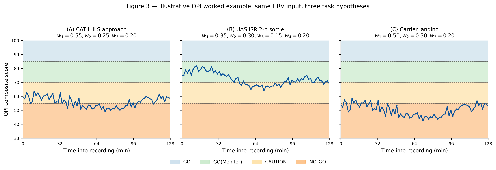

# Authors: Diego L. Malpica (PI); Ingrid Xiomara Bejarano Cifuentes

## Title page

**Title:** Task-calibrated Operational Performance Indicators for aviation and unmanned aircraft system operators: a biomathematical framework integrating SAFTE fatigue, heart-rate variability, and cognitive-load theory, with open-source reference implementation

**Running title:** Task-calibrated OPI for aerospace operators

**Authors**

1. **Diego L. Malpica MD**^a,\* (Principal Investigator)  
2. **Ingrid Xiomara Bejarano Cifuentes**^b

**Affiliations**

^a Aerospace Medicine — Subdirectorate of Aerospace Sciences, Direction of Aerospace Medicine (DIMAE), Colombian Aerospace Force (Fuerza Aeroespacial Colombiana), Bogotá D.C., Colombia  
^b Centro de Investigación y Desarrollo de Tecnologías Aeroespaciales (CITAE), Colombian Aerospace Force (Fuerza Aeroespacial Colombiana), Bogotá D.C., Colombia

**Corresponding author**

**Diego L. Malpica MD** — affiliation ^a

| | |
| --- | --- |
| **E-mail** | diego.malpica@fac.mil.co |
| **ORCID** | https://orcid.org/0000-0002-2257-4940 |
| **Postal address** | Direction of Aerospace Medicine (DIMAE), Colombian Aerospace Force, Bogotá D.C., Colombia *(add building/street and postal code if required by the submission system)* |

**Second author ORCID:** https://orcid.org/0000-0002-7981-2356

*Target journal: Applied Ergonomics (Elsevier). Initial submission may use a single Word or PDF file (“Your Paper Your Way”); journal formatting is required at revision after acceptance.*

---

## Abstract

Operator-state monitoring in aviation and unmanned aircraft system (UAS) operations increasingly combines physiological signals, biomathematical fatigue models, and workload theory, yet no published framework integrates these streams into an interpretable, task-calibrated readiness index spanning manned and unmanned operators with explicit weight profiles and open implementation. This article defines the Operational Performance Indicator (OPI): a weighted composite of SAFTE-style fatigue effectiveness, heart-rate-variability markers, Multiple Resource Theory-derived task modifiers, and bounded task-operational penalties, including UAS-specific vigilance-decay and teleoperation-latency terms. Seventeen operator categories receive explicit profiles. We describe the MIT-licensed open-source reference implementation, report engineering verification across the tested fusion pathway including PVT, sleep, and API-linked modules, and apply one illustrative 128-minute HRV recording summary under three task hypotheses to show that the same summary-consistent physiology yields different readiness scores when task context changes. Claims are limited to framework definition, software, and illustrative demonstration rather than validated prediction of operator performance; prospective field validation is planned as future work.

### Keywords

Heart rate variability; Fatigue modelling; Aviation ergonomics

---

## 1. Introduction

### 1.1 Operator state and the limits of current monitoring approaches

Aviation and unmanned aircraft system (UAS) operations increasingly rely on physiological, behavioural, and schedule information to infer operator state and inform mission-level decisions. Heart-rate variability (HRV) is now a routine analytic layer in studies of workload, fatigue, and vigilance in safety-critical domains (Shaffer & Ginsberg, 2017; Quigley et al., 2024). Biomathematical fatigue modelling has matured from early pacemaker formulations to operational scheduling tools such as the Fatigue Avoidance Scheduling Tool built on the SAFTE model (Forger, Jewett, & Kronauer, 1999; Hursh, Balkin, Miller, & Eddy, 2004; Devine et al., 2022). Subjective workload ratings and task-batteries such as MATB remain widely used to elicit and benchmark physiological responses (Pontiggia et al., 2024). Recent reviews document an active literature on wearable psychophysiological sensing in safety-critical environments (Houghton, Martinetti, & Majumdar, 2024) and on machine-learning classifiers for cognitive-state recognition across aviation and other high-stakes domains (Jin et al., 2025).

Despite this activity, three recurring structural limitations affect how operator-state information is used in practice. First, most published frameworks rely on a single information channel: HRV-only analyses, SAFTE-only fatigue forecasts, or electroencephalography-only workload classifiers (Hamann et al., 2026). Second, task-specific calibration is rare; the few composite studies that exist tend to be constrained to a narrow task slice such as cruise-approach-landing phases of a single aircraft type (Feng, Wanyan, Yang, Zhuang, & Wu, 2018). Third, the recent wave of machine-learning classifiers for operator state (Stevens, Morris, Fisher, & Myers, 2022; Vogl, O'Brien, & St. Onge, 2025; Li, Molloy, El-Fiqi, & Eves, 2025) demonstrates high classification accuracy on the tasks they evaluate, but black-box classifiers are difficult to audit, transfer across platforms, and modify when new task categories appear.

### 1.2 Multiple Resource Theory and biomathematical readiness components

Multiple Resource Theory (MRT) provides a principled framework for combining task demands with operator capacity (Wickens, 2002, 2008). Rather than treating attention as a single undifferentiated pool, MRT decomposes operator capacity along modalities (visual-auditory), processing stages (perceptual-central-responding), codes (verbal-spatial), and resources, and predicts that dual-task interference depends on the extent to which two tasks recruit the same dimensions. Operationally, this suggests that the same HRV or fatigue state can have very different implications for performance depending on the task an operator is actually performing. A high sympathetic load that is tolerable during a vigilance-dominated intelligence-surveillance-reconnaissance mission may be unacceptable during a precision carrier landing.

Two further HF constructs expand this principle. The Warm vigilance-resource framework (Warm, Parasuraman, & Matthews, 2008) established that sustained-monitoring tasks deplete attentional resources predictably over time-on-task, with task-specific decay constants and asymptotic minima. The Chen teleoperation framework (Chen, Haas, & Barnes, 2007) formalised the impact of control latency on teleoperator performance, showing that latencies above ~100 ms force operators to adopt anticipatory or move-and-wait strategies with attendant cognitive cost. Together with situation-awareness theory (Endsley, 1995) and the allostatic-load model of cumulative physiological strain (McEwen, 1998), these constructs motivate a task-calibrated composite readiness index rather than a universal operator-state score.

### 1.3 Gap statement

Existing tools do not adequately combine four features in a single open framework: (i) theoretically grounded biomathematical fatigue estimation, (ii) HRV-derived autonomic markers, (iii) task-specific cognitive-load modifiers derived from HF literature, and (iv) explicit coverage of both manned aviation and UAS operator categories. Recent systematic reviews explicitly flag this gap for UAS operators (Li et al., 2025) and for warfighter mental-fatigue management more broadly (Rabat et al., 2025). Published cockpit-fatigue reviews focus on head-worn sensing (electroencephalography, functional near-infrared spectroscopy, eye-tracking) and omit HRV (Hamann et al., 2026), while machine-learning classifier studies of UAV and aviation workload rarely publish an inspectable biomathematical layer or task-taxonomy extension path (Stevens et al., 2022; Vogl et al., 2025). Recent multi-dimensional workload studies in adjacent aviation contexts such as helicopter maintenance demonstrate the value of combining NASA-TLX, heart-rate, and HRV features but stop short of a formal composite-readiness framework (Berthon et al., 2025).

### 1.4 Objective and contribution

The objective of this work is to define the **Operational Performance Indicator (OPI) framework**, provide its open-source reference implementation, and demonstrate the framework end-to-end with a single illustrative worked example. The manuscript makes five specific contributions. First, it formulates an explicit four-component weighted composite readiness index with per-task weight profiles. Second, it specifies a task taxonomy covering ten manned-aviation and seven UAS operator categories, each with expected HRV signatures and dominant failure modes. Third, it integrates a Warm-type vigilance-decrement model and a Chen-type control-latency penalty for the UAS subset, components that have no direct analogue in manned aviation and are not present in prior composite readiness frameworks. Fourth, it distributes an open-source reference implementation under the MIT license with documented execution environment, engineering verification across the fusion pathway, and three inspectable modules — the Psychomotor Vigilance Task, an actigraphy-backed sleep analytics layer, and a longitudinal trajectory-risk module — that concretise the composite's vigilance, fatigue, and cumulative-strain inputs. A prospective validation of the framework is planned for deployment with the Colombian Antarctic aerial campaign during the 2026–2027 austral summer; the protocol instruments multi-leg Drake Passage sorties flown aboard a Colombian Air Force C-130 Hercules using the ActiGraph wGT3X-BT wrist accelerometer for sleep and activity ground truth and the Polar H10 chest-strap electrocardiogram for RR-interval acquisition.

A fifth contribution is epistemic. The OPI is deliberately simple: a linear weighted composite with theory-derived per-task weights rather than an end-to-end trained classifier. The simplicity is not a concession but a design choice tuned to the aerospace context. A linear composite is auditable line-by-line by safety reviewers, extensible to new task categories through demand analysis rather than new training data, calibrable on modest operational samples using Bayesian hierarchical or penalised-regression methods, and falsifiable at the level of individual per-task weight profiles — each profile generates predictions that can be tested against operator outcomes. In settings where labelled aerospace performance data are scarce, operator populations are small and specialised, sensor generations change faster than training cycles, and safety review demands traceable gate logic, this simplicity is the principled choice. The framework does not reject machine-learning approaches; it positions classifiers downstream as local refinements of the composite's weights under specific operational conditions rather than as replacements for an audit-friendly substrate.

The manuscript does not claim validated numerical parity with any external HRV or fatigue package, diagnostic accuracy against operator outcomes, or regulatory clearance. Field calibration of the per-task weights against operator performance is stated as the next research step.

---

## 2. Methods

### 2.1 Framework formulation

The OPI is a weighted linear composite of four components, with explicit penalty terms for stress, task complexity, control latency, and multi-vehicle supervisory load. Two formulations are used, one for manned aviation and one for UAS / teleoperator tasks.

For manned-aviation task categories the composite is

```
OPI_task = w1 · SAFTE_eff · Task_mod
         + w2 · HRV_recovery
         + w3 · Autonomic_reserve
         − Stress_penalty
         − Task_complexity_penalty
```

with `w1 + w2 + w3 = 1.00`. For UAS and teleoperator task categories the composite is extended to

```
OPI_UAS = w1 · SAFTE_eff
        + w2 · Vigilance_adj
        + w3 · HRV_recovery
        + w4 · Attention_capacity
        − Latency_penalty
        − Multi_vehicle_penalty
```

with `w1 + w2 + w3 + w4 = 1.00`. Component definitions, normalisation rules, and penalty functional forms are given in full in the framework document accompanying this manuscript and summarised in Table 2. Per-task weights and complexity modifiers are theory-derived from the HF sources cited throughout this section; field calibration against operator-performance outcomes is future work (Section 4.6).

The framework is intentionally linear and interpretable. Each component maps to a named construct in the HF literature, each weight is traceable to a theoretical rationale, and each penalty has a bounded functional form. This design is a deliberate contrast with the machine-learning classifiers that dominate recent operator-state literature (Stevens et al., 2022; Vogl et al., 2025; Jin et al., 2025): those classifiers achieve high accuracy within their training distribution, but they are less extensible to new task categories, less auditable for safety review, and more sensitive to sensor drift and population differences. A transparent composite with theory-derived weights is not expected to outperform a well-trained classifier on an in-distribution test set; it is expected to provide a reproducible, extensible, and inspectable substrate on which task-specific calibration and future classifier hybridisation can be layered.

### 2.2 Task taxonomy

Seventeen operator task categories are specified across two blocks: ten manned-aviation categories and seven UAS / teleoperator categories. Each category is defined by its primary performance demands, its dominant failure modes, and the expected HRV signatures under high workload, drawn from the HF literature. Table 1 presents the taxonomy in full. Manned-aviation categories include instrument flight under reduced visibility (IMC), night-vision operations, helmet-mounted-display flying, high-density air-traffic control, critical and non-critical emergencies, test-pilot operations, carrier landing, weapons delivery, and new-platform flight testing. UAS categories include intelligence-surveillance-reconnaissance, strike operations, search-and-rescue, autonomous-swarm supervisory control, contested-environment operations, ground-robot teleoperation, and subsea or long-latency teleoperation.

The taxonomy is not exhaustive and is not mutually exclusive. Mission-level activity often transitions across categories within a single sortie, and the OPI pipeline is designed to be re-evaluated per-window as the active task category changes. Additional categories can be added by specifying their primary demands, failure modes, and weight profile following the template used throughout the taxonomy.

### 2.3 Per-task weight profiles

Per-task weight profiles for the seventeen categories are given in Table 2. Weights reflect the theoretical dominance of particular OPI components in particular task contexts. Examples: in precision-motor-control tasks such as carrier landing, the HRV-recovery component is weighted more heavily (`w2 = 0.30`) because short-term vagal recovery has been linked to fine-motor precision; in critical-emergency tasks, the autonomic-reserve component gains weight (`w3 = 0.25`) because recovery capacity from acute stress drives sustained performance; in UAS supervisory control of multiple vehicles, the attention-capacity component dominates (`w4 = 0.30`) because sustained exception-handling across vehicles depletes attentional resources (Warm et al., 2008). The rationale column in Table 2 cites the HF source supporting each profile.

The task-complexity modifier `Task_mod ∈ [0.70, 1.00]` applies multiplicatively to SAFTE_eff in the manned-aviation formulation and captures operational compounding: a CAT III instrument approach under low platform familiarity combines to a lower modifier than either condition alone. Compound modifiers multiply with a floor at 0.50 to prevent degenerate near-zero products.

A stress penalty proportional to the excess of the Baevsky stress index over 150 applies across all categories (Shaffer & Ginsberg, 2017), and a learning-curve modifier applies to new-platform testing only (Table 2).

### 2.4 Vigilance-decrement and control-latency models (UAS)

Two UAS-specific components have no analogue in manned aviation: the vigilance-decrement model for sustained monitoring and the control-latency penalty for teleoperation. Both are formalised in Table 3.

The vigilance-decrement model follows Warm et al. (2008):

```
Vigilance_capacity(t) = (V0 − Vmin) · e^(−λ · t) + Vmin
```

with task-specific decay constants `λ ∈ [0.08, 0.15]` per hour for high-event ISR, low-event ISR, multi-vehicle supervisory control, and ground teleoperation. Parameter values reflect the combined effects of sustained monitoring load and event rate and are theory-derived; operational field calibration is future work. Recommended maximum sortie durations are offered as planning heuristics rather than validated thresholds.

The control-latency penalty follows Chen et al. (2007):

```
Latency_penalty = 0.5 · ln(1 + latency_ms / 100)
```

The logarithmic form captures the diminishing-returns relationship between latency and performance loss: small latencies have minimal impact, intermediate latencies force move-and-wait control strategies, and large latencies recommend supervisory-control transitions or autonomous handoff. Numerical latency tiers with suggested strategy selection are given in Table 3.

A linear multi-vehicle penalty `Multi_vehicle_penalty = 3 · (n_vehicles − 1)` captures attentional sharing across supervised vehicles in swarm-control tasks.

### 2.5 Reference implementation

The reference implementation is distributed under the MIT license at `https://github.com/strikerdlm/HRV`. The architecture separates client delivery from model execution while keeping the computational core as a single Python stack.

The frontend is a Next.js application under `frontend/` that exposes operational and research routes. The orchestration layer is a FastAPI service under `api/main.py` and `api/research_endpoints.py` that exposes structured endpoints for HRV analysis, scheduling and readiness, user-profile management, and related research utilities. The shared analytic core lives under `app/` and contains the HRV engine (`app/hrv_core.py`), the SAFTE reservoir model (`app/fatigue_calculator/safte_model.py`), the readiness-fusion logic (`app/scheduling_core.py`, `app/scheduling_engine.py`, `app/frms.py`, `app/frms_v2.py`), user-profile persistence (`app/user_profile_tab.py`, `app/user_database.py`), and publication-oriented export utilities (`app/publication_export.py`, `app/export_utils.py`). A client-side TypeScript SAFTE mirror (`frontend/src/lib/safte-model.ts`) reproduces the Python reservoir equations for responsive operational displays and is treated as architectural consistency rather than an independent validation layer.

The HRV engine computes time-domain metrics (RMSSD, SDNN, pNN50, median-NN, CVNN), frequency-domain metrics (VLF, LF, HF power; LF/HF ratio), and nonlinear metrics (SD1, SD2, SampEn, DFA-α1, Poincaré ellipse area, Baevsky stress index) from RR-interval series, with bounded artefact heuristics and linear interpolation for invalid samples. Outputs feed the HRV_recovery, Autonomic_reserve, and Attention_capacity components of the OPI through documented normalisation functions. External numerical benchmarking of the HRV engine against reference packages (e.g., Kubios, pyHRV, NeuroKit2) is explicitly out of scope for this manuscript and is stated as future work.

Three additional reference-implementation modules were added to strengthen the operational path from physiological input to composite readiness. The first is an in-platform **Psychomotor Vigilance Task (PVT)** module (`app/pvt_core.py`) that administers and scores three validated variants: PVT-B (3 min, 355 ms lapse threshold; Basner & Dinges, 2011), PVT-5 (5 min), and PVT-10 (standard; Dinges et al., 1997). The browser administration surface runs in the Next.js client with `performance.now()` timing bounded to ≈5–10 ms per Anwyl-Irvine et al. (2020), complemented by a PsychoPy desktop driver for sub-millisecond research sessions where required (Garaizar & Vadillo, 2014). The module was also validated on smartphone and tablet hardware by Grant et al. (2017) against a gold-standard 10-minute laptop PVT across 38 hours of total sleep deprivation. Its `pvt_lapses_3min` output feeds the existing `score_pvt_lapses_3min` subscore in the readiness-fusion layer with a ≥20-lapse hard gate; this operationalises a vigilance-related input to the composite as an inspectable feed rather than an external assumption.

The second is an **actigraphy-backed sleep module** (`app/sleep_core.py`) that derives sleep debt (cumulative deficit over a 7-night rolling window), the **Sleep Regularity Index** (Lunsford-Avery et al., 2018) via 5-minute epoch matching between consecutive 24-hour cycles, stage-balance proportions, and a low-SpO₂ screening proxy (four-band; explicitly not a clinical apnea classification). These outputs feed the SAFTE effectiveness estimate and the chronobiological-modifier component of the OPI and drive a four-band operational sleep readiness gate. The module is sensor-agnostic at the data-contract level and accepts either consumer-wearable or research-grade accelerometer inputs. Consumer-wearable bounds relative to polysomnography (Lee et al., 2025; Schyvens et al., 2024) are surfaced alongside every visualisation, clinical sleep-disorder claims are prohibited in the operational UI, and for validation studies the module ingests ActiGraph wGT3X-BT (wrist-worn) recordings — a research-grade accelerometer characterised in adult free-living sleep and activity measurement with documented agreement against contemporary ActiGraph reference devices (Buchan, 2024).

The third is a **longitudinal trajectory-risk module** (`app/trajectory_risk.py`) that maps short-term readiness into cumulative-strain dynamics aligned with the allostatic-load construct (McEwen, 1998). The module maintains exponentially weighted moving averages of OPI, SAFTE effectiveness, and HRV-recovery over operator-specified horizons, flags sustained downward trajectories using pre-specified slope and persistence thresholds, and exposes a bounded cumulative-strain modifier that is consumed by the readiness-fusion layer as a longitudinal adjustment to the per-window composite rather than as its replacement. This module operationalises the allostatic-load rationale introduced in §1.2 and is the substrate on which multi-mission operator-level overreach and recovery trajectories can be evaluated across an operational deployment.

A prospective validation of the framework is planned for deployment with the Colombian Antarctic aerial campaign during the 2026–2027 austral summer. The protocol instruments multi-leg Drake Passage sorties flown aboard a Colombian Air Force C-130 Hercules transport aircraft, each operational day comprising several long over-water legs between the South American continental staging base and the Antarctic Peninsula. The research-grade instrumentation surfaces are the ActiGraph wGT3X-BT wrist accelerometer for sleep and activity ground truth and the Polar H10 chest-strap electrocardiogram for RR-interval acquisition; the Polar H10 has been benchmarked against Holter and laboratory electrocardiography with near-perfect beat-to-beat agreement in ambulatory settings (Pereira et al., 2020; Yang & Ben-Menachem, 2024) and has been characterised as suitable for twenty-four-hour HRV monitoring in military-adjacent populations (Hinde, White, & Armstrong, 2021). The validation sits squarely within the manned-aviation branch of the OPI taxonomy, combining extended-endurance over-water operations, sustained instrument-flight demands under high-latitude meteorological conditions, and the cumulative fatigue signatures of consecutive multi-leg operational days.

### 2.6 Worked-example methodology

A single 128-minute HRV recording collected in November 2025 (8,553 RR intervals, 0.047 % quality-flagged windows) was used to anchor an illustrative worked example. For the public worked-example artefact, the recording-level summary statistics were used to generate representative five-minute windowed HRV metrics with realistic variability rather than re-parsing a raw RR-interval file; those representative windows were then combined with a rested-baseline SAFTE trajectory and the OPI fusion logic under three task hypotheses: a CAT II instrument landing system approach (category 1), a two-hour UAS intelligence-surveillance-reconnaissance sortie (category 11), and a daytime carrier recovery (category 8). For each task hypothesis the full OPI time series was computed per window and mapped to the readiness categories defined in Table 1. This worked example is a **framework-instantiation demonstration**: it shows how the same summary-consistent physiological input yields different composite outputs when the active task category changes. It does not test whether the OPI predicts operator outcomes, and it does not generalise beyond this single-recording illustration.

---

## 3. Results

### 3.1 Illustrative worked example: framework instantiation across three task hypotheses

Figure 3 presents the per-window OPI time series for the three task hypotheses computed across eighty representative five-minute windows spanning the 128-minute recording duration. Across all windows, the three task hypotheses produced substantively different composite distributions from identical summary-consistent physiological input.

Under the **CAT II ILS approach** hypothesis (`w1 = 0.55`, `w2 = 0.25`, `w3 = 0.20`, `Task_mod = 0.90`), the composite score varied between **48.9 and 63.7** (mean 55.9, SD 3.7) and was classified in the **CAUTION** band (55-69) for 58.8 % of windows and in the **NO-GO** band (< 55) for 41.2 % of windows. No window reached the **GO** or **GO (Monitor)** bands, reflecting the combined effect of the Category II complexity modifier, the dominance of the SAFTE component under moderate baseline effectiveness, and the stress-index penalty in higher-arousal windows.

Under the **UAS ISR 2-hour sortie** hypothesis (`w1 = 0.35`, `w2 = 0.30`, `w3 = 0.15`, `w4 = 0.20`, Vigilance_adj evaluated through the Warm decay with `λ = 0.12 h⁻¹`, `V0 = 100`, `Vmin = 65`; latency penalty at 120 ms datalink; single vehicle), the composite was higher overall, varying between **64.1 and 81.8** (mean 72.4, SD 4.4), with **66.2 %** of windows classified as **GO (Monitor)** and the remaining **33.8 %** as **CAUTION**. The composite showed a visible downward drift as simulated time-on-task approached 2 hours, consistent with the Warm vigilance decrement. No window reached **GO** (≥ 85) and none reached **NO-GO**.

Under the **carrier-landing** hypothesis (`w1 = 0.50`, `w2 = 0.30`, `w3 = 0.20`, `Task_mod = 0.85` to reflect CVN deck motion and short-final demands), the composite was systematically lower, varying between **42.6 and 58.3** (mean 50.3, SD 4.1), with **86.2 %** of windows classified as **NO-GO** and the remaining **13.8 %** as **CAUTION**. The complexity modifier combined with the relatively moderate RMSSD-derived HRV_recovery in the recording produced the most stringent task-specific assessment of the three hypotheses.

The central observation is that the same summary-consistent physiological input yielded composite distributions that differed both in central tendency (mean OPI 55.9 vs. 72.4 vs. 50.3) and in category allocation (0 % / 33.8 % / 86.2 % NO-GO across the three tasks, respectively). This is consistent with the MRT-derived weight-profile design intent and demonstrates that a task-calibrated composite exposes task-specific readiness information that a task-agnostic composite would collapse. The illustrative numerical outputs are framework-instantiation values only; they do not reflect the readiness state of any operator performing any of the three tasks, because the recording was collected from a single individual in a non-operational context. The worked-example parameters and outputs are supplied in full at `analysis/opi_worked_example.json` and are reproducible from `analysis/opi_worked_example.py`.



**Figure 3.** Per-window Operational Performance Indicator (OPI) composite scores for three task hypotheses (CAT II ILS approach, UAS ISR 2-hour sortie, carrier landing) computed from identical physiological input across eighty-five 5-minute windows. *Colour in print:* if colour figures are required in the print edition, indicate preference when submitting; online publication will show colour by default where supplied.

*Tables 1–5.* Editable sources for compilation into the submission file are in `manuscript/tables/` (task taxonomy, weight profiles, vigilance/latency models, reproducibility metadata, verification coverage). Embed each table beside the relevant section or supply as supplementary material per journal instructions.

### 3.2 Engineering verification of the OPI fusion pathway

Engineering verification of the reference implementation covers the major tested paths through the OPI pipeline at the software level. Automated tests exercise scheduling-core readiness fusion (`tests/test_scheduling_core.py`), fatigue-risk-management behaviour and SAFTE-adjacent logic (`tests/test_frms.py`, `tests/test_frms_v2.py`, `tests/test_fatigue_integration.py`), API endpoint normalisation and behaviour (`tests/test_api_user_profile_normalization.py`, `tests/test_research_windowed_endpoint.py`), and broader statistical and charting modules (`tests/test_comprehensive_modules.py`). The PVT and sleep reference-implementation modules described in §2.5 are covered by dedicated test suites: `tests/test_pvt_core.py` (28 tests across trial classification, alert- and fatigued-session metrics, variant scaling, edge cases, and the operational gate) and `tests/test_sleep_core.py` (27 tests across stage balance, sleep debt scaling, Sleep Regularity Index behaviour on identical and alternating schedules, SpO₂ screening bands, operational gate escalation, and the Pearson / Spearman correlation engine with Benjamini-Hochberg FDR adjustment). The longitudinal trajectory-risk module (`app/trajectory_risk.py`) is implemented and documented in the repository but is not yet covered by a dedicated regression test suite. Likewise, the UAS-specific Warm/Chen formulations are formalised in the framework artefacts and instantiated in the worked-example script (`analysis/opi_worked_example.py`) rather than exposed as a separately tested operational API pathway. A coverage map at the manuscript-safe claim level is supplied in Table 5.

These tests justify reporting that the readiness fusion, orchestration, PVT, and sleep layers are implemented and regression-tested at the software level. They do not establish operational validation, clinical deployment readiness, or numerical equivalence of the HRV engine to external reference packages. In particular, the windowed-endpoint test monkeypatches the inner HRV computation to isolate endpoint behaviour, so that pathway is verified more directly than the underlying numerical implementation. The browser PVT and sleep analytics inherit the timing precision and wearable-device validity bounds of the underlying measurement surfaces rather than being independently benchmarked against reference hardware in this manuscript.

### 3.3 Reproducibility and reporting assets

The reference implementation is distributed at `https://github.com/strikerdlm/HRV` under the MIT license. The documented primary execution environment is `conda hrv-py312` with Python 3.12 and dependencies declared in `requirements.txt`, and the primary web client is a Next.js/TypeScript application with dependencies under `frontend/package.json`. The repository supports structured logging, cached environmental-data management, and export utilities designed to emit manuscript-oriented statistics and supporting artefacts. Before formal submission, a tagged release or archived DOI (e.g., Zenodo) will be cited as the frozen identifier for the reported version. These reproducibility characteristics are consistent with published guidance for reproducible computational research (Sandve, Nekrutenko, Taylor, & Hovig, 2013).

Table 4 summarises the reproducibility and deployment metadata.

---

## 4. Discussion

### 4.1 Principal contribution

The principal contribution of this manuscript is neither a new physiological marker nor a new machine-learning classifier but a deliberately simple, theoretically grounded substrate for aerospace operator-readiness decisions: the Operational Performance Indicator — a linear weighted composite whose per-task weight profiles, Warm-type vigilance-decrement model, Chen-type control-latency penalty, operational gate thresholds, and reference-implementation modules are specified in the open and distributed as inspectable code. The framework's simplicity is a design choice, not a limitation of method. The composite is intended to be audited line-by-line by safety reviewers, extended by domain experts without re-training, and calibrated against operator outcomes using modest-sample-size Bayesian hierarchical or penalised-regression studies. It is not intended to outperform well-trained classifiers on their in-distribution training tasks; it is intended to be operationally trustworthy in contexts where labelled aerospace outcome data are scarce, populations are small and specialised, regulatory scrutiny is high, and the cost of an unexplainable NO-GO decision is large.

### 4.2 Comparison with adjacent frameworks

Several recent frameworks are adjacent to the OPI but differ in important ways. Feng et al. (2018) proposed an MRT-grounded multinomial logistic regression combining fixation-frequency, ECG, and electrodermal features for pilot workload across three flight phases (cruise, approach, landing), with reported discrimination accuracy of 84.85 %. The Feng framework validates the principle of MRT + physiological fusion but covers only three phases of one aircraft type, includes no fatigue model, and is distributed as a study result rather than as reusable software. The OPI extends this line of work to seventeen operator task categories, incorporates SAFTE fatigue dynamics, and ships as open-source reference code.

Stevens et al. (2022) used Cognitive Metrics Profiling to link a cognitive model to physiological workload in a single unmanned-vehicle control task. That work demonstrates the predictive value of cognitive-architecture modelling for workload but addresses a single task and does not provide per-task weight profiles across a taxonomy. Vogl et al. (2025) developed individualised support-vector machine classifiers of cognitive workload from ECG and pupillometry in a low-fidelity aviation simulator with three participants, reporting 70-80 % binary classification accuracy. Their work is complementary: the OPI can serve as a calibration layer under which classifiers like the Vogl model are trained on particular operator populations. Li et al. (2025) systematically reviewed machine-learning approaches for UAS operator cognitive load and explicitly identified the absence of unified frameworks integrating physiological signals, biomathematical fatigue, and task-specific weighting as a research gap. The OPI as proposed addresses that gap directly.

Berthon et al. (2025) recently published a multi-dimensional workload study in helicopter maintenance that combined NASA-TLX, heart rate, and HRV across tasks of varying complexity. The work confirms that combining subjective, physiological, and performance measures is tractable in an applied aviation context and validates the venue-level fit between this kind of contribution and Applied Ergonomics, while demonstrating the absence of a formal task-calibrated composite-readiness framework that OPI fills.

Hamann et al. (2026) reviewed the state of the art in cockpit mental-fatigue assessment using head-worn sensing (EEG, fNIRS, eye-tracking). Their conclusion — that mature methods exist but are not yet operationally deployable — highlights the broader need for inspectable, deployment-ready frameworks. The OPI is consistent with that need and accommodates head-worn signals as additional inputs to the Attention_capacity component where available.

Rabat et al. (2025) reviewed fatigue and management of warfighter mental endurance and called specifically for "an infrastructure for physiological monitoring and integrated analyses" combined with explainable and interpretable modelling. The OPI is a concrete instance of this infrastructure.

### 4.3 Theoretical grounding and the case for principled simplicity

The OPI's linear structure and per-task weighting reflect three theoretical commitments. First, Multiple Resource Theory predicts that task interference and performance ceiling depend on the specific demand profile of the task (Wickens, 2002, 2008); a composite that weights components differently by task category operationalises this prediction directly rather than expecting a classifier to discover task-specific demand structure from noisy physiological data. Second, the allostatic-load framework (McEwen, 1998) distinguishes between acute stress responses (captured here by the stress-index penalty) and cumulative regulatory strain (captured by the HRV_recovery and Autonomic_reserve components), justifying a composite that separates short-term from longer-term autonomic signals rather than collapsing them into a single learned feature. Third, situation-awareness theory (Endsley, 1995) motivates the dedicated attention-capacity component for UAS supervisory-control tasks, where operator cognition is dominated by multi-target tracking and exception handling rather than fine-motor control — a demand profile that is structurally distinct from manned fixed-wing flight and that the per-task weights make explicit. In each case, the linear composite leverages accumulated theoretical evidence directly; it does not reconstruct the theory from data.

The deliberate use of a linear composite in an era of machine-learning ascendancy warrants explicit defence. The contemporary literature on operator-state monitoring increasingly converges on trained classifiers (Stevens et al., 2022; Vogl et al., 2025; Jin et al., 2025) or systematic reviews of them (Li et al., 2025), and that trajectory has been productive for in-distribution predictive accuracy in laboratory and simulator settings. For aerospace operations, however, four structural constraints weigh against a classifier-first strategy. Labelled outcome data in operational aerospace environments are scarce: a single squadron of UAS operators or a single fleet's airline pilots seldom produces the tens of thousands of labelled sorties that modern classifiers require, and the labels that do exist (accident reports, safety-event databases) are extraordinarily sparse for the NO-GO tail of the distribution. Populations are small, specialised, and heterogeneous across platforms, ratings, and operational tempo; classifiers trained on one population transfer poorly to another, as Vogl et al. (2025) themselves emphasised in advocating individualised models. Sensor generations — wearables, cockpit avionics, ground-station telemetry — change faster than training cycles, so a classifier built this year is frequently obsolete before its first major validation study completes. Finally, the cost function in aerospace is asymmetric and dominated by safety review; an unexplainable automated NO-GO is operationally worse than a slightly less accurate gate whose logic can be traced to cited theory, because the former cannot be approved by a safety board and cannot be safely defended after an incident.

Against these constraints, a linear composite with theory-derived weights is not a concession to methodological conservatism but an appropriate match of method to context. The composite is inspectable: an OPI NO-GO decision decomposes exactly into the contributions of SAFTE effectiveness, HRV-derived recovery and reserve, task-specific cognitive-load weighting, and each penalty term, with every weight traceable to a named theoretical source. The composite is extensible: a new task category — a carrier recovery with ship-motion cueing, a lunar-teleoperation protocol, a long-duration analogue mission — can be specified through demand analysis producing an a-priori weight profile using the existing template, with no training data required at the point of deployment and with field data subsequently refining the weights. The composite is calibrable on modest samples: the linear structure is compatible with penalised regression, ridge regression, or Bayesian hierarchical modelling at n in the hundreds rather than the hundreds of thousands, and the partial pooling afforded by a hierarchical model aligns well with small-population operational data. The composite is falsifiable in the Popperian sense: each per-task weight profile constitutes a specific prediction about the relative importance of fatigue, autonomic, and cognitive-load channels for that task, and the prediction can be tested by comparing model-derived readiness to observed performance.

These epistemic properties do not require the framework to reject classifier approaches. Hybrid architectures that place trained classifiers downstream of the linear substrate — for example, a vigilance-specific SVM tuned for a particular UAS platform under contested-environment conditions that locally refines the Vigilance_adj component, while the overall OPI structure remains theory-driven and auditable — are a natural extension path. The linear composite is positioned as the substrate; classifiers are positioned as refinements under specified conditions. This division of labour preserves auditability where it is operationally required and admits data-driven precision where labelled data genuinely exist.

Occam's razor applies here in the operational-science sense rather than the purely formal one. Between two frameworks that satisfy the same HF-theoretic constraints, the one that can be audited by a safety board, extended to a new task category without a training campaign, calibrated on the data an operator community actually has, and falsified at the level of individual weight profiles is the framework that should be preferred. The OPI is offered as that framework.

### 4.4 Strengths

The OPI has several strengths as a methodology paper. The framework is theoretically grounded in multiple HF constructs with clearly cited source literature. It spans both manned aviation and UAS, two populations usually treated in separate research communities. It ships with an open-source reference implementation under the MIT license, enabling independent verification and extension. The reference implementation includes an in-platform PVT module (three validated variants plus browser and PsychoPy desktop administration surfaces), an actigraphy-backed sleep module (debt, Sleep Regularity Index, SpO₂ screening proxy), and a longitudinal trajectory-risk module (EWMA tracking of readiness with allostatic-load framing), which together concretise the vigilance, fatigue, and cumulative-strain inputs to the composite as inspectable code rather than external dependencies. A prospective validation of the framework is planned for a Colombian Air Force C-130 Hercules Antarctic aerial campaign during the 2026–2027 austral summer, with multi-leg Drake Passage sorties instrumented using ActiGraph wGT3X-BT accelerometry paired with Polar H10 electrocardiography, positioning the next iteration of the manuscript to report operator-outcome data from the manned-aviation branch of the OPI under genuine polar-aviation operational tempo. The evidence posture is explicitly tiered, distinguishing what is demonstrated (framework, implementation, engineering verification, illustrative example) from what remains to be validated (per-task weight calibration, operator outcome prediction, numerical parity with external HRV packages).

### 4.5 Limitations

The most important limitation is that **per-task OPI weights are theory-derived, not empirically calibrated against field operator performance**. The weights reflect the HF literature for each task category but have not been optimised against real operator outcomes. A reviewer could reasonably argue that the specific numerical values proposed for `w1`, `w2`, `w3`, and `w4` are a subset of a larger family of plausible profiles and that empirical selection among them is pending. This limitation is intrinsic to a methodology-introduction paper and is addressed in Section 4.6.

A second limitation is that the illustrative worked example uses a single HRV recording collected in a non-operational context. It demonstrates framework instantiation and does not demonstrate operational validity. All prose in Section 3 has been written to be consistent with this framing.

A third limitation is that the public worked-example artefact uses representative five-minute windows generated from recording-level summary statistics rather than re-processing a raw RR-interval file. This is acceptable for illustration but further reinforces that Section 3.1 is a framework-instantiation demonstration rather than a numerical validation exercise.

A fourth limitation is that the HRV engine has not been externally benchmarked against reference HRV packages for the purposes of this manuscript. The engine produces standards-aligned metrics and has internal verification for the fusion pathway, but numerical equivalence to Kubios or comparable tools is not established and is not claimed.

A fifth limitation is that the client-side TypeScript SAFTE mirror reproduces the canonical Python implementation for responsive display but has not been subjected to formal parity testing against the canonical version. This mirror is treated as architectural consistency rather than as an independent model.

A sixth limitation applies specifically to the vigilance-decrement and control-latency components: the decay constants and penalty coefficients are derived from seminal HF literature (Warm et al., 2008; Chen et al., 2007) and may require re-calibration for modern UAS platforms with advanced autonomy and degraded links, neither of which are typical of the original studies.

A seventh limitation is that the platform is not presented as a certified medical device or as a regulatory-cleared decision-support system. Operational modules draw on published aerospace, fatigue-management, and safety frameworks (ICAO, 2020; National Aeronautics and Space Administration, 2023), but these are alignment references, not certifications.

An eighth limitation applies to the sleep-analytics layer when it is deployed in operational mode with consumer wrist-worn wearables. Such devices have been systematically compared against polysomnography with clinically meaningful disagreement on total sleep time, sleep efficiency, sleep latency, and wake-after-sleep-onset (Lee et al., 2025; Schyvens et al., 2024). The manuscript therefore bounds operational-mode sleep-derived composites to pattern-level tracking and an explicit screening posture: Sleep Regularity Index and sleep debt are used as operational modifiers within a documented disclosure, and low-nocturnal-SpO₂ night counts are surfaced only as a screening proxy without any apnea or sleep-disordered-breathing diagnosis. For the forthcoming Antarctic aerial validation and for any future deployment in which research-grade ground truth is required, the sleep module ingests ActiGraph wGT3X-BT recordings, a research-grade accelerometer characterised in adult free-living conditions with documented agreement against contemporary ActiGraph reference devices (Buchan, 2024) and providing the research-grade measurement substrate that consumer wearables do not. Clinical sleep-disorder claims remain out of scope for the present methodology paper regardless of the input sensor.

A ninth limitation applies to the browser administration surface for the PVT. Robot-actuator benchmarking places typical web-browser reaction-time precision at the order of 5–10 ms across modern browsers and devices (Anwyl-Irvine et al., 2020). This is adequate for operational GO/NO-GO gating (which is driven by lapse counts) and for longitudinal within-operator tracking, but is not equivalent to laboratory-grade timing. Research sessions that require sub-millisecond precision should use the PsychoPy desktop driver, whose validity has been independently evaluated for brief-stimulus timing (Garaizar & Vadillo, 2014).

### 4.6 Validation roadmap

The most immediate next step is a planned prospective field validation of the framework during the 2026–2027 Colombian Antarctic aerial campaign. The campaign operates a Colombian Air Force C-130 Hercules platform from a South American continental staging base into the Antarctic Peninsula across the Drake Passage, with multiple long over-water legs per operational day during the austral summer. Consenting crew are planned to wear the ActiGraph wGT3X-BT wrist accelerometer continuously for sleep and activity ground truth (Buchan, 2024) and the Polar H10 chest-strap electrocardiogram during structured daily HRV windows and mission task blocks (Pereira et al., 2020; Hinde, White, & Armstrong, 2021; Yang & Ben-Menachem, 2024). Longitudinal OPI trajectories, PVT lapses, Sleep Regularity Index, cumulative sleep debt, and trajectory-risk EWMA series will be analysed with penalised regression or Bayesian hierarchical models to refine the per-task weight profiles for the extended-endurance, over-water, and instrument-flight categories against performance and self-reported workload benchmarks. Sensitivity analysis across weight families will quantify how much the specific theory-derived values matter relative to the structure of the composite. The campaign is also intended as an operational-utility evaluation: it asks whether OPI-derived GO/CAUTION/NO-GO bands track observed performance decrements under genuine polar-aviation operational tempo without laboratory or simulator confounds.

A second priority is external numerical benchmarking of the HRV engine against reference implementations, producing intraclass correlation coefficients and Bland-Altman limits of agreement for time-domain, frequency-domain, and nonlinear metrics on standard test datasets (e.g., MIT-BIH Normal Sinus Rhythm, Fantasia). This is a bounded piece of work amenable to publication as a companion validation paper.

A third priority is comparative benchmarking against adjacent frameworks on matched datasets. Feng et al. (2018), Stevens et al. (2022), and Vogl et al. (2025) provide comparator systems whose outputs could be replicated and scored against the same ground-truth performance data used to calibrate the OPI.

A fourth priority, complementary to the Antarctic aerial campaign and focused on task categories not exercised by polar over-water legs, is a prospective pilot study in a well-characterised manned-aviation or UAS training population, most naturally Colombian Air Force pilots in simulator-based instrument-flight training or UAS operators in training sorties, with ethics approval and a pre-specified analysis plan.

Beyond validation, future work includes a tagged release or archived DOI for the reported version, a formal artefact manifest for figures and tables, usability studies and role-specific deployment playbooks for flight surgeons and operational teams, and a separation of the vigilance and latency models into dedicated methodological studies if the UAS branch of the framework develops beyond its current scope.

---

## 5. Conclusions

The Operational Performance Indicator framework offers a theoretically grounded, task-calibrated alternative to fatigue-only composites, HRV-only analyses, and machine-learning operator-state classifiers. The framework covers both manned-aviation and UAS operator categories, ships as open-source reference code under the MIT license, and is supported by engineering verification across its fusion pathway. The present manuscript is bounded to framework definition, reference implementation, and illustrative demonstration; empirical calibration of per-task weights, external numerical benchmarking of the HRV engine, and prospective field validation in operator populations are the next research steps. The framework is designed to be extensible by domain experts without requiring re-training, which positions it as a substrate for iterative operational deployment and subsequent classifier hybridisation rather than as a closed analytic end-product.

---

## 6. Compliance and Transparency

### 6.1 Data availability

No new human-subject dataset was generated for the framework-definition and engineering-verification components reported in this manuscript. The single 128-minute HRV recording used to anchor the illustrative worked example in Section 3.1 is available from the corresponding author on reasonable request as a de-identified illustrative dataset. The public repository also contains the derived JSON artefact (`analysis/opi_worked_example.json`) and the reproduction script (`analysis/opi_worked_example.py`) used for the worked example. Code, manuscript support files, and derived repository artefacts are available at the public source repository.

### 6.2 Code and artefact availability

The reference implementation is available as open-source software at `https://github.com/strikerdlm/HRV` under the MIT license. The primary execution environment is `conda hrv-py312` with Python 3.12 and dependencies declared in `requirements.txt`; the primary web client is a Next.js/TypeScript application with dependencies under `frontend/package.json`. A tagged release or archived DOI corresponding to the exact reported version will be cited before submission.

### 6.3 Ethics and regulatory alignment

Ethics approval and informed consent were not required for the framework-definition and engineering-verification components because no new human-subject dataset was generated or analysed for those components. The single illustrative HRV recording was contributed by the corresponding author for framework-demonstration purposes and is presented only as de-identified illustrative material, without linkage to any operational scenario. If future versions of the manuscript incorporate prospective or retrospective operator data, study-specific ethics approval, consent documentation, and reporting-guideline alignment (STROBE for observational, TRIPOD+AI for predictive models) will be added. This article does not report primary sex- or gender-stratified human data; if empirical validation is later published, analysis and reporting will follow SAGER-aligned practice and funder requirements.

The platform is not presented as a certified medical device or as a regulated decision-support system. Operational modules were designed with reference to published aerospace, fatigue-management, and safety frameworks, including NASA-STD-3001 human-systems standards and ICAO Doc 9966 fatigue-management guidance (International Civil Aviation Organization, 2020; National Aeronautics and Space Administration, 2023). These references inform design and threshold logic but do not constitute certification, legal compliance, or regulatory clearance.

### 6.4 Author contributions (CRediT)

**Diego L. Malpica:** Conceptualisation; Methodology; Software; Formal analysis; Investigation; Writing — original draft; Writing — review & editing; Visualisation; Supervision; Project administration.

**Ingrid Xiomara Bejarano Cifuentes:** Investigation; Writing — review & editing; Resources.

### 6.5 Funding and conflicts of interest

**Funding:** This research did not receive any specific grant from funding agencies in the public, commercial, or not-for-profit sectors. If institutional or grant support applies before acceptance, this section will be updated accordingly.

**Declaration of competing interests.** The authors declare no competing financial or non-financial interests related to this manuscript. Neither author is currently serving nor has served on the editorial board of *Applied Ergonomics*. Upload the Elsevier competing-interest declaration using the journal’s official **.docx template** (do not convert to another format) **or** confirm via the Editorial Manager checkbox that matches this statement—see declaration template on the journal’s Guide for Authors.

### 6.6 Reporting-guideline positioning

This manuscript is a methodology and reference-implementation paper. The central claims are framework definition, implementation, and illustrative demonstration; the evidence base does not include prospective human-subject outcomes or predictive-accuracy evaluation. Reporting therefore emphasises transparent description of framework components, per-task parameterisation, reference-implementation architecture, and engineering verification. If future versions add empirical validation, adapted STROBE elements will be incorporated, and TRIPOD+AI or CLAIM extensions will apply only to sections making predictive-model claims.

---

## Acknowledgements

The authors acknowledge the open-source scientific Python ecosystem, DIMAE and CITAE within the Colombian Aerospace Force (Fuerza Aeroespacial Colombiana), and the Colombian Antarctic Program (Programa Antártico Colombiano) for the context of the forthcoming aerial-campaign validation, and the human factors research community whose foundational work on Multiple Resource Theory, vigilance, teleoperation, fatigue modelling, and situation awareness provides the theoretical basis for this framework.

---

## Declaration of generative AI and AI-assisted technologies in the manuscript preparation process

During the preparation of this work the authors used AI-assisted technologies (large language-model-based drafting, editing, literature cross-checking, and formatting workflows under human oversight). After using these tools, the authors reviewed and edited the content as needed and take full responsibility for the content of the manuscript. Basic grammar, spelling, and reference checks alone would not require this statement under Elsevier policy; this declaration reflects substantive AI-assisted preparation as required by the journal’s [generative AI policies](https://www.elsevier.com/about/policies/publishing-ethics).

---

## References

Anwyl-Irvine, A., Dalmaijer, E. S., Hodges, N., & Evershed, J. K. (2020). Realistic precision and accuracy of online experiment platforms, web browsers, and devices. *Behavior Research Methods, 53*(4), 1407-1425. https://doi.org/10.3758/s13428-020-01501-5

Basner, M., & Dinges, D. F. (2011). Maximizing sensitivity of the Psychomotor Vigilance Test (PVT) to sleep loss. *Sleep, 34*(5), 581-591. https://doi.org/10.1093/sleep/34.5.581

Berthon, L., Bernard, F., Fleury, S., Paquin, R., & Richir, S. (2025). Multi-dimensional measurement of mental workload in industrial context: an experiment in the field of helicopter maintenance. *Applied Ergonomics, 129*, 104599. https://doi.org/10.1016/j.apergo.2025.104599

Buchan, D. S. (2024). Comparison of sleep and physical activity metrics from wrist-worn ActiGraph wGT3X-BT and GT9X accelerometers during free-living in adults. *Journal for the Measurement of Physical Behaviour, 7*(1). https://doi.org/10.1123/jmpb.2023-0026

Chen, J. Y. C., Haas, E. C., & Barnes, M. J. (2007). Human performance issues and user interface design for teleoperated robots. *IEEE Transactions on Systems, Man, and Cybernetics, Part C (Applications and Reviews), 37*(6), 1231-1245. https://doi.org/10.1109/TSMCC.2007.905819

Dinges, D. F., Pack, F., Williams, K., Gillen, K. A., Powell, J. W., Ott, G. E., Aptowicz, C., & Pack, A. I. (1997). Cumulative sleepiness, mood disturbance, and psychomotor vigilance performance decrements during a week of sleep restricted to 4-5 hours per night. *Sleep, 20*(4), 267-277. https://doi.org/10.1093/sleep/20.4.267

Devine, J. K., Garcia, C. R., Simoes, A. S., Guelere, M. R., de Godoy, B., Silva, D. S., Pacheco, P. C., Choynowski, J., & Hursh, S. R. (2022). Predictive biomathematical modeling compared to objective sleep during COVID-19 humanitarian flights. *Aerospace Medicine and Human Performance, 93*(1), 4-12. https://doi.org/10.3357/AMHP.5909.2022

Endsley, M. R. (1995). Toward a theory of situation awareness in dynamic systems. *Human Factors, 37*(1), 32-64. https://doi.org/10.1518/001872095779049543

Feng, C., Wanyan, X., Yang, K., Zhuang, D., & Wu, X. (2018). A comprehensive prediction and evaluation method of pilot workload. *Technology and Health Care, 26*(S1), 65-78. https://doi.org/10.3233/thc-174201

Forger, D. B., Jewett, M. E., & Kronauer, R. E. (1999). A simpler model of the human circadian pacemaker. *Journal of Biological Rhythms, 14*(6), 533-538. https://doi.org/10.1177/074873099129000867

Garaizar, P., & Vadillo, M. A. (2014). Accuracy and precision of visual stimulus timing in PsychoPy: No timing errors in standard usage. *PLoS ONE, 9*(11), e112033. https://doi.org/10.1371/journal.pone.0112033

Grant, D. A., Honn, K. A., Layton, M. E., Riedy, S. M., & Van Dongen, H. P. A. (2017). 3-minute smartphone-based and tablet-based psychomotor vigilance tests for the assessment of reduced alertness due to sleep deprivation. *Behavior Research Methods, 49*(3), 1020-1029. https://doi.org/10.3758/s13428-016-0763-8

Hamann, A., van Klaren, C., Zon, R., Dehais, F., Carstengerdes, N., van Miltenburg, M., & Cabrera Castillos, K. (2026). The state of the art in assessing mental fatigue in the cockpit using head-worn sensing technology. *Frontiers in Neuroergonomics, 6*, 1673268. https://doi.org/10.3389/fnrgo.2025.1673268

Hinde, K., White, G., & Armstrong, N. (2021). Wearable devices suitable for monitoring twenty four hour heart rate variability in military populations. *Sensors, 21*(4), 1061. https://doi.org/10.3390/s21041061

Houghton, R., Martinetti, A., & Majumdar, A. (2024). A framework for selecting and assessing wearable sensors deployed in safety critical scenarios. *Sensors, 24*(14), 4589. https://doi.org/10.3390/s24144589

Hursh, S. R., Balkin, T. J., Miller, J. C., & Eddy, D. R. (2004). The Fatigue Avoidance Scheduling Tool: Modeling to minimize the effects of fatigue on cognitive performance. *SAE Technical Paper Series*, 2004-01-2151. https://doi.org/10.4271/2004-01-2151

International Civil Aviation Organization. (2020). *Manual for the oversight of fatigue management approaches (Doc 9966, 2nd ed., Version 2, revised).* ICAO.

Jin, K., Rubio-Solis, A., Naik, R., Leff, D., Kinross, J., & Mylonas, G. (2025). Human-centric cognitive state recognition using physiological signals: A systematic review of machine learning strategies across application domains. *Sensors, 25*(13), 4207. https://doi.org/10.3390/s25134207

Lee, Y. J., Lee, J. Y., Cho, J. H., Kang, Y. J., & Choi, J. H. (2025). Performance of consumer wrist-worn sleep tracking devices compared to polysomnography: A meta-analysis. *Journal of Clinical Sleep Medicine, 21*(3), 573-582. https://doi.org/10.5664/jcsm.11460

Li, Q., Molloy, O., El-Fiqi, H., & Eves, G. (2025). Applications of machine learning in assessing cognitive load of uncrewed aerial system operators and in enhancing training: A systematic review. *Drones, 9*(11), 760. https://doi.org/10.3390/drones9110760

Lunsford-Avery, J. R., Engelhard, M. M., Navar, A. M., & Kollins, S. H. (2018). Validation of the Sleep Regularity Index in Older Adults and Associations with Cardiometabolic Risk. *Scientific Reports, 8*, 14158. https://doi.org/10.1038/s41598-018-32402-5

McEwen, B. S. (1998). Protective and damaging effects of stress mediators. *New England Journal of Medicine, 338*(3), 171-179. https://doi.org/10.1056/NEJM199801153380307

National Aeronautics and Space Administration. (2023). *NASA Spaceflight Human-System Standard Volume 1, Crew Health (NASA-STD-3001, Vol. 1, Rev. C).* NASA.

Pereira, R. A., Alves, J. L. B., Silva, J. H. C., Costa, M. S., & Silva, A. S. (2020). Validity of a smartphone application and chest strap for recording RR intervals at rest in athletes. *International Journal of Sports Physiology and Performance, 15*(6), 896-899. https://doi.org/10.1123/ijspp.2019-0406

Pontiggia, A., Gomez-Merino, D., Quiquempoix, M., Beauchamps, V., Boffet, A., Fabries, P., Chennaoui, M., & Sauvet, F. (2024). MATB for assessing different mental workload levels. *Frontiers in Physiology, 15*, 1408242. https://doi.org/10.3389/fphys.2024.1408242

Quigley, K. S., Gianaros, P. J., Norman, G. J., Jennings, J. R., Berntson, G. G., & de Geus, E. J. C. (2024). Publication guidelines for human heart rate and heart rate variability studies in psychophysiology — Part 1: Physiological underpinnings and foundations of measurement. *Psychophysiology, 61*(9), e14604. https://doi.org/10.1111/psyp.14604

Rabat, A., Van Cutsem, J., Marcora, S. M., Lambert, A., Markwald, R., Kubala, A. G., & Friedl, K. E. (2025). Fatigue and management of warfighter mental endurance. *BMJ Military Health, 171*(5), 447-451. https://doi.org/10.1136/military-2025-002963

Sandve, G. K., Nekrutenko, A., Taylor, J., & Hovig, E. (2013). Ten simple rules for reproducible computational research. *PLoS Computational Biology, 9*(10), e1003285. https://doi.org/10.1371/journal.pcbi.1003285

Schyvens, A.-M., Van Oost, N. C., Aerts, J.-M., Masci, F., Peters, B., Neven, A., Dirix, H., Wets, G., Ross, V., & Verbraecken, J. (2024). Accuracy of Fitbit Charge 4, Garmin Vivosmart 4, and WHOOP versus polysomnography: Systematic review. *JMIR mHealth and uHealth, 12*, e52192. https://doi.org/10.2196/52192

Shaffer, F., & Ginsberg, J. P. (2017). An overview of heart rate variability metrics and norms. *Frontiers in Public Health, 5*, 258. https://doi.org/10.3389/fpubh.2017.00258

Stevens, C. A., Morris, M. B., Fisher, C. R., & Myers, C. W. (2022). Profiling cognitive workload in an unmanned vehicle control task with cognitive models and physiological metrics. *Military Psychology, 35*(6), 507-520. https://doi.org/10.1080/08995605.2022.2130673

Vogl, J., O'Brien, K., & St. Onge, P. (2025). One size does not fit all: A support vector machine exploration of multiclass cognitive state classifications using physiological measures. *Frontiers in Neuroergonomics, 6*, 1566431. https://doi.org/10.3389/fnrgo.2025.1566431

Warm, J. S., Parasuraman, R., & Matthews, G. (2008). Vigilance requires hard mental work and is stressful. *Human Factors, 50*(3), 433-441. https://doi.org/10.1518/001872008X312152

Wickens, C. D. (2002). Multiple resources and performance prediction. *Theoretical Issues in Ergonomics Science, 3*(2), 159-177. https://doi.org/10.1080/14639220210123806

Wickens, C. D. (2008). Multiple resources and mental workload. *Human Factors, 50*(3), 449-455. https://doi.org/10.1518/001872008X288394

Yang, J., & Ben-Menachem, E. (2024). Accuracy and clinical utility of heart rate variability derived from a wearable heart rate monitor in patients undergoing major abdominal surgery. *Journal of Clinical Monitoring and Computing, 38*(2), 433-443. https://doi.org/10.1007/s10877-023-01080-8

---

*End of manuscript draft v0.1 (branch: `q1-hf-opi-reframe`). Supplementary materials (engineering-verification inventory, standards crosswalk, deployment prerequisites, non-claims list) are consolidated in `manuscript/supplement/submission_support_appendix.md` and align with the current OPI framing.*
