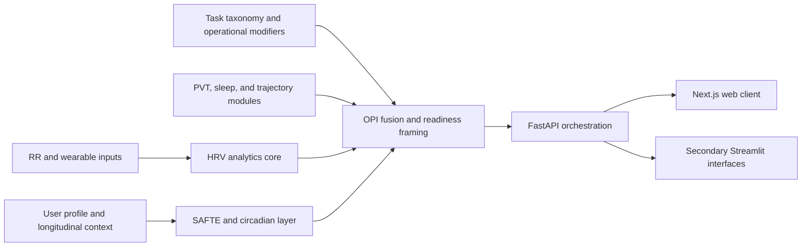

# Author: Dr Diego Malpica MD

## Core Module Scope

This document fixes the minimum set of modules and workflows that belong in the main manuscript for a task-calibrated aerospace readiness methodology paper with an open reference implementation.

## Main-text system story

## Modules to keep in the main manuscript

| Workflow | Primary files | Why it stays in the main paper | Evidence anchor |
| --- | --- | --- | --- |
| HRV analytics core | `app/hrv_core.py`, `docs/Manual.md` | This is the physiological measurement backbone for the whole platform and the main source of reproducible computational detail. | Implemented code, user manual, export modules |
| User profile and persistence | `app/user_profile_tab.py`, `app/user_database.py` | The paper needs a clear explanation of how person-level context enters the analysis and decision layers. | Persistent schema and documented longitudinal workflow |
| SAFTE and circadian dynamics | `app/fatigue_calculator/safte_model.py`, `frontend/src/lib/safte-model.ts`, `app/frms.py`, `app/frms_v2.py`, `app/fatigue_integration.py` | These modules give the manuscript an explicit biomathematical fatigue/circadian core rather than a superficial platform description. | Canonical Python model, mirrored TypeScript implementation, literature references, and test files |
| OPI fusion and readiness framing | `app/scheduling_core.py`, `app/scheduling_engine.py`, `app/scheduling_tab.py` | This is the clearest translational bridge from analytics to actionable aerospace-medicine decision support. | `tests/test_scheduling_core.py`, explicit threshold logic |
| Task taxonomy and UAS modifiers | `analysis/operational_performance_indicators_research.md`, `analysis/opi_worked_example.py`, `manuscript/tables/opi_weight_profiles.md`, `manuscript/tables/opi_vigilance_latency_models.md` | These materials define the task-calibrated logic that differentiates the OPI from fatigue-only or HRV-only composites. | Worked-example artifact, framework tables, methodological derivations |
| PVT vigilance module | `app/pvt_core.py`, `api/pvt_endpoints.py`, `frontend/src/lib/pvt-scoring.ts` | Provides an inspectable vigilance-related input to the readiness pathway rather than a hypothetical external feed. | `tests/test_pvt_core.py`, API route, mirrored scoring logic |
| Sleep analytics module | `app/sleep_core.py`, `api/research_endpoints.py`, `frontend/src/lib/sleep-metrics.ts` | Concretises sleep debt and chronobiological context within the reference implementation. | `tests/test_sleep_core.py`, operational and research routes |
| Trajectory-risk module | `app/trajectory_risk.py` | Extends the composite from per-window readiness to cumulative-strain tracking aligned with allostatic-load theory. | Implemented code, manuscript narrative, worked-example framing |
| Web delivery and orchestration | `frontend/`, `api/main.py`, `api/research_endpoints.py` | The manuscript should show that one Python model stack is delivered primarily through a Next.js client and FastAPI orchestration path. | Frontend route tree, API surface, repo architecture docs |
| Publication and reproducibility exports | `app/publication_export.py`, `app/export_utils.py` | Q1 software papers expect explicit reporting and export pathways, not only computation. | Export code and reproducibility fields |

## Modules to move to supplementary material

| Supplementary area | Primary files | Why it moves out of the main paper |
| --- | --- | --- |
| Device-specific ingestion details | `app/actigraph_import.py`, `app/garmin_import.py`, `app/somfit_import.py`, `app/polar_accesslink.py`, related import utilities | Important for implementation depth, but too detailed for the primary systems narrative. |
| Secondary Streamlit interfaces | `app/research_app.py`, `app/operational_app.py`, `app/app.py` | Important for repo accuracy and historical continuity, but secondary to the primary web-delivery scope of the revised manuscript. |
| Real-time and BLE pathways | `app/realtime_ble.py`, `app/realtime_hrv.py`, `app/polar_h10_recorder.py` | Operationally interesting, but not necessary to establish the core translational architecture. |
| GPU and CPU optimization internals | `app/gpu_processing.py`, `app/performance_utils.py`, other optimization helpers | Relevant to engineering performance, not central to the paper's clinical and operational contribution. |
| ML, GPT, and agentic interpretation layers | `app/ml_enhancements.py`, `app/ml_analytics.py`, `app/ml_predictions.py`, `app/gpt_interpretation.py`, `app/agent_insights.py` | These features raise separate validation and reporting questions; include only if they are independently supported. |
| Deep exploratory specialty modules | `app/radiation_exposure.py`, `app/advanced_hrv_analytics.py`, `app/hrv_fragmentation.py`, other niche analytics modules | Valuable as breadth indicators, but they would diffuse the main argument if described in detail. |
| Single-user data-science entrypoint | `app/space_weather_ds_app.py` | Useful for specialized workflows, but secondary to the main readiness-framework story. |

## Claim boundaries for the main paper

1. The manuscript should describe a task-calibrated readiness framework with open reference implementation, not a validation paper for every module in the repository.
2. The main Results section should prioritize workflows with both code-level implementation and clear test or artifact support.
3. The paper should mention advanced AI, real-time, and niche modules only when they strengthen the model-stack narrative or belong in Supplementary Methods.
4. Any module without a stable validation story should appear as optional architecture, not as a central contribution.
5. Streamlit should remain visible only as a secondary interface, not as the main delivery scope.

## Recommended main-paper contributions

1. An open OPI reference implementation delivered through Next.js and FastAPI over a shared Python model stack.
2. A standards-informed physiological and biomathematical pipeline that integrates HRV, longitudinal user context, SAFTE/circadian dynamics, and task-specific operational modifiers.
3. Inspectable supporting modules for vigilance, sleep, and cumulative-strain tracking that concretise the readiness pathway.
4. A reproducibility-oriented export and reporting workflow suitable for research and operational audit trails.
